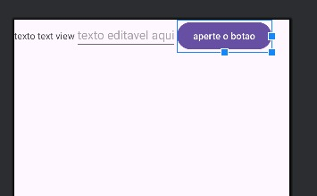
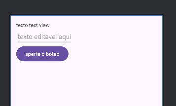

# Um App Simples

Nesta aula vamos fazer um app simples.

Nos concentraremos apenas em criar elementos visuais sem nenhuma funcionalidade.

Vamos criar uma tela com o layout mais simples possível, o `LinearLayout`, e vamos adicionar apenas 3 elementos na tela: 
- um `Button`, é um botão simples
- um `TextView`, é um elemento com um texto simples escrito
- um `EditText`, um elemento com um espaço de texto editável, o equivalente ao *textfield* no HTML

### O Código

Como o nosso aplicativo não terá nenhuma funcionalidade, editaremos apenas o documento `activity_main.xml`.

A primeira linha será a linha que já vem pronta no código, informando as especificações do `xml`. **Não precisa de preocupar com esta linha**:

```xml
<?xml version="1.0" encoding="utf-8"?>
```


##### LinearLayout

Na próxima linha escolheremos um layout simples, o `LinearLayout`. 
Neste layout os elementos adicionados serão adicionados linearmente, um depois do outro.

```xml
<?xml version="1.0" encoding="utf-8"?>
<LinearLayout
    xmlns:android="http://schemas.android.com/apk/res/android"
    android:layout_width="match_parent"
    android:layout_height="match_parent">

</LinearLayout>
```

Como é o primeiro layout, precisamos definir o *namespace* do android com a linha `xmlns:android="http://schemas.android.com/apk/res/android"`, esta linha também estará em todos os documentos, não vamos nos preocupar com ela.

Precisaremos escolher os valores dos campos obrigatórios `layout_width` e `layout_height`, escolhemos o valor `"match_parent"` para que tenha o tamanho do *view* pai, que é o container que contém esta *view*.


##### TextView


Dentro do `LinearLayout` colocaremos um texto simples com o elemento `TextView`.

```xml
<?xml version="1.0" encoding="utf-8"?>
<LinearLayout
    xmlns:android="http://schemas.android.com/apk/res/android"
    android:layout_width="match_parent"
    android:layout_height="match_parent">

    <TextView
        android:layout_width="wrap_content"
        android:layout_height="wrap_content"
        android:text="texto text view"
        />

</LinearLayout>
```

O elemento `TextView` criará um texto com o conteúdo que estiver em `android:text`. Novamente o `layout_width` e `layout_height` são obrigatórios, neste caso escolheremos o valor `wrap_content` que fará com que o tamanho do elemento seja o menor possível para conter seu conteúdo.


##### EditText

Agora incluiremos um campo de texto com o elemento `EditText`


```xml
<?xml version="1.0" encoding="utf-8"?>
<LinearLayout
    xmlns:android="http://schemas.android.com/apk/res/android"
    android:layout_width="match_parent"
    android:layout_height="match_parent">

    <TextView
        android:layout_width="wrap_content"
        android:layout_height="wrap_content"
        android:text="texto text view"
        />
    
    <EditText
        android:layout_width="wrap_content"
        android:layout_height="wrap_content"
        android:hint="texto editavel aqui"
        />


</LinearLayout>
```

O parâmetro `hint` escreverá um texto inicial dentro do campo de texto.


##### Button

Por último incluiremos um botão com o elemento `Button`

```xml
<?xml version="1.0" encoding="utf-8"?>
<LinearLayout
    xmlns:android="http://schemas.android.com/apk/res/android"
    android:layout_width="match_parent"
    android:layout_height="match_parent">

    <TextView
        android:layout_width="wrap_content"
        android:layout_height="wrap_content"
        android:text="texto text view"
        />
    
    <EditText
        android:layout_width="wrap_content"
        android:layout_height="wrap_content"
        android:hint="texto editavel aqui"
        />

    <Button
        android:layout_width="wrap_content"
        android:layout_height="wrap_content"
        android:text="aperte o botao"
        />

</LinearLayout>
```

O parâmetro `text` escreverá um texto em cima do botão.


##### Resultado



#### Melhorando o Layout

Como podemos ver os elementos entraram em orientação horizontal, um após o outro. Vamos melhorar escolhendo uma orientação vertical para o `LinearLayout`, e adicionando um `padding` de 16 pixels.


```xml
<LinearLayout
    xmlns:android="http://schemas.android.com/apk/res/android"
    android:layout_width="match_parent"
    android:layout_height="match_parent"
    android:orientation="vertical"
    android:padding="16dp"
    >
    .
    .
    .
``` 

##### Resultado



