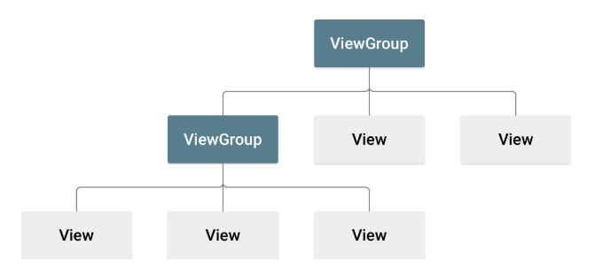

# Linear Layout[^1]

[^1]: [referência oficial de layouts](https://developer.android.com/develop/ui/views/layout/declaring-layout).

O primeiro elemento de uma tela, aquele em que todos os outros elementos estão dentro dele, deve ser um layout.

Na linguagem do Android, esta caixa que contém outros elementos é chamada de `ViewGroup`, enquanto que os elementos que mostram informação e que os usuários podem interagir são chamados de `View`.

Pense no `ViewGroup` como uma caixa onde você coloca elementos, que podem botões, textos, e inclusive outras caixas. Cada caixa tem um layout, que é uma regra de como os elementos dentro dela irão se organizar.

#### Exemplo de `ViewGroup`[^2]:
[^2]: [exemplos de layouts](https://www.geeksforgeeks.org/android-ui-layouts/)
- `LinearLayout`: O tipo mais simples de layout. Organiza seus elementos sequencialmente, um após o outro.
- `RelativeLayout`: Posiciona elementos em uma posição relativa a outros elementos. Para cada elemento que for posicionado você deve dizer ao lado de qual elemento ele deve ser colocado, ou em qual posição em relação ao pai.
- `ConstraintLayout`: Igual ao `RelativeLayout`, mas possibilita configurações a mais como limitar o tamanho dos elementos.
- `FrameLayout`: Apenas um elemento é mostrado no topo, e um controle pode ser usado para mudar qual elemento será mostrado.
- `TableLayout`: Alinha seus elementos em linhas e colunas.
- `WebView`: Usado para mostrar uma página web dentro do aplicativo.
- `ListView`: Mostra uma lista com os elementos adicionados
- `GridView`: Assim como a lista, mostra uma lista de itens, mas podem ser separados por linhas e colunas.

#### Exemplos de `View`:
- `TextView`: Mostra um texto
- `EditText`: Campo para que o usuário entre com um texto
- `Button`: Um botão que, quando pressionado, engatilha uma ação.
- `ToggleButton`(`SwitchCompat`): Um botão que funciona como se fosse um interruptor, tem um estado de ligado e desligado ()
- `RadioButton`: Um botão que funciona como o *toggle*, porém faz parte de um grupo de *radio buttons* que deixa apenas um ser ligado por vez.
- `ImageView`: Adiciona uma imagem.

