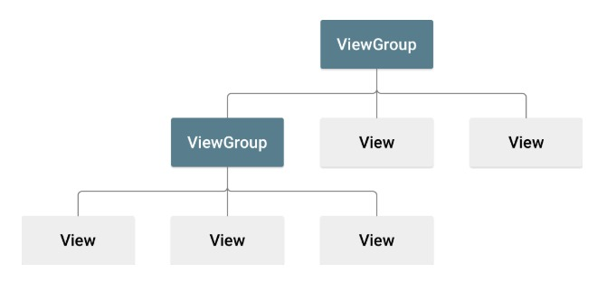

# Um Simples Layout[^1]

[^1]: [referência oficial de layouts](https://developer.android.com/develop/ui/views/layout/declaring-layout).

O primeiro elemento de uma tela, aquele em que todos os outros elementos estão dentro dele, deve ser um layout.

Na linguagem do Android, esta caixa que contém outros elementos é chamada de `ViewGroup`, enquanto que os elementos que mostram informação e que os usuários podem interagir são chamados de `View`.

Pense no `ViewGroup` como uma caixa onde você coloca elementos, que podem ser botões, textos, e inclusive outras caixas. Cada caixa tem um **layout**, que é uma regra de como os elementos dentro dela irão se organizar.



#### Exemplo de `ViewGroup`[^2]:
[^2]: [exemplos de layouts](https://www.geeksforgeeks.org/android-ui-layouts/)
- `LinearLayout`: O tipo mais simples de layout. Organiza seus elementos sequencialmente, um após o outro.
- `RelativeLayout`: Posiciona elementos em uma posição relativa a outros elementos. Para cada elemento que for posicionado você deve dizer ao lado de qual elemento ele deve ser colocado, ou em qual posição em relação ao pai.
- `ConstraintLayout`: Igual ao `RelativeLayout`, mas possibilita configurações a mais como limitar o tamanho dos elementos.
- `FrameLayout`: Apenas um elemento é mostrado no topo, e um controle pode ser usado para mudar qual elemento será mostrado.
- `TableLayout`: Alinha seus elementos em linhas e colunas.
- `WebView`: Usado para mostrar uma página web dentro do aplicativo.
- `ListView`: Mostra uma lista com os elementos adicionados
- `GridView`: Assim como a lista, mostra uma lista de itens, mas podem ser separados por linhas e colunas.

#### Exemplos de `View`:
- `TextView`: Mostra um texto
- `EditText`: Campo para que o usuário entre com um texto
- `Button`: Um botão que, quando pressionado, engatilha uma ação.
- `CheckBox`: Uma caixa de seleção que pode ser selecionada ou desselecionada.
- `RadioButton`: Um botão que funciona como o *check box*, porém faz parte de um grupo de *radio buttons* que deixa apenas um ser selecionado por vez.
- `ToggleButton`(`SwitchCompat`): Um botão que funciona como se fosse um interruptor, tem um estado de ligado e desligado
- `ImageView`: Adiciona uma imagem.

### LinearLayout

Por enquanto usaremos o `LinearLayout`, a seguir veremos alguns detalhes de configuração:

- `layout_width` e `layout_height`: Define o tamanho do elemento, sendo *width* para largura e *height* para altura. Os valores pode ser dados em medida, por exemplo `16dp`, ou 
   - `match_parent`: o tamanho irá aumentar até ficar do tamanho do pai
   - `wrap_content`: Irá encolher para o tamanho mínimo em que caberá os elementos internos.
- `orientation`: podendo ter os valores `vertical` ou `horizontal`, define se os elementos ficarão alinhados
- `gravity`: Define em qual posição seus elementos internos ficarão, podendo ser definido em relação a X e Y
- `weightSum`: Caso você prefira que os elementos tenham tamanho diferente, defina uma soma do peso dos tamanho com este parâmetro, e para cada elemento, escolha seu peso usando `layout_weight`

##### Atributos dos filhos

Elementos dentro de um `LinearLayout` também ganham atributos que vão definir sua localização e tamanho em relação ao layout.

- `layout_gravity`: Define a localização deste elemento. Seus valores podem ser `center`, `center_vertical`, `fill`, etc...
- `layout_weight`: Define como o espaço compartilhado do layout pode ser usado para este elemento.

### Exemplo (retirado das referências[^3])
[^3]: [exemplo de linear layout](https://www.geeksforgeeks.org/linearlayout-and-its-important-attributes-with-examples-in-android/).

```xml
<?xml version="1.0" encoding="utf-8"?>
<LinearLayout xmlns:android="http://schemas.android.com/apk/res/android"
    xmlns:tools="http://schemas.android.com/tools"
    android:layout_width="match_parent"
    android:layout_height="match_parent"
    android:orientation="vertical"
    android:weightSum="5"
    tools:context=".MainActivity">
    <!--  Set Orientation as "vertical"  -->
    <!--  Set WeightSum as "3"  -->

    <!--sub view 1-->
    <!--This view has more weight than others providing it with more space-->
    <TextView
        android:id="@+id/view_1"
        android:text="GeeksforGeeks"
        android:background="@color/black"
        android:textColor="@color/white"
        android:gravity="center"
        android:layout_weight="3"
        android:layout_width="match_parent"
        android:layout_margin="32dp"
        android:layout_height="wrap_content" />

    <!--sub view 2-->
    <TextView
        android:id="@+id/view_2"
        android:text="GeeksforGeeks"
        android:background="@color/grey"
        android:textColor="@color/white"
        android:gravity="center"
        android:layout_weight="1"
        android:layout_width="match_parent"
        android:layout_margin="32dp"
        android:layout_height="wrap_content" />

    <!--sub view 3-->
    <TextView
        android:id="@+id/view_3"
        android:text="GeeksforGeeks"
        android:background="@color/grey"
        android:textColor="@color/white"
        android:gravity="center"
        android:layout_weight="1"
        android:layout_width="match_parent"
        android:layout_margin="32dp"
        android:layout_height="wrap_content" />

</LinearLayout>

```

