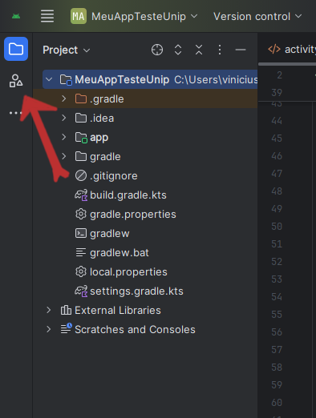

# Alguns Elementos

Elementos que possibilitam interação com o usuário são chamados de `View`.

Nesta aula vamos falar de
- `TextView`: Um simples texto
- `EditText`: Uma caixa de texto para o usuário entrar com informações
- `Button`: Um botão para o usuário apertar
- `CheckBox`: Uma caixa de seleção para o usuário selecionar
- `RadioButton`: Mesmo que o `CheckBox`, porém somente um radio button de cada grupo pode ser selecionado
- `ImageView`: Uma imagem.

### TextView

Exibe um texto para o usuário. Podemos customizar tamanho, cor, fonte, inclusive o próprio texto a ser mostrado. Útil para mostrar informações para o usuário.

Alguns atributos úteis:
- `text`: o texto que será exibido para o usuário
- `textSize`: O tamanho do texto, lembre de usar a unidade sp, por exemplo `android:textSize="26sp"`, esta unidade faz com que o tamanho do texto mude caso o usuário aumente a fonte das letras no app.
- `textColor`: Define a cor do texto, podendo usar código hexadecimal para escolher a cor, por exemplo: `android:textColor="#aa1122"` criará um texto vermelho.


### EditText

Exibe um campo para que o usuário escreva um texto. Útil para coletar informações do usuário.

Alguns atributos úteis:
- `hint`: o texto que será exibido para o usuário dentro do campo **Atenção: não use `text`, use `hint`.**
- `textSize`: O tamanho do texto, lembre de usar a unidade sp, por exemplo `android:textSize="26sp"`, esta unidade faz com que o tamanho do texto mude caso o usuário aumente a fonte das letras no app.
- `textColorHint`: Por padrão o texto aparecerá em cinz claro, mas você pode usar este atributo para mudar a cor.


### Button

Um botão para o usuário clicar.

Alguns atributos úteis:
- `text`: o texto que será colocado dentro do botão

### CheckBox

Uma caixa de seleção usuário selecionar.

Alguns atributos úteis:
- `text`: o texto que será colocado ao lado da caixa


### RadioButton

Igual ao `CheckBox`, mas faz parte de um grupo, e somente um de cada grupo pode ser selecionado.

Você vai precisar colocar os que fazem parte do mesmo grupo dentro da mesma tag `RadioGroup`, por exemplo:

```xml
<RadioGroup
    android:layout_width="match_parent"
    android:layout_height="wrap_content"
    android:orientation="vertical">
    <RadioButton
        android:layout_width="wrap_content"
        android:layout_height="wrap_content"
        android:text="Pirates"
        android:textSize="24sp"/>
    <RadioButton
        android:layout_width="wrap_content"
        android:layout_height="wrap_content"
        android:text="Ninjas"
        android:textSize="24sp"/>
</RadioGroup>
```

### Button

Um botão para o usuário clicar.

Alguns atributos úteis:
- `text`: o texto que será colocado dentro do botão

### ImageView

Para adicionar uma imagem você precisará importar a imagem como um *drawable*. Olhe no lado extremo esquerdo:


Clique no símbolo de **+** na esquerda. 
Escolha "*Import Drawables*"
Uma janela abrirá para que você escolha a imagem.
Na tela seguinte escolha um nome para a imagem.
Agora você poderá adicionar uma `ImageView` no xml.
Coloque o nome da imagem no atributo `src`, por exemplo: `android:src="@drawable/nome_da_imagem"`

Alguns atributos úteis:
- `maxHeight` e `maxWidth`: Máxima altura e largura da imagem


