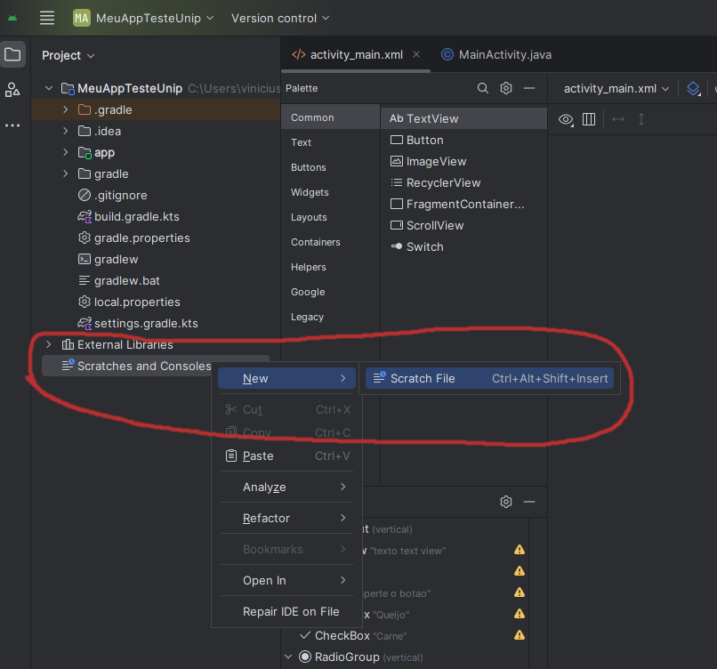
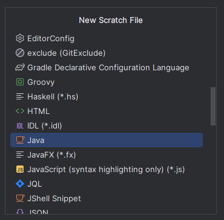

# Um pequeno programa em Java

Vamos fazer um pequeno programa em Java para conhecer alguns conceitos básicos que vamos precisar, como variáveis, tipos, uso de métodos e valores.

Crie um rascunho (*scratch*) no Android Studio, este ambiente de rascunho é independente de projeto e serve para testar algumas funcionalidades.

Clique com o botão direito em *scratches and consoles*



As opções estarão em ordem alfabética, selecione Java.



Será criado um arquivo com uma classe e um método `main`.

Agora vamos colocar um código dentro do `main`

```java
class Scratch {
    public static void main(String[] args) {
        /*
         * TODO CÓDIGO DEVE SER COLOCADO AQUI
         */
    }
}
```

Para programar usaremos a seguinte ordem:
1. Primeiro criaremos 3 variáveis do tipo inteira, isso quer dizer que estas variáveis só podem ter um valor de um número inteiro.
1. Depois colocaremos valores nas variáveis `a` e `b`
1. Depois vamos operar as variáveis e guardar o valor em `c`
1. Em seguida vamos mostrar o resultado na tela para o usuário.

```java
class Scratch {
    public static void main(String[] args) {
        // Aqui estamos definindo as variaveis
        // devemos colocar o tipo (int) e o nome da variavel
        int a;
        int b;
        int c;

        // aqui estamos colocando um valor para as variaveis a e b
        a = 2;
        b = 3;

        // estamos fazendo uma operacao matematica e guardando este valor em c
        c = a+b;

        // aquio estamos imprimindo esta variavel na tela do usuario
        System.out.println(c);

    }
}
```

Execute o programa clicando na seta verde ao lado esquerdo da `main` para ver o resultado.


### Mais um programa em Java

Java é uma linguagem orientada a objetos, isto quer dizer que cada elemento criado tem **muitas funcionalidades**.

Estes elementos criados chamamos de **objetos**.

Neste próximo exemplo vamos criar algumas `String` e veremos algumas funcionalidades.

`String` são objetos que representam palavras ou qualquer cadeia de characteres alinhados. Criamos uma `String` colocando aspas duplas em volta de uma cadeia de characteres.

Por exemplo `"casa"` é uma `String`. 
`"a minha casa"` é uma `String`. 
`"n#n s3n$3!"` é uma `String`. 
E **Atenção** `"3"` é uma `String` e não o número inteiro `3`.

Agora crie outro arquivos de rascunho e vamos usar algumas funcionalidades de `String`.

Para programar usaremos a seguinte ordem:
1. Primeiro criaremos 3 variáveis para guardar os valores das `String`
1. Depois colocaremos valores nas variáveis
1. Depois vamos operar as variáveis concatenando o valor de `nome` com `sobrenome`
1. Em seguida vamos mostrar o resultado
1. Depois vamos usar uma funcionalidade de `String` que é o método `toUpperCase`, este método retorna o mesmo valor da `String` mas transformando tudo em letra maiúscula.
1. Em seguida vamos mostrar o tamanho da `String nome` usando o método `lenght` que retorna um inteiro.


```java
class Scratch {
    public static void main(String[] args) {
        // vamos definir 3 variaveis do tipo String
        String nome;
        String sobrenome;
        String nomeInteiro;

        // Vamos dar um valor para estas variaveis
        nome = "vinicius";
        sobrenome = "pereira";
        nomeInteiro = nome + sobrenome;

        // vamos imprimir o resultado
        System.out.println(nomeInteiro);

        // vamos usar uma funcionalidade da String: transformar para letra maiuscula
        String nomeLetraMaiuscula = nome.toUpperCase();
        System.out.println(nomeLetraMaiuscula);

        // vamos ver o tamanho do nome
        int tamanho = nome.length();
        System.out.println(tamanho);

    }
}
```

