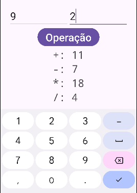

# Um Programa com Operações Matemáticas

Já vimos que `Java` tem tipos diferentes de variáveis e objetos. 

Por exemplo, se fizermos a conta `2+3` teremos resultado `5`. Mas se fizermos a conta `"2"+"3"` teremos resultado `"23"`.

Por que isso acontece? Porque `2` é o valor do tipo `int` (número inteiro) `2`, que se somado com `3` teremos `5`. 

Mas `"2"` é uma variável do tipo `String` que se somarmos com `"3"` ele irá **concatenar** as duas **palavras** resultado na **palavra** `"23"`. Assim como `"Hello" + "World"` resultará em `"HelloWorld"`.

Então para fazermos operações matemáticas com a entrada do usuário, que sempre será uma `String`, precisamos aprender a transformar uma `String` em um `int`. O nome desta transformação é ***parse***.

## O Programa

Vamos fazer um programa que recebe dois números e exibe a soma, subtração, multiplicação e a divisão.

### A parte do `xml`

Para a parte do `xml` copie o código abaixo.

```xml
<?xml version="1.0" encoding="utf-8"?>
<LinearLayout
    xmlns:android="http://schemas.android.com/apk/res/android"
    android:layout_width="match_parent"
    android:layout_height="match_parent"
    android:orientation="vertical"
    android:padding="16dp"
    android:gravity="center"
    >

    <LinearLayout
        android:layout_width="wrap_content"
        android:layout_height="wrap_content"
        android:orientation="horizontal"
        >

        <EditText
            android:id="@+id/numero1"
            android:layout_width="180dp"
            android:layout_height="64dp"
            android:hint="Numero 1"
            android:textSize="32dp"
            android:inputType="number"
            />
        <EditText
            android:id="@+id/numero2"
            android:layout_width="180dp"
            android:layout_height="64dp"
            android:hint="Numero 2"
            android:textSize="32dp"
            android:inputType="number"
            />
    </LinearLayout>

    <Button
        android:id="@+id/botao"
        android:layout_width="wrap_content"
        android:layout_height="wrap_content"
        android:text="Operação"
        android:textSize="32dp"
        />

    <TableLayout
        android:layout_width="wrap_content"
        android:layout_height="wrap_content"
        android:orientation="vertical"
        >

        <TableRow>
            <TextView
                android:layout_width="wrap_content"
                android:layout_height="wrap_content"
                android:text="+: "
                android:textSize="32dp"
                android:fontFamily="monospace"
                />

            <TextView
                android:id="@+id/saidaSoma"
                android:layout_width="wrap_content"
                android:layout_height="wrap_content"
                android:text="Soma"
                android:textSize="32dp"
                android:fontFamily="monospace"
                />

        </TableRow>


        <TableRow>
            <TextView
                android:layout_width="wrap_content"
                android:layout_height="wrap_content"
                android:text="-: "
                android:textSize="32dp"
                android:fontFamily="monospace"
                />

            <TextView
                android:id="@+id/saidaSub"
                android:layout_width="wrap_content"
                android:layout_height="wrap_content"
                android:text="Subtração"
                android:textSize="32dp"
                android:fontFamily="monospace"
                />

        </TableRow>


        <TableRow>
            <TextView
                android:layout_width="wrap_content"
                android:layout_height="wrap_content"
                android:text="*: "
                android:textSize="32dp"
                android:fontFamily="monospace"
                />

            <TextView
                android:id="@+id/saidaMulti"
                android:layout_width="wrap_content"
                android:layout_height="wrap_content"
                android:text="Multiplicação"
                android:textSize="32dp"
                android:fontFamily="monospace"
                />

        </TableRow>


        <TableRow>
            <TextView
                android:layout_width="wrap_content"
                android:layout_height="wrap_content"
                android:text="/: "
                android:textSize="32dp"
                android:fontFamily="monospace"
                />

            <TextView
                android:id="@+id/saidaDiv"
                android:layout_width="wrap_content"
                android:layout_height="wrap_content"
                android:text="Divisão"
                android:textSize="32dp"
                android:fontFamily="monospace"
                />

        </TableRow>


    </TableLayout>


</LinearLayout>

```


#### Novidades do Código

Temos novidades neste código `xml`:

##### Tipo de teclado na entrada
Nos elementos `EditText` que recebem números, colocamos o parâmetro `android:inputType="number"`, que usa um teclado numérico quando o usuário for colocar a entrada.


##### Table Layout
Para organizar a saída, e deixar tudo alinhado, usamos o layout `TableLayout`, e em cada linha deste layout usamos `TableRow`


##### Estilo do texto para números
Para ficar ainda mais alinhado, incluímos o parâmetro `android:fontFamily="monospace"` nos textos de saída para deixar os números da saída com a fonte *monospace*. Esta fonte deixa todos os characteres com a mesma largura, e ajuda o texto da linha de uma tabela a ficar alinhado com as outras linhas.


### A parte do `java`

Quase tudo no código `java` já vimos em aulas anteriores:

```java
package com.viniciusdenovaes.meuapptesteunip;

import android.os.Bundle;
import android.widget.Button;
import android.widget.EditText;
import android.widget.TextView;

import androidx.activity.EdgeToEdge;
import androidx.appcompat.app.AppCompatActivity;

public class MainActivity extends AppCompatActivity {

    /*
    * Aqui teremos a definicao das variaveis
    * */

    EditText inNum1;
    EditText inNum2;
    Button botao;
    TextView outSom;
    TextView outSub;
    TextView outMul;
    TextView outDiv;

    @Override
    protected void onCreate(Bundle savedInstanceState) {
        super.onCreate(savedInstanceState);
        EdgeToEdge.enable(this);
        setContentView(R.layout.activity_main);

        /*
        * Aqui teremos os valores de cada variavel
        * */

        inNum1 = findViewById(R.id.numero1);
        inNum2 = findViewById(R.id.numero2);
        botao = findViewById(R.id.botao);
        outSom = findViewById(R.id.saidaSoma);
        outSub = findViewById(R.id.saidaSub);
        outMul = findViewById(R.id.saidaMulti);
        outDiv = findViewById(R.id.saidaDiv);

        /*
        * Aqui teremos as funcionalidades
        * */

        botao.setOnClickListener(view -> {
            String textoN1 = inNum1.getText().toString();
            String textoN2 = inNum2.getText().toString();

            // transformamos o text em um numero inteiro
            Integer numero1 = Integer.parseInt(textoN1);
            Integer numero2 = Integer.parseInt(textoN2);

            // fazemos as operacoes com numeros
            Integer resSom = numero1 + numero2;
            Integer resSub = numero1 - numero2;
            Integer resMul = numero1 * numero2;
            Integer resDiv = numero1 / numero2;

            // fazemos a operacao de volta para transformar o numero em string
            String texSom = resSom.toString();
            String texSub = resSub.toString();
            String texMul = resMul.toString();
            String texDiv = resDiv.toString();

            outSom.setText(texSom);
            outSub.setText(texSub);
            outMul.setText(texMul);
            outDiv.setText(texDiv);
        });


    }
}


```

#### Novidades do Código `java`

Temos novidades neste código `java`:

##### Transformação de `String` em `Integer`
Usamos o comando `Integer numero1 = Integer.parseInt(textoN1);` para transformar o texto da entrada em um número.

##### Transformação de `Integer` em `String`
Usamos o comando `String texSom = resSom.toString();` para transformar o resultado da operação em um texto.

##### Usamos `Integer` ao invés de `int`
Podemos usar `int` ou `Integer` para usar números inteiros. Aqui usamos `Integer` para usar o método `toString()` que ele fornece. Este método transforma um número em `String`.

#### Resultado

Abaixo podemos ver o resultado em operar dois números inteiros



##### O Que Está Errado?

Você percebeu que a divisão de `9` por `2` deu resultado `4`? Isto acontece por que quando operamos um número inteiro por outro inteiro o resultado deve ser um inteiro! Isto faz com que a parte decimal do resultado `9/2=4.5` foi jogada fora.

Para consertar isto precisamos usar um número real no lugar de um número inteiro.

Faremos isso no próximo tutorial...

