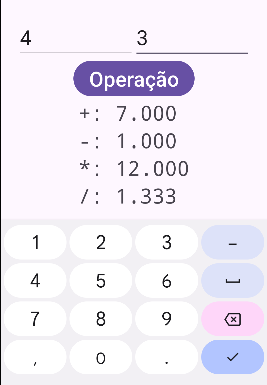

# Um Programa com Operações Matemáticas Usando Double

No tutorial passado fizemos um programa que usa `Integer` para fazer operações matemáticas. 

Vimos que isto não basta para algumas operações, precisamos usar números reais com uma parte decimal para algumas operações.

Neste tutorial vamos fazer **o mesmo programa**, mas desta vez usaremos número decimais.


## O Programa

Vamos fazer um programa que recebe dois números reais e exibe a soma, subtração, multiplicação e a divisão.

### A parte do `xml`

Para a parte do `xml` vamos usar o `xml` da aula anterior, apenas mudar o tipo de entrada de `number` para `numberDecimal`. Outros tipos de entrada podems ser visto [aqui](https://developer.android.com/reference/android/widget/TextView#attr_android:inputType)

```xml
<?xml version="1.0" encoding="utf-8"?>
<LinearLayout
    xmlns:android="http://schemas.android.com/apk/res/android"
    android:layout_width="match_parent"
    android:layout_height="match_parent"
    android:orientation="vertical"
    android:padding="16dp"
    android:gravity="center"
    >

    <LinearLayout
        android:layout_width="wrap_content"
        android:layout_height="wrap_content"
        android:orientation="horizontal"
        >

        <EditText
            android:id="@+id/numero1"
            android:layout_width="180dp"
            android:layout_height="64dp"
            android:hint="Numero 1"
            android:textSize="32dp"
            android:inputType="numberDecimal"
            />
        <EditText
            android:id="@+id/numero2"
            android:layout_width="180dp"
            android:layout_height="64dp"
            android:hint="Numero 2"
            android:textSize="32dp"
            android:inputType="numberDecimal"
            />
    </LinearLayout>

    <Button
        android:id="@+id/botao"
        android:layout_width="wrap_content"
        android:layout_height="wrap_content"
        android:text="Operação"
        android:textSize="32dp"
        />

    <TableLayout
        android:layout_width="wrap_content"
        android:layout_height="wrap_content"
        android:orientation="vertical"
        >

        <TableRow>
            <TextView
                android:layout_width="wrap_content"
                android:layout_height="wrap_content"
                android:text="+: "
                android:textSize="32dp"
                android:fontFamily="monospace"
                />

            <TextView
                android:id="@+id/saidaSoma"
                android:layout_width="wrap_content"
                android:layout_height="wrap_content"
                android:text="Soma"
                android:textSize="32dp"
                android:fontFamily="monospace"
                />

        </TableRow>


        <TableRow>
            <TextView
                android:layout_width="wrap_content"
                android:layout_height="wrap_content"
                android:text="-: "
                android:textSize="32dp"
                android:fontFamily="monospace"
                />

            <TextView
                android:id="@+id/saidaSub"
                android:layout_width="wrap_content"
                android:layout_height="wrap_content"
                android:text="Subtração"
                android:textSize="32dp"
                android:fontFamily="monospace"
                />

        </TableRow>


        <TableRow>
            <TextView
                android:layout_width="wrap_content"
                android:layout_height="wrap_content"
                android:text="*: "
                android:textSize="32dp"
                android:fontFamily="monospace"
                />

            <TextView
                android:id="@+id/saidaMulti"
                android:layout_width="wrap_content"
                android:layout_height="wrap_content"
                android:text="Multiplicação"
                android:textSize="32dp"
                android:fontFamily="monospace"
                />

        </TableRow>


        <TableRow>
            <TextView
                android:layout_width="wrap_content"
                android:layout_height="wrap_content"
                android:text="/: "
                android:textSize="32dp"
                android:fontFamily="monospace"
                />

            <TextView
                android:id="@+id/saidaDiv"
                android:layout_width="wrap_content"
                android:layout_height="wrap_content"
                android:text="Divisão"
                android:textSize="32dp"
                android:fontFamily="monospace"
                />

        </TableRow>


    </TableLayout>


</LinearLayout>

```


### A parte do `java`

A diferença entre este código e o anterior é que agora vamos operar números do tipo `Double`

```java
package com.viniciusdenovaes.meuapptesteunip;

import android.os.Bundle;
import android.widget.Button;
import android.widget.EditText;
import android.widget.TextView;

import androidx.activity.EdgeToEdge;
import androidx.appcompat.app.AppCompatActivity;

public class MainActivity extends AppCompatActivity {

    /*
    * Aqui teremos a definicao das variaveis
    * */

    EditText inNum1;
    EditText inNum2;
    Button botao;
    TextView outSom;
    TextView outSub;
    TextView outMul;
    TextView outDiv;

    @Override
    protected void onCreate(Bundle savedInstanceState) {
        super.onCreate(savedInstanceState);
        EdgeToEdge.enable(this);
        setContentView(R.layout.activity_main);

        /*
        * Aqui teremos os valores de cada variavel
        * */

        inNum1 = findViewById(R.id.numero1);
        inNum2 = findViewById(R.id.numero2);
        botao = findViewById(R.id.botao);
        outSom = findViewById(R.id.saidaSoma);
        outSub = findViewById(R.id.saidaSub);
        outMul = findViewById(R.id.saidaMulti);
        outDiv = findViewById(R.id.saidaDiv);

        /*
        * Aqui teremos as funcionalidades
        * */

        botao.setOnClickListener(view -> {
            String textoN1 = inNum1.getText().toString();
            String textoN2 = inNum2.getText().toString();

            // transformamos o text em um numero Double
            Double numero1 = Double.parseDouble(textoN1);
            Double numero2 = Double.parseDouble(textoN2);

            // fazemos as operacoes com numeros
            Double resSom = numero1 + numero2;
            Double resSub = numero1 - numero2;
            Double resMul = numero1 * numero2;
            Double resDiv = numero1 / numero2;

            // fazemos a operacao de volta para transformar o numero em string
            // desta vez com 3 casas decimais
            String texSom = String.format("%.3f", resSom);
            String texSub = String.format("%.3f", resSub);
            String texMul = String.format("%.3f", resMul);
            String texDiv = String.format("%.3f", resDiv);

            outSom.setText(texSom);
            outSub.setText(texSub);
            outMul.setText(texMul);
            outDiv.setText(texDiv);
        });


    }
}


```

#### Novidades do Código `java`

Temos novidades neste código `java`:

##### Transformação de `Double` em `String`
Usamos o comando `String texSom = String.format("%.3f", resSom);` para transformar o resultado da operação em um texto, o formato `"%.3f"` especifica que deve ser usado apenas 3 casas decimais depois do `.`.

#### Resultado

Abaixo podemos ver o resultado em operar dois números inteiros



Agora podemos ver que o resultado está correto até certa casa decimal especificada.

