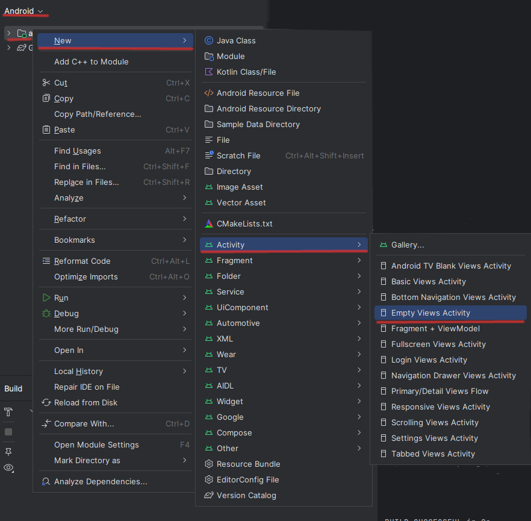

# Atividades, Intentos e o *Android Manifest*

Cada tela do seu aplicativo será uma atividade.

O ideal é que cada tela será focada em uma única coisa que o usuário pode fazer.

## `Activity`, como criar uma nova atividade

O jeito mais fácil de criar uma atividade nova é clicar com o botão direito do mouse em `app->New->Activity->Empty Views Activity`



Isto criará dois arquivos no seu projeto: 
- `NomeDaAtividadeActivity.java` com o código `java` da nova tela; e 
- `activity_nome_da_atividade.xml` com o `xml` da nova tela.

Além disso teremos uma nova entrada no `AndroidManifest.xml` com o nome da atividade.

## `Intent`, como ir para a nova tela

Com a nova atividade criada precisaremos criar um `Intent` sinalizando que queremos mudar desta tela para a nova tela.

Após a criação do `Intent` precisamos executar o intento com o método `startActivity` passando o intento como argumento.

Um código minimalista com um botão que passa para a tela nova, chamada `EmptyActivity` ficará da seguinte forma:

```java
public class MainActivity extends AppCompatActivity {

    Button button;

    @Override
    protected void onCreate(Bundle savedInstanceState) {
        super.onCreate(savedInstanceState);
        setContentView(R.layout.activity_main);

        button = findViewById(R.id.main_button);
        button.setOnClickListener(view -> {
            Intent emptyViewIntent = new Intent(MainActivity.this, EmptyActivity.class);
            startActivity(emptyViewIntent);

        });

    }
}
```

Na linha `Intent emptyViewIntent = new Intent(MainActivity.this, EmptyActivity.class);` estamos sinalizando a intenção de sair da tela `MainActivity` e entrar na tela `EmptyActivity`

Na linha `startActivity(emptyViewIntent);` estamos executando o `Intent emptyViewIntent` 

## Uma configuração do `AndroidManifest.xml`

No arquivo `AndroidManifest.xml` podemos configurar qual é a atividade de volta em relação à nova atividade.

Encontre a entrada da nova atividade em `AndroidManifest.xml` com a tag `activity`, coloque o valor da propriedade `parentActivityName` como `MainActivity`.

Olhe o exemplo abaixo:

```xml
<activity
    android:name=".EmptyActivity"
    android:parentActivityName=".MainActivity"
    />
```

Desta forma, quando o usuário estiver na tela `Empty` e clicar em voltar, ele será direcionado para a tela `Main`


