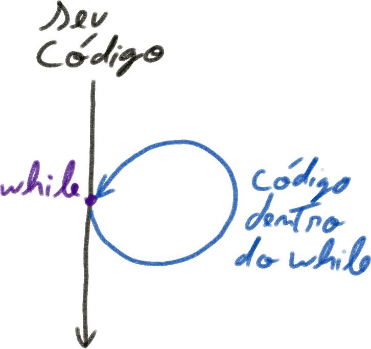

# Comandos de Repetição

Um outro comando importante para controlar o fluxo do código é o comando de repetição.

Em C temos os comandos `while`e `for`. Os dois fazem a mesma ação, mas com a sintaxe (a forma de escrever) de cada um é diferente.

O que eles fazem é **repetir um bloco de código enquanto uma condição for verdadeira**.




* `while`: a `condicao` (uma expressão booleana que pode ter valor verdadeiro ou falso) é verificada. Caso seja verdadeira o `//bloco de comandos 01` é executado e o controle **volta** para o começo do while (e faz a verificação novamente). Caso não seja, o bloco não será executado.
``` c
while(condicao){
  // bloco de comandos 01
  // este bloco se repete enquanto a condicao for satisfeita
}
```


* `do while`: a `condicao` o bloco de comando é executado e **depois** a condição é verificada. Caso seja verdadeira o controle **volta** para o começo do while (e faz a verificação **no final** novamente). Caso não seja, o controle não volta.

OBS1: a única diferença entre o `do-while` e o `while` é que no primeiro você pode ter certeza de que o bloco será executado na primeira vez, mesmo que a condição seja falsa.

OBS2: perceba que tem um `;` no final do while.

``` c
do{
  // bloco de comandos 01
  // este bloco executa uma vez e
  // se repete enquanto a condicao for satisfeita
}while(condicao);
```


* `for`: é **inicializado** com um `comandoInicializacao`; repete enquanto a `condição` for verdadeira; sempre ao final de cada iteração um `comandoRepeticao` é executado.

``` java
for(comandoInicializacao; condicao; comandoRepeticao){
  // bloco de comandos 01
  // este bloco se repete enquanto a condicao for satisfeita
  // ao final o comandoRepeticao é executado
}
```

exemplo:

``` java
for(int i=0; i<5; i++){
  printf("%d\n", i);
}
```
saída:
```
0
1
2
3
4
```
