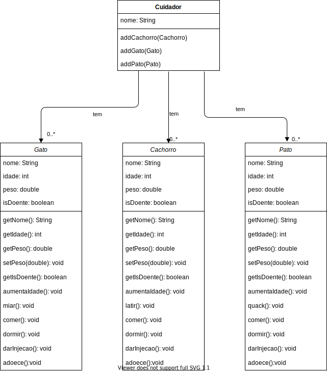

# Lab 02.02 - Classes e Encapsulamento (Continuação)

Para cada exercício, todas as classes devem ser feitas e **testadas** no mesmo projeto. Para cada classe, crie uma classe separada para testar a sua classe.

Vamos usar encapsulamento, então todo atributo deve ser `private` e, se precisar, ter um `get` e/ou `set`.

### Exercicio 01

Fazer uma classe, **que respeite as convenções de encapsulamento** que representa um `Carro`, que seja composta por
* `dono`: o dono do carro que é uma `private Pessoa`
* `modelo`: o modelo do carro, que é `private Modelo`
* `tanque`: a quantidade de gasolina que o carro tem, que é um `private TanqueDeGasolina`
* `private double distanciaPorLitro`: a distância que o carro faz por cada litro de gasolina
* A kilometragem do carro.
* O constructor `public Carro(Modelo umModelo, double umDistanciaPorLitro, double limiteGasolina)`
* os métodos de acesso
  * get (para acessar dados do objeto)
    * `public Pessoa getDono()`
    * `public Modelo getModelo()`
    * `public Tanque getTanque()`
    * `public double getDistanciaPorLitro()`
    * `public double getLimiteGasolina()`
    * `public double getKilometragem()`
  * set (para modificar dados do objeto)
    * `public void setDono(Pessoa umDono)`
    * Sim! Somente este, um carro não deve mudar o `Modelo` nem `distanciaPorLitro`, a quantidade de gasolina será modificada por outro método
* o método `public double addGasolina(double gasolina)` que abastece o tanque, sem nunca passar do máximo, e retorna o quanto foi abastecido.
* o método `public double anda(double kilometros)` que gasta a gasolina do carro e retorna quantos kilometros o carro se deslocou, atualizando a quantidade de gasolina que tem no carro, sem andar mais do que a gasolina permite, e atualizando a kilometragem.

`Pessoa`:
* `nome`: que é uma `String`
* `ssobrenome`: que é uma `String`
* constructor
* `get` dos atributos

`Modelo`:
* `nome`: que é uma `String`
* `ano`: que é um `int`
* constructor
* `get` dos atributos

`TanqueDeGasolina`:
* `quantidadeGasolina`: a quantidade de gasolina que tem no tanque, um `double`
* `limiteGasolina`: a quantidade máxima que o tanque pode ter, `double`
* constructor que recebe o limite máximo de gasolina e inicializa a quantidade de gasolina para 0
* `get` dos atributos
* um método para aumentar a gasolina sem passar do máximo e retorna o quanto de gasolina foi possível aumentar
* um método para gastar a gasolina sem passar de 0 e retorna o quanto de gasolina foi possível gastar

Fazer uma classe `Posto` que vai abastecer o carro
* um método estático `abastecerCarro(Carro carro, double qtdGas)` que recebe um `Carro` e quantidade de gasolina para abastecer este carro.

Fazer uma classe `Cartorio` que vai trocar o dono do carro
* um método estático `mudaDonoCarro(Carro carro, Pessoa novoDono)` que recebe um `Carro` e um `novoDono` e muda o `dono` do `carro`.

Fazer o `TesteCarro` que testa todas os métodos do carro e imprime um relatório após cada um deles.


### Exercício 02

Neste exercício você irá fazer um programa que simula uma uma clínica veterinária.



**IMPORTANTE**: Para cada classe que você fizer, **teste!** antes de continuar. Trate cada classe como se fosse um exercício separado. Teste em um arquivo separado

Um `Cachorro` deve ter
* `nome`
* `idade`
* `peso`
* e uma variável `boolean` que indica se este animal está doente
* Um cachorro não pode ser criado sem um `nome`, `idade` e `peso`, e ele deve sempre ser criado saudável.
* Deve ser possível acessar `nome`, `idade`, `peso` e `isDoente`
* Deve ser possível setar o valor do `peso`.
* O método `aumentaIdade()` deve aumentar a idade em um ano
* O método `latir()` deve
  * escrever `au au au` na tela, se o `peso` for menor que 4
  * escrever `AU AU AU` se o peso for maior ou igual a 4, e a idade for menor ou igual a 10.
  * escrever `ROOF ROOF ROOF` se o peso for maior ou igual a 4 e a idade for maior que 10.
* O método `dormir` deve escrever na tela `foi dormir no sofá`
* O método `comer` deve escrever na tela `comendo ração de cachorro`
* O método `darInjecao` deve setar a variável `isDoente` para `false`
* O método `adoece` deve setar a variável `isDoente` para `true`

O `Gato` deve ser igual ao cachorro, com algumas diferenças:
* O método `miar()` deve escrever `miaaauu` na tela
* O método `dormir` deve escrever na tela `foi dormir no alto`
* O método `comer` deve escrever na tela `comendo ração de gato`

O `Pato` deve ser igual ao cachorro, com algumas diferenças:
* O método `quack()` deve escrever `quaaack quaack` na tela
* O método `dormir` deve escrever na tela `foi dormir no quintal`
* O método `comer` deve escrever na tela `comendo o que o pato come`

Crie uma classe `Veterinaria` para cuidar do `Cachorro`, `Gato` e `Pato`, um método estático para cada, que siga o seguinte exemplo:

``` java
public class Veterinaria {

  public static void cuidaDoCachorro(Cachorro cachorro) {
		System.out.println("Recebendo " + cachorro.getNome());
		if(!cachorro.getIsDoente()) {
			System.out.println("O cachorro está saudável");
			System.out.println("...");
			return;
		}

		System.out.println("Dando injeção para o animalzinho");
		cachorro.darInjecao();
		cachorro.latir();
		cachorro.comer();
		cachorro.dormir();
		System.out.println("saindo do veterinario");
		System.out.println("...");
	}

}
```
Faça a classe `Cuidador`, esta classe deve ter:
* um `nome` que deve ser uma `String`
* uma `Collection` de `cachorros`, `gatos` e `patos`
* um método para adicionar `Cachorro`, `Gato` e `Pato` em suas coleções.

Crie classes separadas para testar cada uma das suas classes, por exemplo:

``` java
public class TestaVeterinaria {

	public static void main(String[] args) {
		Cachorro cachorro01 = new Cachorro("Brutus", 12, 5.0);
		Veterinaria.cuidaDoCachorro(cachorro01);

		cachorro01.adoece();
		Veterinaria.cuidaDoCachorro(cachorro01);
	}

}

```

Crie a `TestaCuidador`, `TestaCachorro`, `TestaGato`, `TestaPato`.


### Exercício 03

Neste exercício você irá fazer o cadastro de um aluno, e seu histórico escolar com notas em cada matéria.

Cada aluno tem os seguintes dados:
* `id` que pode ter números e letras
* `nome` que é uma String.
* `historico` que é composto por uma lista de `rendimentos`
* um aluno não pode ser criado sem que tenha `id` e `nome`

Um `rendimento` é composto por uma `materia` e suas `notas`

Uma `materia` tem
* o `nome` da matéria
* o `ano` que ela foi lecionada

E as `notas` são compostos por três valores:
* `np1`
* `np2`
* `exame`

Cada rendimento deverá ter o método `public boolean getAprovacao` que responde se o aluno passou naquela matéria. A regra para um aluno ser aprovado é
* se a média da `np1` com a `np2` for maior que 7, o aluno será aprovado
* caso contrário,
  * vamos chamar a média da `np1` com a `np2` de `m`, se a média de `m` com `exame` for maior que 5, o aluno será aprovado
  * caso contrário, o aluno será reprovado.


Cada aluno deverá ter um método chamado `fazRelatorio` que imprime na tela os dados de um aluno, as matérias que ele cursou e a nota e situação de cada matéria.

## [Respostas](https://github.com/viniciusdenovaes/JavaCourseUnip/tree/main/Lab02_02/src)

.
