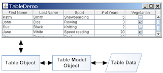
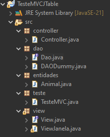

# JTable e o Model-View-Controller (MVC)

Em um programa normalmente é esperado que o usuário tenha acesso a uma quantidade indefinida de informação.

Pense no app iFood por exemplo, onde o usuário tem acesso a uma lista de restaurantes e pratos. 

Ou em uma busca do sistema de uma livraria, onde o usuário tem acesso a uma tabela de livros, cada um com informações como editora, autores e preço.

Nesta aula vamos aprender a fazer uma tabela em Java:
- Preencher a tabela com resultado de uma busca; 
- Configurar o que será mostrado na tabela;
- Escolher um item específico na tabela;
- Estruturar o programa para que se adeque ao padrão MVC.

**Mas antes:** Vamos criar as classes que serão trabalhadas durantes os exemplos práticos da aula

Para os exemplos vamos usar a classe entidade `Animal` com 
- Um id
- Um nome
- Uma idade

```java
public class Animal {
	
	private int id;
	private String nome;
	private int idade;
	
  public Animal(int id, String nome, int idade) {
		this.id = id;
		this.nome = nome;
		this.idade = idade;
	}
	
	public int getId() {return id;}
	public String getNome() {return nome;}
	public int getIdade() {return idade;}
	
	@Override
	public String toString() {return getNome();}
}
```

Para simular um banco de dados vamos usar uma classe chamada `DAODummy` que tem uma lista de animais e retorna o resultado de uma busca.

```java
public class DAODummy {
	List<Animal> animais = new ArrayList<>(Arrays.asList(
			new Animal(0, "Brutus", 15), 
			new Animal(1, "Chirriro", 14), 
			new Animal(2, "Xitara", 13), 
			new Animal(3, "Mili", 12), 
			new Animal(4, "Jade", 11) 
			));
	
	public List<Animal> buscaAnimais(String nome) {
		List<Animal> animaisResult = new ArrayList<>();
		for(Animal a: animais)
			if(a.getNome().toLowerCase().contains(nome.toLowerCase()))
				animaisResult.add(a);
		
		return animaisResult;
	}
}
```

Definidas estas classes auxiliares, vamos ver como criar uma tabela.

## JTable[^1]

[^1]: O tutorial oficial de JTable pode ser visto no seguinte [link](https://docs.oracle.com/javase/tutorial/uiswing/components/table.html)




Para fazer uma tabela em Java precisamos de, no mínimo, 3 elementos:
- Um `TableModel` que contem os **dados da tabela**.
- Um `JTable` que é o objeto tabela, e onde podemos configurar o jeito que os dados aparecem.
- Um `JScrollPane` que é um painel, com um *scroll* para conter a tabela.

#### O TableModel default, os Dados e a Tabela

Para criar um `TableModel` completo você precisaria extender de `AbstractTableModel`. Para este exemplo simples vamos usar um table model pronto chamado `DefaultTableModel`.

Para criar um `DefaultTableModel` basta passar os nomes das colunas e a quantidade de linhas iniciais (no caso serão 0).

Então teremos o seguinte bloco de código para criar uma tabela dentro de um panel:
```java
String[] nomesColunas = {"Nome", "Idade"};
DefaultTableModel dtm = new DefaultTableModel(nomesColunas, 0);

JTable table = new JTable(dtm);
JScrollPane sp = new JScrollPane(table);
```
Explicação:
- Criamos um array com o nome das colunas
- um `DefaultTableModel` com o nome das colunas e 0 linhas.
- um `JTable` que usará o `DefaultTableModel`
- um `JScrollPane` que terá apenas o `JTable` dentro dele.

#### Populando a tabela

Vamos ver como colocar informações dentro da tabela:
```java
void preencheTabela(List<Animal> animais) {
	dtm.setRowCount(0);
	for(Animal a: animais) {
		Object[] row = new Object[2];
		row[0] = a.getNome();
		row[1] = a.getIdade();
		dtm.addRow(row);
	}
}
```
Sempre que vamos mexer nos dados da tabela, devemos mexer no `TableModel dtm`.

- Primeiro esvaziamos a tabela com `dtm.setRowCount(0);`.
- depois iteramos na lista de animais e, para cada animal:
   - criamos uma linha de dados, que deve ser um array de objetos `Object[] row = new Object[2];`
   - preenchemos o array com os dados:
      - `row[0] = a.getNome();`
      - `row[1] = a.getIdade();`
   - Finalmente adicionamos a o array de dados na tabela com `dtm.addRow(row);`

## Montando um Exemplo Completo

O seguinte código irá montar um exemplo completo do que foi aprendido até agora:

```java
public class TestandoJTable extends JFrame{
	
	String[] nomesColunas = {"Nome", "Idade"};
	DefaultTableModel dtm = new DefaultTableModel(nomesColunas, 0);
	
	JTable table = new JTable(dtm);
	JScrollPane sp = new JScrollPane(table);
	
	JTextField buscaField = new JTextField(20);
	
	DAODummy dao = new DAODummy();
	
	public TestandoJTable() {
		
		setLayout(new BoxLayout(this.getContentPane(), BoxLayout.PAGE_AXIS));
		
		add(buscaField);
		
		JButton buscaButton = new JButton("Buscar");
		add(buscaButton);
		
		sp.setPreferredSize(new Dimension(400, 400));
		add(sp);
		
		AcaoBusca ab = new AcaoBusca();
		buscaButton.addActionListener(ab);
		buscaField.addActionListener(ab);
		
		setDefaultCloseOperation(JFrame.EXIT_ON_CLOSE);
		pack();
		setVisible(true);
		
	}
	
	void preencheTabela(List<Animal> animais) {
		dtm.setRowCount(0);
		for(Animal a: animais) {
			Object[] row = new Object[2];
			row[0] = a.getNome();
			row[1] = a.getIdade();
			
			dtm.addRow(row);
		}
	}
	
	public static void main(String[] args) {
		new TestandoJTable();
	}
	
	class AcaoBusca implements ActionListener{

		@Override
		public void actionPerformed(ActionEvent e) {
			String keyword = buscaField.getText();
			List<Animal> animais = dao.buscaAnimais(keyword);
			preencheTabela(animais);
			
		}
		
	}
	
}
```

#### Consertando a Tabela Editável

Se você reparar o exemplo anterior, cada célula na tabela pode ser editável, vamos aprender a desligar este recurso. 
Perceba que essa edição não muda o estado do objeto original.

Infelizmente não basta mudar a configuração na `JTable`, precisamos criar uma classe filha da `JTable` e fazer `@Override` do método `public boolean isCellEditable(int row, int column)`.

O bom é que podemos fazer isso na mesma linha que criamos a `JTable`. Mas, ao invés de criar a `JTable`, vamos criar uma classe anônima filha:
```java
JTable table = new JTable(dtm) {
	@Override public boolean isCellEditable(int row, int column) {
		return false;
	}
};
```

#### Selecionando um Animal da Tabela

Podemos selecionar uma linha na tabela usando o mouse, mas como pegar essa informação e passar para o código?

- Pegamos a linha selecionada na tabela usando `int rowIndex = table.getSelectedRow();`
- Pegamos a informação em uma dada linha e coluna usando `dtm.getValueAt(rowIndex, colIndex)`

Então se quisermos pegar o nome do animal da linha selecionada podemos usar 
```java
String selecionaLinha() {
	int rowIndex = table.getSelectedRow();
	String nome = dtm.getValueAt(rowIndex, 0).toString();
	return nome;
}
```

##### Pegando o objeto `Animal` da Linha

Podemos fazer ainda melhor e pegar o objeto da linha.

Temos que consertar um detalhe: não guardamos nenhum objeto na linha, apenas os dados do objeto. Mais ainda, não guardamos nem todos os dados do objeto (faltou o id).

Como resolver isso?

Perceba que o `toString` da classe `Animal` é apenas o nome do animal. 

Isso tem um propósito: podemos guardar o objeto na coluna de nomes! 

Assim, quando o objeto for mostrado na tabela, só seu nome será mostrado; mas quando for acessado, o objeto inteiro será acessado!

Então vamos reescrever a função de preencher a tabela para guardar o objeto na coluna nomes: 

```java
void preencheTabela(List<Animal> animais) {
	dtm.setRowCount(0);
	for(Animal a: animais) {
		Object[] row = new Object[2];
		row[0] = a; // Soh precisou mudar essa linha!!!
		row[1] = a.getIdade();
		dtm.addRow(row);
	}
}
```

Agora para recuperar o objeto podemos simplesmente fazer
```java
Animal selecionaLinha() {
	int rowIndex = table.getSelectedRow();
	Animal animal = (Animal)dtm.getValueAt(rowIndex, 0);
	return animal;
}
```

#### Testando a Seleção de Linha

Vamos fazer modificar o programa anterior para que, quando clicado com duplo clique, apareça uma mensagem dizendo qual objeto foi selecionado.

```java

public class TestandoJTable extends JFrame{
	
	String[] nomesColunas = {"Nome", "Idade"};
	DefaultTableModel dtm = new DefaultTableModel(nomesColunas, 0);
	
	JTable table = new JTable(dtm) {
		@Override public boolean isCellEditable(int row, int column) {return false;}
	};
	JScrollPane sp = new JScrollPane(table);
	
	JTextField buscaField = new JTextField(20);
	
	DAODummy dao = new DAODummy();
	
	public TestandoJTable() {
		
		setLayout(new BoxLayout(this.getContentPane(), BoxLayout.PAGE_AXIS));
		
		add(buscaField);
		
		JButton buscaButton = new JButton("Buscar");
		add(buscaButton);
		
		sp.setPreferredSize(new Dimension(400, 400));
		add(sp);
		
		table.addMouseListener(new AcaoClicaTabela());
		
		AcaoBusca ab = new AcaoBusca();
		buscaButton.addActionListener(ab);
		buscaField.addActionListener(ab);
		
		setDefaultCloseOperation(JFrame.EXIT_ON_CLOSE);
		pack();
		setVisible(true);
		
	}
	
	void preencheTabela(List<Animal> animais) {
		dtm.setRowCount(0);
		for(Animal a: animais) {
			Object[] row = new Object[2];
			row[0] = a;
			row[1] = a.getIdade();
			
			dtm.addRow(row);
		}
	}
	
	Animal selecionaLinha() {
		int rowIndex = table.getSelectedRow();
		Animal animal = (Animal)dtm.getValueAt(rowIndex, 0);
		return animal;
	}
	
	public static void main(String[] args) {
		new TestandoJTable();
	}
	
	class AcaoBusca implements ActionListener{

		@Override
		public void actionPerformed(ActionEvent e) {
			String keyword = buscaField.getText();
			
			List<Animal> animais = dao.buscaAnimais(keyword);
			
			preencheTabela(animais);
			
		}
		
	}
	
	class AcaoClicaTabela extends MouseAdapter{

		@Override
		public void mouseClicked(MouseEvent e) {
			if(e.getClickCount()==2) {
				Animal a = selecionaLinha();
				if(a==null) return;
				String message = 
						"Animal selecionado: " + a.getId() + " - " + a.getNome() + "("+a.getIdade()+")";
				JOptionPane.showMessageDialog(null, message);
			}
		}
	}
	
}
```

**OBS:** Perceba que usamos um `MouseAdapter` ao invés de um `MouseListener`. Os dois são a mesma coisa. A diferença é que no `MouseAdapter` não precisamos fazer Override dos métodos que não queremos usar.

## MVC

Model-View-Controller é um padrão de arquitetura de software usado para implementa uma Interface de Usuário Final.

O objetivo do MVC é separar a lógica em três elementos:

- Model: O estado do programa (por exemplo: banco de dados, resolvedores de problemas matemáticos, etc...)
- View: A tela de interação com o usuário, com janelas, botões, comandos
- Controller: Faz a interação entre o Model e o View:
   - recebe uma requisição do View,
   - traduz esta requisição para o Model,
   - recebe uma resposta do Model,
   - traduz essa resposta para o View

O MVC é usado em várias áreas, em vários tipos de projetos, aqui veremos exemplos de MVC para um projeto em Java.

## MVC para Java

Neste curso faremos projetos usando o padrão MVC. Todos os projetos seguirão o seguinte padrão:

- Uma `interface` `View`, com
   - todas as requisições que o `Controller` poderá fazer para o `View`
   - um `addActionListener` para cada interação que o usuário, indiretamente, poderá fazer com o `Model`
- Uma `interface` `Model`, com todas as requisições que o `Controller` poderá fazer para o `Model`.
- Uma classe concreta `Controller` que
   - receberá uma implementação de `View` e de `Model` em seu `constructor`, porém, **trabalha apenas com as interfaces de `View` e `Model`**.
   - definirá um `ActionListener` para cada interação que o usuário poderá fazer com o `Model`
   - fará a interação do `View` com o `Model`

Os exemplos vistos nas aulas seguirão o seguinte fluxo

 ```dot {engine="dot"}
 digraph MVCExemplo01 {
   Controller -> Model
   View -> Controller
   Controller -> View
 }
 ```
 - O Controller faz requisições para o Model
 - O Controller faz requisições para o View
    - Requisições de dados de entrada do usuário e
    - Requisições para o View mostrar dados para o usuário
 - O View inicia ações definidas pelo Controller (ActionListener)


### Exemplos de Modelos de Projetos

#### Exemplo1: Interação de um usuário com um banco de dados de nomes

Vamos considerar um projeto que guarda nomes de pessoas em um banco de dados, e uma interface de usuário que permite ao usuário fazer uma busca de uma parte do nome, e inserir um nome

Teremos uma `interface View`

```java
interface View {
  // configurações de gatilhos de ações
  public void addAcaoInserirNome(ActionListener acaoInserirNome);
  public void addAcaoBuscarNome(ActionListener acaoBuscarNome);

  // mostrar dados do programa
  public void mostrarNomes(List<String> nomes);

  // requisições de entrada de usuários
  public String getNomeBusca();
  public String getNomeInserir();
}
```


Teremos uma `interface Model`

```java
interface Model {
  // ações para fazer em um banco de dados
  public List<String> buscarNome(String nome);
  public void inserirNome(String nome);
}
```

Teremos uma classe concreta `Controller` programado para as interface `View` e `Model`

```java
class Controller {
  Model model;
  View view;

  public Controller(Model aModel, View aView){
    this.model = aModel;
    this.view = aView;
  }

  public void init(){
    view.addAcaoInserirNome(new AcaoInserirNome());
    view.addAcaoBuscarNome(new AcaoBuscarNome());
  }

  class AcaoBuscarNome implements ActionListener{
    @Override
    public void actionPerformed(ActionEvent e){

      // resuisita as entradas para o view
      String nome = view.getNomeBusca();

      // pede para o model fazer a busca
      List<String> nomes = model.buscarNome(nome);

      // pede para o view mostrar o resultado
      view.mostrarNomes(nomes);
    }
  }


  class AcaoInserirNome implements ActionListener{
    @Override
    public void actionPerformed(ActionEvent e){

      // resuisita as entradas para o view
      String nome = view.getNomeInserir();

      // pede para o model fazer a inserção
      model.inserirNome(nome);
    }
  }

}
```


#### Exemplo02: Interação de um usuário com um resolvedor matemático

Vamos considerar um projeto recebe dois números do usuário e faz algum tipo de conta.

```java
interface View {
  // configurações de gatilhos de ações
  public void addAcaoCalcular(ActionListener acaoCalcular);

  // mostrar dados do programa
  public void mostrarResultado(int resultado);

  // requisições de entrada de usuários
  public int getNumeroA();
  public int getNumeroB();
}
```


```java
interface Model {
  // ações para fazer em um banco de dados ou resolvedores matemáticos
  public int calcularNumeros(int a, int b);
}
```

```java
class Controller {
  Model model;
  View view;

  public Controller(Model aModel, View aView){
    this.model = aModel;
    this.view = aView;
  }

  public void init(){
    view.addAcaoCalcular(new AcaoCalcular());
  }

  class AcaoCalcular implements ActionListener{
    @Override
    public void actionPerformed(ActionEvent e){

      // resuisita as entradas para o view
      int numeroA = view.getNumeroA();
      int numeroB = view.getNumeroB();

      // pede para o model fazer as contas
      int result = model.calcularNumeros(numeroA, numeroB);

      // mostra o resultado para o view
      view.mostrarResultado(result);
    }
  }

}
```

### Mas onde estão as classes concretas de Model e View?

O modelo MVC permite que o programa seja flexível e que funcione com **qualquer** implementação das interfaces `View` e `Model`. 

Por isso o `Controller` trabalha apenas com as **interfaces** `View` e `Model`.

No exemplo de projeto a seguir vamos ver como usar no exemplo da tabela:



###### Dao
```java
public interface Dao {
	public List<Animal> buscaAnimais(String nome);
}
```
###### View
```java
public interface View{
	
	// mostra info para o user
	void mostraAnimais(List<Animal> animais);
	void mostraAnimal(Animal animal);
	
	// pega info do user
	String getNomeBusca();
	Animal getAnimalSelecionado();
	
	// configura o listener das acoes
	void addListenerBusca(ActionListener al);
	void addListenerSelecionaAnimal(ActionListener al);
	
}
```
###### Controller
```java
public class Controller {
	Dao model;
	View view;
	
	public Controller(View v, Dao m) {
		this.view = v;
		this.model = m;
		
		view.addListenerBusca(new AcaoBuscarAnimal());
		view.addListenerSelecionaAnimal(new AcaoSelecionarAnimal());
	}
	
	class AcaoBuscarAnimal implements ActionListener{

		@Override
		public void actionPerformed(ActionEvent e) {
			String keyword = view.getNomeBusca();
			List<Animal> animais = model.buscaAnimais(keyword);
			view.mostraAnimais(animais);
		}
	}

	class AcaoSelecionarAnimal implements ActionListener{

		@Override
		public void actionPerformed(ActionEvent e) {
			Animal animal = view.getAnimalSelecionado();
			view.mostraAnimal(animal);
		}
	}
}
```
###### DaoDummy
```java
public class DAODummy implements Dao{
	
	
	List<Animal> animaisList = new ArrayList<>(Arrays.asList(
			new Animal(0, "Brutus", 15), 
			new Animal(1, "Chirriro", 14), 
			new Animal(2, "Xitara", 13), 
			new Animal(3, "Mili", 12), 
			new Animal(4, "Jade", 11) 
			));
	
	Map<Integer, Animal> animais = new HashMap<Integer, Animal>();
	{
		for(var a: animaisList)
			animais.put(a.getId(), a);
	}
	
	
	@Override
	public List<Animal> buscaAnimais(String nome) {
		
		List<Animal> animaisResult = new ArrayList<>();
		for(var a: animais.values())
			if(a.getNome().toLowerCase().contains(nome.toLowerCase()))
				animaisResult.add(a);
		
		return animaisResult;
	}
	
}
```
###### ViewJanela
```java
public class ViewJanela extends JFrame implements View {
	
	String[] nomesColunas = {"Nome", "Idade"};
	DefaultTableModel dtm = new DefaultTableModel(nomesColunas, 0);
	
	JTable table = new JTable(dtm) {
		@Override public boolean isCellEditable(int row, int column) {return false;}
	};
	JScrollPane sp = new JScrollPane(table);
	
	JTextField buscaField = new JTextField(20);
	JButton buscaButton = new JButton("Buscar");
	
	ActionListener alSelecionaAnimal;
	
	public ViewJanela() {
		
		setLayout(new BoxLayout(this.getContentPane(), BoxLayout.PAGE_AXIS));
		
		add(buscaField);
		add(buscaButton);
		
		sp.setPreferredSize(new Dimension(400, 400));
		add(sp);
		
		table.addMouseListener(new AcaoClicaTabela());
		
		setDefaultCloseOperation(JFrame.EXIT_ON_CLOSE);
		pack();
		setVisible(true);
		
	}
	
	
	@Override
	public void mostraAnimais(List<Animal> animais) {
		preencheTabela(animais);
	}
	void preencheTabela(List<Animal> animais) {
		dtm.setRowCount(0);
		for(Animal a: animais) {
			Object[] row = new Object[2];
			row[0] = a;
			row[1] = a.getIdade();
			
			dtm.addRow(row);
		}
	}

	@Override
	public void mostraAnimal(Animal a) {
		String message = 
				"Animal selecionado: " + a.getId() + " - " + a.getNome() + "("+a.getIdade()+")";
		JOptionPane.showMessageDialog(null, message);
	}

	@Override
	public String getNomeBusca() {
		return buscaField.getText();
	}

	@Override
	public Animal getAnimalSelecionado() {
		return selecionaLinha();
	}
	Animal selecionaLinha() {
		int rowIndex = table.getSelectedRow();
		Animal animal = (Animal)dtm.getValueAt(rowIndex, 0);
		return animal;
	}

	@Override
	public void addListenerBusca(ActionListener al) {
		buscaButton.addActionListener(al);
		buscaField.addActionListener(al);
	}

	@Override
	public void addListenerSelecionaAnimal(ActionListener al) {
		alSelecionaAnimal = al;
	}
	
	class AcaoClicaTabela extends MouseAdapter{

		@Override
		public void mouseClicked(MouseEvent e) {
			if(e.getClickCount()==2) {
				alSelecionaAnimal.actionPerformed(null);
			}
		}
	}

}
```
###### TesteMVC
```java
public class TesteMVC {
	
	public static void main(String[] args) {
		new Controller(new ViewJanela(), new DAODummy());
	}

}
```


.
