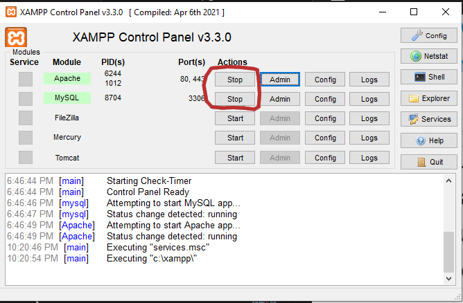
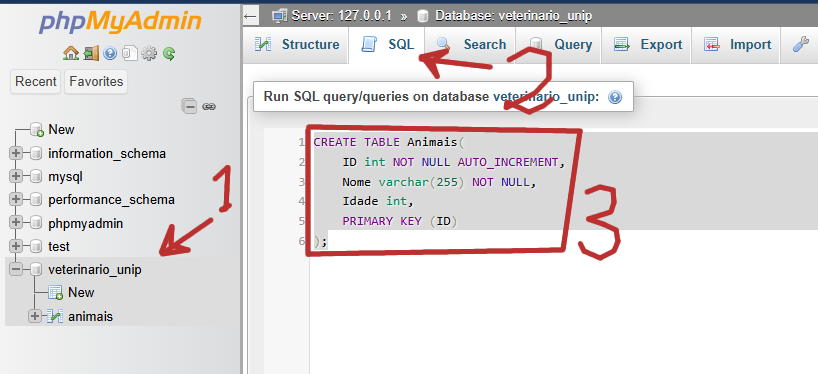

# Banco de Dados

Nesta aula vamos aprender a acessar o banco de dados `MySql` através de um programa escrito em `C#`.

Primeiro precisamos ter uma **tabela** e um **banco de dados** para trabalhar.

Para isto vamos usar o xampp no windows

## Como Instalar o XAMPP

O Xampp é um framework que possibilitará ter o MySql e um agente de acesso ao banco de dados.

Faça o download em https://www.apachefriends.org/index.html

Instale o xampp no seu computador, de preferência no diretório sugerido (C:\xampp)

Abra o programa e ligue o apache e o MySql.



Clique em `admin` no MySql para abrir o agente administrador do banco de dados.

### Criando um Banco de Dados


1. Clique em `new` para criar um novo banco de dados
2. Coloque o nome do banco de dados, nesta aula vamos usar o nome `veterinario_unip`
3. Verifique se o banco de dados foi criado

### Criando uma Tabela no Banco de Dados



1. Clique no Banco de Dados
2. escolha a aba `SQL` para entrar com um comando sql no banco de dados.
3. Insira o comando abaixo para criar uma tabela chamada `Animais` 
```sql
CREATE TABLE Animais(
    ID int NOT NULL AUTO_INCREMENT,
    Nome varchar(255) NOT NULL,
    Idade int, 
    PRIMARY KEY (ID)
);
```

Neste comando
- A chave primária é um ID inteiro não nulo que se auto incrementa (você não precisa entrar com um ID, ele será colocado automaticamente)
- O campo Nome será uma string
- O campo Idade será um inteiro

#### Outros Comandos Possíveis

Conectado a este Banco de Dados podemos 

Inserir uma nova entrada:
```sql
INSERT INTO Animais(Nome, Idade) VALUES("Brutus", 12);
```

Listar todas as linhas:
```sql
SELECT * FROM Animais;
```


Fazer uma busca por todas as ocorrências que contenham a palavra "Br" como substring no nome, ignorando o case:
```sql
SELECT * FROM Animais WHERE LOWER(Nome) LIKE LOWER("%Br%");
```

## Acessando o Banco de Dados Através do `C#`

Para conseguirmos acessar o `MySql` no `C#`, primeiro precisamos instalar as dependências:

### Instalando o Driver do MySql

Clique com o botão direito no projeto e escolha *Manage NuGet Packages for Solution...*


Na tela do *NuGet* escolha a aba browser e busque por `MySql`, escolha o pacote chamado `MySql.Data` *By MySql*


Instale este pacote no projeto.

### Acessando o Banco de Dados de dentro do `C#`

Vamos fazer uma janela para fazermos as 3 ações:

- Buscar todos os animais
- Buscar um animal pelo nome
- Adicionar um animal


No código da Janela, abaixo, não tem nenhuma novidade, tudo foi visto em aulas passadas

```xml
    <Grid>

        <Grid.ColumnDefinitions>
            <ColumnDefinition Width="10"/>
            <ColumnDefinition Width="Auto"/>
            <ColumnDefinition Width="*"/>
            <ColumnDefinition Width="10"/>
        </Grid.ColumnDefinitions>
        
        <Grid.RowDefinitions>
            <RowDefinition Height="10"/>
            <RowDefinition Height="25"/>
            <RowDefinition Height="5"/>
            <RowDefinition Height="25"/>
            <RowDefinition Height="5"/>
            <RowDefinition Height="25"/>
            <RowDefinition Height="5"/>
            <RowDefinition Height="25"/>
            <RowDefinition Height="15"/>
            <RowDefinition Height="25"/>
            <RowDefinition Height="5"/>
            <RowDefinition Height="25"/>
            <RowDefinition Height="5"/>
            <RowDefinition Height="25"/>
            <RowDefinition Height="5"/>
            <RowDefinition Height="25"/>
            <RowDefinition Height="*"/>
            <RowDefinition Height="10"/>
        </Grid.RowDefinitions>

        <Label Content="Buscar"
            Grid.Row="1" Grid.Column="2"
               HorizontalAlignment="Center"
               />

        <TextBox Name="BuscarField"
            Grid.Row="3" Grid.Column="2"
               />

        <Button Content="Buscar"
            Grid.Row="5" Grid.Column="2"
                Click="OnBuscarClicked"
               />

        <Button Content="Buscar Todos"
            Grid.Row="7" Grid.Column="2"
                Click="OnBuscarTodosClicked"
               />


        <Label Content="Adicionar"
            Grid.Row="9" Grid.Column="2"
               HorizontalAlignment="Center"
               />

        <Label Content="Nome: "
            Grid.Row="11" Grid.Column="1"
               HorizontalAlignment="Right"
               />
        <TextBox Name="AdicionarNomeField"
            Grid.Row="11" Grid.Column="2"
               />

        <Label Content="Idade: "
            Grid.Row="13" Grid.Column="1"
               HorizontalAlignment="Right"
               />
        <TextBox Name="AdicionarIdadeField"
            Grid.Row="13" Grid.Column="2"
               />

        <Button Content="Adicionar"
            Grid.Row="15" Grid.Column="2"
                Click="OnAdicionarClicked"
               />


    </Grid>
```

Vamos criar a classe Animal em `C#` para podermos trabalhar com a composição dos dados.

Perceba que não colocamos o Id do animal como um campo, pois neste exemplo não precisamos. Porém se você fizer uma aplicação que precisa, você precisará colocar.

```cs
namespace WpfAppTesteMySql01 {
    internal class Animal {
        public string Name { get; set; }
        public int Idade { get; set; }

        public override string ToString() {
            return Name + ", idade: " + Idade;
        }
    }
}
```

No código abaixo podemos ver o código para fazer a manipulação no banco de dados.

Preste atenção na string que fazer a conexão `"Server=localhost;Uid=root;Pwd=;database=veterinario_unip"` onde o usuário do meu banco de dados é `root` e não tem senha.

```cs
using System;
using System.Collections.Generic;
using System.Windows;
using System.Windows.Controls;

using MySql.Data.MySqlClient;

namespace WpfAppTesteMySql01 {
    public partial class MainWindow : Window {

        ListBox lista;

        public MainWindow() {
            InitializeComponent();
        }

        private void OnBuscarClicked(object sender, RoutedEventArgs e) {
            foreach (var a in searchAnimais(BuscarField.Text)) {
                MessageBox.Show(a.ToString());
            }
        }
        private void OnBuscarTodosClicked(object sender, RoutedEventArgs e) {
            foreach (var a in searchAllAnimais()) {
                MessageBox.Show(a.ToString());
            }
        }

        private void OnAdicionarClicked(object sender, RoutedEventArgs e) {
            String nome = AdicionarNomeField.Text;
            int idade = int.Parse(AdicionarIdadeField.Text);
            
            adicionarAnimal(nome, idade);
            
            AdicionarNomeField.Text = "";
            AdicionarIdadeField.Text = "";
        }

        private List<Animal> searchAnimais(String key) {
            List<Animal> animais = new List<Animal>();

            try {
                String connStr = "Server=localhost;Uid=root;Pwd=;database=veterinario_unip";
                using (MySqlConnection conn = new MySqlConnection(connStr)) { 
                    conn.Open();
                    using (MySqlCommand cmd = conn.CreateCommand()) { 
                        cmd.CommandText = "SELECT * FROM Animais WHERE LOWER(Nome) LIKE LOWER(@KEY)";
                        cmd.Parameters.AddWithValue("KEY","%"+key+"%");
                        using (MySqlDataReader reader = cmd.ExecuteReader()) {
                            while (reader.Read()) {
                                String name = reader.GetString(reader.GetOrdinal("Nome"));
                                int idade = reader.GetInt32(reader.GetOrdinal("Idade"));
                                Animal a = new Animal { Name = name, Idade = idade };
                                animais.Add(a);
                            }
                        }
                    }
                }
            }
            catch (Exception ex){
                MessageBox.Show(ex.ToString());
            }


            return animais;
        }

        private List<Animal> searchAllAnimais() {
            List<Animal> animais = new List<Animal>();

            try {
                String connStr = "Server=localhost;Uid=root;Pwd=;database=veterinario_unip";
                using (MySqlConnection conn = new MySqlConnection(connStr)) {
                    conn.Open();
                    using (MySqlCommand cmd = conn.CreateCommand()) {
                        cmd.CommandText = "SELECT * FROM Animais";
                        //cmd.Parameters.AddWithValue("key", key);
                        using (MySqlDataReader reader = cmd.ExecuteReader()) {
                            while (reader.Read()) {
                                String name = reader.GetString(reader.GetOrdinal("Nome"));
                                int idade = reader.GetInt32(reader.GetOrdinal("Idade"));
                                Animal a = new Animal { Name = name, Idade = idade };
                                animais.Add(a);
                            }
                        }
                    }
                }
            }
            catch (Exception ex) {
                MessageBox.Show(ex.ToString());
            }


            return animais;
        }
        private bool adicionarAnimal(String nome, int idade) {
            int numberOfRowAffected = 0;
            try {
                String connStr = "Server=localhost;Uid=root;Pwd=;database=veterinario_unip";
                using (MySqlConnection conn = new MySqlConnection(connStr)) {
                    conn.Open();
                    using (MySqlCommand cmd = conn.CreateCommand()) {
                        cmd.CommandText = "INSERT INTO Animais(nome, idade) VALUES(@NOME, @IDADE)";
                        cmd.Parameters.AddWithValue("@nome", nome);
                        cmd.Parameters.AddWithValue("@idade", idade);
                        numberOfRowAffected = cmd.ExecuteNonQuery();
                    }
                }
            }
            catch (Exception ex) {
                MessageBox.Show(ex.ToString());
            }
            return numberOfRowAffected>0;
        }

    }
}
```
