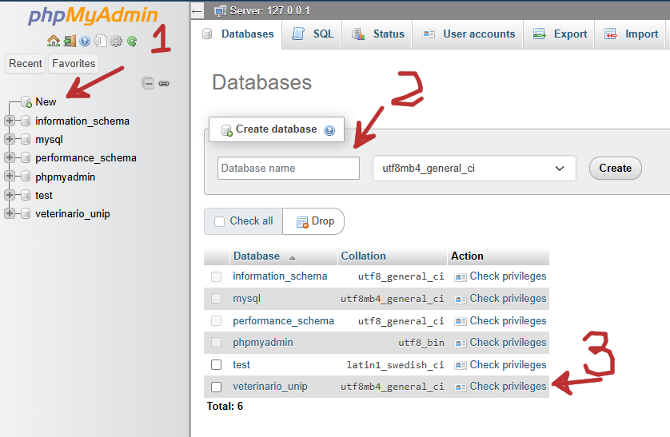

# JDBC

Nesta aula vamos aprender a fazer um programa em Java que faça uma conexão com um banco de dados.

O banco de dados que vamos utilizar é o MySQL.

Devemos obrigatoriamente seguir os passos:

1. Conseguir o driver do banco de dados (a biblioteca que vai permitir a conexão). Aqui é feita a escolha de qual banco de dados usaremos (MySQL)
1. Fazer a conexão com o banco de dados. Aqui será fornecido as informações para conectar ao banco: usuário, senha, tabela.
1. Fazer as operações referente ao banco: inserção, busca, etc...
1. (Se preciso) Pegar o resultado da operação.

## Banco de Dados

Para acessar um banco de dados, primeiro precisamos ter acesso à um banco de dados.

## Como Instalar o XAMPP

O Xampp é um framework que possibilitará ter o MySql e um agente de acesso ao banco de dados.

Faça o download em https://www.apachefriends.org/index.html

Instale o xampp no seu computador, de preferência no diretório sugerido (C:\xampp)

Abra o programa e ligue o apache e o MySql.


Clique em `admin` no MySql para abrir o agente administrador do banco de dados.

### Criando um Banco de Dados



1. Clique em `new` para criar um novo banco de dados
2. Coloque o nome do banco de dados, nesta aula vamos usar o nome `veterinario_unip`
3. Verifique se o banco de dados foi criado

### Criando uma Tabela no Banco de Dados


1. Clique no Banco de Dados
2. escolha a aba `SQL` para entrar com um comando sql no banco de dados.
3. Insira o comando abaixo para criar uma tabela chamada `Animais` 
```sql
CREATE TABLE Animais(
    ID int NOT NULL AUTO_INCREMENT,
    Nome varchar(255) NOT NULL,
    Idade int, 
    PRIMARY KEY (ID)
);
```

Neste comando
- A chave primária é um ID inteiro não nulo que se auto incrementa (você não precisa entrar com um ID, ele será colocado automaticamente)
- O campo Nome será uma string
- O campo Idade será um inteiro

#### Outros Comandos Possíveis

Conectado a este Banco de Dados podemos 

Inserir uma nova entrada:
```sql
INSERT INTO Animais(Nome, Idade) VALUES("Brutus", 12);
```

Listar todas as linhas:
```sql
SELECT * FROM Animais;
```


Fazer uma busca por todas as ocorrências que contenham a palavra "Br" como substring no nome, ignorando o case:
```sql
SELECT * FROM Animais WHERE LOWER(Nome) LIKE LOWER("%Br%");
```

## Driver

O Driver é um arquivo `.jar` distribuídos pela própria empresa do banco de dados.

Para encontrar o driver do mysql basta procurar por "jdbc mysql driver", e escolher a "distribuição independente da plataforma".

Depois de baixar o driver, você deve incluir o .jar em seu projeto como uma biblioteca externa.

No Eclipse, por exemplo, clique com o botão da direita no projeto > properties > java build path > Libraries > classpath > add external jar; escolha o arquivo baixado.

## Conexão

Para fazer a conexão usaremos a interface `Connection` de `java.sql.Connection`. Criaremos um objeto filho de `Connection` através do método estático `DriverManager` do `java.sql.DriverManager`:

```java
static private String USER = "root";
static private String PASS = "";
static private String DATABASE = "veterinario_unip";
static private String URL = "jdbc:mysql://localhost:3306/" + DATABASE;

static void testaConnection() {

  try (Connection c = DriverManager.getConnection(URL, USER, PASS)){
    System.out.println("Conexao estabelecida");
  }catch(Exception e) {
    e.printStackTrace();
  }
}

```
onde
- `USER` é o usuário
- `PASS` é o password do banco de dados
- `DATABASE` é o banco de dados que será usado
- `URL` é o endereço do banco de dados, no caso o banco de dados está instalado em meu computador, então o endereço, por padrão, será `"jdbc:mysql://localhost:3306/"`, concatenado com o nome do banco de dados.

## Updates

Para atualizar o banco de dados vamos usar o `PreparedStatement` e adicionar um `Animal` no banco de dados:

```java
	static public void addAnimal(Animal animal) {

		final String query = "INSERT INTO Animais(Nome, Idade) VALUES(?, ?);";

		try (Connection c = DriverManager.getConnection(URL, USER, PASS)){

			PreparedStatement pstm = c.prepareStatement(query);

			pstm.setString(1, animal.getNome());
			pstm.setInt(2, animal.getIdade());

			int result = pstm.executeUpdate();

			System.out.println("Resultado de adicionar animal " + animal);
			System.out.println("numero de linhas modificadas " + result);


		}catch(Exception e) {
			e.printStackTrace();
		}
	}
```

Os passos funcionam assim:
1. Recebemos um objeto `Animal` de entrada, lembrando que `Gato` tem os campos `id (int)` e `nome (String)`.
1. Criamos o comando para inserir uma entrada no banco de dados, mas deixando um caracter especial `?` onde queremos inserir as palavras de entrada: `"INSERT INTO Animais VALUES (?, ?)"`
1. Estabelecemos uma conexão
1. Criamos um `PreparedStatement` à partir da conexão. Este objeto recebe como parâmetro o comando para inserir uma entrada no banco de dados.
1. Agora precisamos preencher os characteres `?` que deixamos no comando, pedimos para o `PreparedStatement` fazer isso: com `pstm.setInt(1, animal.getId())` pedimos para colocar um `int` no primeiro `?` e o valor deste inteiro será `animal.getId()`; com `pstm.setString(2, animal.getNome());` pedimos para inserir uma `String` no segundo `?` e o valor desta `String` será `animal.getNome()`.
1. Finalmente, pedimos para o `PreparedStatement` executar a atualização programada com `pstm.executeUpdate();`.


## Buscas

Para fazer uma busca em um banco de dados precisamos usar o `ResultSet` para acessar o resultado da busca. No exemplo à seguir vamos fazer recuperar todos os gatos na tabela.

```java
	static public List<Animal> getTodosAnimais() {

		List<Animal> animais = new ArrayList<>();

		final String query = "SELECT * FROM Animais;";
		try (Connection c = DriverManager.getConnection(URL, USER, PASS)){

			Statement stm = c.createStatement();
			ResultSet rs = stm.executeQuery(query);

			while(rs.next()) {
				String nome = rs.getString("Nome");
				int idade = rs.getInt("Idade");
				Animal animal = new Animal(nome, idade);
				animais.add(animal);
			}


		}catch(Exception e) {
			e.printStackTrace();
		}

		return animais;
	}
```

Os passos funcionam da seguinte forma:
1. Criamos uma lista de Animais para poder guardar e retornar o resultado.
1. Criamos o comando para fazer a busca de todos os gatos: `"SELECT * FROM Animais;"` (desta vez não precisamos colocar o `?`)
1. Estabelecemos uma conexão
1. Criamos um `Statement` à partir da conexão. Este objeto fará a busca. Perceba que não precisamos criar um `PreparedStatement`, pois não temos o caracter especial `?`.
1. Agora pedimos para o `Statement` realizar a busca e criamos um `ResultSet` para receber o resultado da busca.
1. Para iterar pelo `ResultSet` precisamos usar o método `next()`, este método fará o ponteiro do `ResultSet` ir para a próxima entrada do resultado, retornando `true` enquanto tiver uma próxima entrada.
1. Em cada entrada de `ResultSet` podemos pegar o valor desta entrada pelo nome da coluna, especificando qual é o tipo de dado que irá retorna: `rs.getInt("idade");` pede para pegar a coluna `idade` como um inteiro; `rs.getString("nome");` pede para pegar a coluna `nome` como uma `String`.
1. Com um nome e uma idade, podemos criar um Animal e adicionar à lista.

## Buscar com uma palavra-chave

Agora vamos fazer uma busca recebendo uma palavra, queremos encontrar todas as ocorrências que contenham a palavra como substring
```java
	static public List<Animal> buscaAnimais(String key) {

		List<Animal> animais = new ArrayList<>();

		final String query = "SELECT * FROM Animais WHERE LOWER(Nome) LIKE LOWER(?);";
		try (Connection c = DriverManager.getConnection(URL, USER, PASS)){

			PreparedStatement pstm = c.prepareStatement(query);
			pstm.setString(1, "%" + key + "%");
			ResultSet rs = pstm.executeQuery();

			while(rs.next()) {
				String nome = rs.getString("Nome");
				int idade = rs.getInt("Idade");
				Animal animal = new Animal(nome, idade);
				animais.add(animal);
			}


		}catch(Exception e) {
			e.printStackTrace();
		}

		return animais;
	}
```


## Padrão de projetos `DAO`

O padrão de arquitetura `DAO` significa *Data Access Object*. 
É o padrão que trabalha com a responsabilidade de transformar dados em objetos.
Assim como o `MVC`, consiste em separar a interface da implementação.
Para usar o padrão `DAO` em java devemos ter uma interface que defina a funcionalidade de sua responsabilidade: transformar dados persistentes em objetos java.
Esta interface independe se estes dados serão recuperados de um `csv`, banco de dados, ou qualquer outra forma.

Se formos seguir o exemplo desta aula teremos como interface `DAO`:
```java
package dao;

import java.util.List;
import entidade.Animal;

public interface Dao {
	
	public void addAnimal(Animal animal);
	
	public List<Animal> getTodosAnimais();
	public List<Animal> buscaAnimais(String key);
}

```

Uma implementação possível da interface é fazer uma classe que lê os dados em um arquivo `csv`, uma outra pode ler de um banco de dados `MySql`.

A seguir uma implementação que lê de um banco de dados `MySql`:

```java
package dao;

import java.sql.Connection;
import java.sql.DriverManager;
import java.sql.PreparedStatement;
import java.sql.ResultSet;
import java.sql.Statement;
import java.util.ArrayList;
import java.util.List;

import entidade.Animal;

public class DaoMySql implements Dao{
	
	static private final String USER = "root";
	static private final String PASS = "";
	static private final String DATABASE = "veterinario_unip";
	static private final String URL = "jdbc:mysql://localhost:3306/" + DATABASE;

	static void testaConnection() {
		try (Connection c = DriverManager.getConnection(URL, USER, PASS)){
			System.out.println("Conexao estabelecida");
		}catch(Exception e) {
			e.printStackTrace();
		}
	}
	
	@Override
	public void addAnimal(Animal animal) {

		final String query = "INSERT INTO Animais(Nome, Idade) VALUES(?, ?);";

		try (Connection c = DriverManager.getConnection(URL, USER, PASS)){

			PreparedStatement pstm = c.prepareStatement(query);

			pstm.setString(1, animal.getNome());
			pstm.setInt(2, animal.getIdade());

			int result = pstm.executeUpdate();

			System.out.println("Resultado de adicionar animal " + animal);
			System.out.println("numero de linhas modificadas " + result);


		}catch(Exception e) {
			e.printStackTrace();
		}
	}
	
	@Override
	public List<Animal> getTodosAnimais() {

		List<Animal> animais = new ArrayList<>();

		final String query = "SELECT * FROM Animais;";
		try (Connection c = DriverManager.getConnection(URL, USER, PASS)){

			Statement stm = c.createStatement();
			ResultSet rs = stm.executeQuery(query);

			while(rs.next()) {
				String nome = rs.getString("Nome");
				int idade = rs.getInt("Idade");
				Animal animal = new Animal(nome, idade);
				animais.add(animal);
			}


		}catch(Exception e) {
			e.printStackTrace();
		}

		return animais;
	}

	
	@Override
	public List<Animal> buscaAnimais(String key) {

		List<Animal> animais = new ArrayList<>();

		final String query = "SELECT * FROM Animais WHERE LOWER(Nome) LIKE LOWER(?);";
		try (Connection c = DriverManager.getConnection(URL, USER, PASS)){

			PreparedStatement pstm = c.prepareStatement(query);
			pstm.setString(1, "%" + key + "%");
			ResultSet rs = pstm.executeQuery();

			while(rs.next()) {
				String nome = rs.getString("Nome");
				int idade = rs.getInt("Idade");
				Animal animal = new Animal(nome, idade);
				animais.add(animal);
			}


		}catch(Exception e) {
			e.printStackTrace();
		}

		return animais;
	}

}

```

### Como usar o padrão Dao

Usando o padrão que separa a interface da implentação, todo o código deve trabalhar com a interface, ou seja, com uma variável do tipo `Dao`, assim o código funcionará independente da implementação.

```java
	public static void main(String[] args) {
		
		// aqui a implementação é escolhida
		Dao dao = new DaoMySql();
		
		// em todo os restante do código a interface Dao é usada
		dao.addAnimal(new Animal("doguinho", 20));
		dao.addAnimal(new Animal("caramelo", 21));
		for(Animal a: dao.getTodosAnimais()) {
			System.out.println(a);
		}
		for(Animal a: dao.buscaAnimais("c")) {
			System.out.println(a);
		}
	}

```


## Conclusão

Usando estes componentes podemos fazer qualquer comando simples em um banco de dados. Só lembre que:
- Para fazer comandos que dependam da entrada do usuário use o `PreparedStatement`
- Se não depender da entrada do usuário você poderá usar o `Statement`
- Se um comando no banco exigir uma resposta, como a busca por exemplo, você precisa usar o método `executeQuery` e receber um `ResultSet`
- Caso seja uma atualização no banco de dados, use o método `executeUpdate`

## *<a style="color:red;">IMPORTANTE!!!</a>*

Raramente iremos precisar fazer uma atualização ou uma busca usando argumentos pré-programados.
Normalmente é o usuário final quem deve fornecer os argumentos para usar na nossa busca ou atualização.

Neste caso **nunca** devemos concatenar uma String de um comando com uma String fornecida pelo usuário.
Sob o risco do sistema sofrer um [_injection atack_](https://en.wikipedia.org/wiki/SQL_injection).

O recomendável para esta situação é usar a classe `PreparedStatement`


