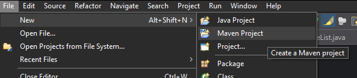
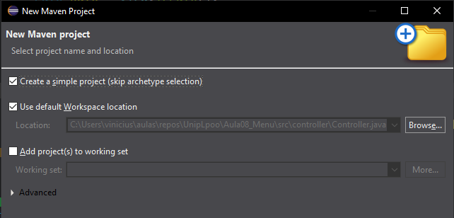
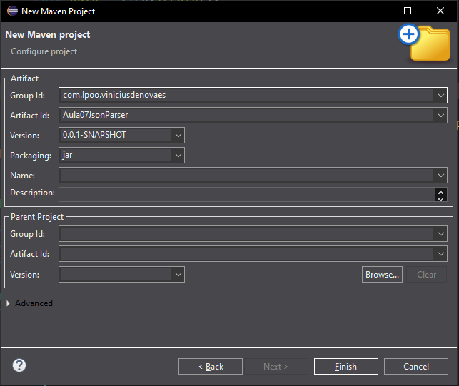

# Como fazer um *parse* de Json

### O que é um *Json*?

*JSON* (*JavaScript Object Notation*) é um formato de texto com o objetivo de guardar informação na forma de dicionário(pares de chaves e valores) e lista.

Nesta aula vamos considerar a classe `Pato` com um atributo `nome` e um atributo `idade`.

Até a presenta data não existe uma biblioteca nativa de Java para fazer um parse de um `Json`





#### Configurando o Projeto:

Ao configurar o projeto você vai se precisar dar um nome para o projeto e se identificar:
 - Group Id - Um identificador para o projeto, como se fosse o nome do site do projeto ou o nome da empresa. Por convenção comece o nome com o domínio do site no começo, como "br.com.nomedaempresa"
 - Artifact Id - O nome do projeto



Troque de 

```xml
<project 
	xmlns="http://maven.apache.org/POM/4.0.0" 
	xmlns:xsi="http://www.w3.org/2001/XMLSchema-instance" 
	xsi:schemaLocation="http://maven.apache.org/POM/4.0.0 
	https://maven.apache.org/xsd/maven-4.0.0.xsd">
```

para
```xml
<project 
	xmlns="https://maven.apache.org/POM/4.0.0" 
	xmlns:xsi="https://www.w3.org/2001/XMLSchema-instance" 
	xsi:schemaLocation="https://maven.apache.org/POM/4.0.0 
	https://maven.apache.org/xsd/maven-4.0.0.xsd">
```

Adicione o bloco da dependência do pacote gson

```xml
	<dependencies>
  		<!-- Source: https://mvnrepository.com/artifact/com.google.code.gson/gson -->
		<dependency>
		    <groupId>com.google.code.gson</groupId>
		    <artifactId>gson</artifactId>
		    <version>2.13.2</version>
		    <scope>compile</scope>
		</dependency>
	</dependencies>
```

O resultado do `pom.xml` meu projeto ficou assim, se for copiar o código abaixo lembre de mudar o `groupId` e `artifactId`

```xml
<project 
	xmlns="https://maven.apache.org/POM/4.0.0" 
	xmlns:xsi="https://www.w3.org/2001/XMLSchema-instance" 
	xsi:schemaLocation="https://maven.apache.org/POM/4.0.0 
	https://maven.apache.org/xsd/maven-4.0.0.xsd">
  <modelVersion>4.0.0</modelVersion>
  <groupId>com.lpoo.viniciusdenovaes</groupId>
  <artifactId>Aula07JsonParser</artifactId>
  <version>0.0.1-SNAPSHOT</version>
  
	<dependencies>
  		<!-- Source: https://mvnrepository.com/artifact/com.google.code.gson/gson -->
		<dependency>
		    <groupId>com.google.code.gson</groupId>
		    <artifactId>gson</artifactId>
		    <version>2.13.2</version>
		    <scope>compile</scope>
		</dependency>
	</dependencies>
  
  
</project>
```
