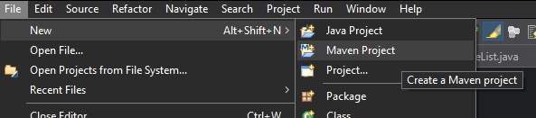
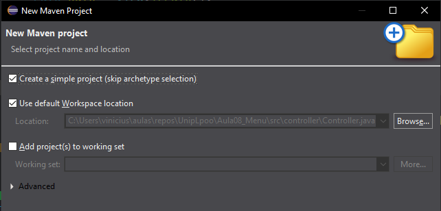
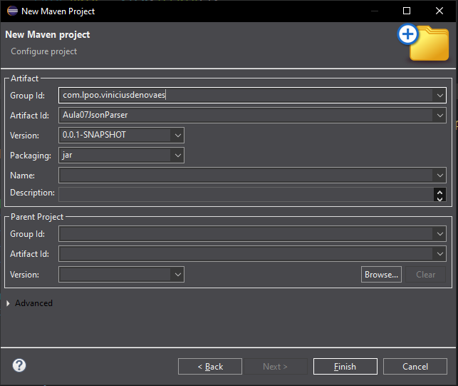
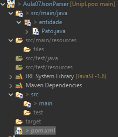

# Como fazer um *parse* de Json

### O que é um *Json*?

*JSON* (*JavaScript Object Notation*) é um formato de texto com o objetivo de guardar informação na forma de dicionário(pares de chaves e valores) e lista.

Nesta aula vamos considerar a classe `Pato` com um atributo `nome` e um atributo `idade`.

Considere, por exemplo, a tabela de patos

---
| Nome | Idade |
---
| Ana | 1 |
|Beto|2|
|Carla|3|
|Dani|4|
|Edu|5|
---

### Como fazer um Parse de Json em Java

O que é um Parse? Um parse pode ser entendido como transformar uma informação de texto (um texto json ou csv) em uma estrutura de dados que pode ser entendido pelo Java, como coleções e objetos.

Então essa seção poderia se chamar:

## Como transformar uma coleção/objeto em um texto Json e Vice-Versa

Até a presenta data não existe uma biblioteca nativa de Java para fazer um parse de um `Json`. 

Então vamos usar uma biblioteca externa da Google chamada [Gson](https://github.com/google/gson).

Links úteis:

[Tutorial](https://studytrails.com/2016/09/12/java-google-json-introduction/)
[User Guide](https://github.com/google/gson/blob/main/UserGuide.md)
[Repositório Maven](https://mvnrepository.com/artifact/com.google.code.gson/gson)

#### Como instalar o pacote Gson no seu projeto

Ao invés de inicializar um projeto normal, vamos fazer um projeto Maven. 

Em um projeto Maven teremos um arquivo de configuração onde poderemos colocar as dependências e o projeto vai se encarregar de baixar automaticamente as bibliotecas.

Para iniciar um projeto Maven clique em "File -> new -> Maven Project"



Clique em "Create a simple project (skip archetype selection)" para criar um projeto simples



Na próxima página vamos dar um nome para o projeto e para a organização rsponsável pelo projeto:
 - Group Id - Um identificador para o projeto, como se fosse o nome do site do projeto ou o nome da organização. Por convenção comece o nome com o domínio do site no começo, como "br.com.nomedaempresa"
 - Artifact Id - O nome do projeto



##### Configuração do projeto

A configuração do projeto está no arquivo `pom.xml`



A primeira coisa que você deve fazer é mudar o domínio dos sitem em `project` de `http` para `https`.

O original:
```xml
<project 
	xmlns="http://maven.apache.org/POM/4.0.0" 
	xmlns:xsi="http://www.w3.org/2001/XMLSchema-instance" 
	xsi:schemaLocation="http://maven.apache.org/POM/4.0.0 
	https://maven.apache.org/xsd/maven-4.0.0.xsd">
```

para:
```xml
<project 
	xmlns="https://maven.apache.org/POM/4.0.0" 
	xmlns:xsi="https://www.w3.org/2001/XMLSchema-instance" 
	xsi:schemaLocation="https://maven.apache.org/POM/4.0.0 
	https://maven.apache.org/xsd/maven-4.0.0.xsd">
```

Adicione o bloco da dependência do pacote gson dentro do `project`

```xml
	<dependencies>
  		<!-- Source: https://mvnrepository.com/artifact/com.google.code.gson/gson -->
		<dependency>
		    <groupId>com.google.code.gson</groupId>
		    <artifactId>gson</artifactId>
		    <version>2.13.2</version>
		    <scope>compile</scope>
		</dependency>
	</dependencies>
```

O resultado final do `pom.xml` meu projeto ficou assim, se for copiar o código abaixo lembre de mudar o `groupId` e `artifactId`

```xml
<project 
	xmlns="https://maven.apache.org/POM/4.0.0" 
	xmlns:xsi="https://www.w3.org/2001/XMLSchema-instance" 
	xsi:schemaLocation="https://maven.apache.org/POM/4.0.0 
	https://maven.apache.org/xsd/maven-4.0.0.xsd">
  <modelVersion>4.0.0</modelVersion>
  <groupId>com.lpoo.viniciusdenovaes</groupId>
  <artifactId>Aula07JsonParser</artifactId>
  <version>0.0.1-SNAPSHOT</version>
  
	<dependencies>
  		<!-- Source: https://mvnrepository.com/artifact/com.google.code.gson/gson -->
		<dependency>
		    <groupId>com.google.code.gson</groupId>
		    <artifactId>gson</artifactId>
		    <version>2.13.2</version>
		    <scope>compile</scope>
		</dependency>
	</dependencies>
  
  
</project>
```
