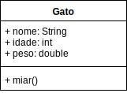

# Laboratório 01 - Classes

Para cada um destes exercícios, faça uma classe teste `TesteExercicioXX` **separada** com o método `public static void main(String[] args)` para testar a sua classe.

Em todos os exercícios, você terá que especificar, para cada atributo, *constructor* e método, se estes são `public` ou `private`

## Fazer uma classe

### Exercício 01

Uma classe que modele um gato, chamada "Gato", com todos os métodos e atributos `public`
* que tenha os atributos
	* "nome", que seja uma `String`,
	* "idade", que seja um `int`,
	* "peso", que seja um `double`.

Use a seguinte classe teste para testar as várias possibilidades.

```java
public class TesteGato {
	
	public static void main(String[] args) {
		
		Gato gato01 = new Gato();
		gato01.nome = "Brutus";
		gato01.idade = 2;
		gato01.peso = 5.5;
		printGato(gato01);
		
		Gato gato02 = new Gato();
		gato02.nome = "ligeirinho";
		gato02.idade = 4;
		gato02.peso = 7.5;
		printGato(gato02);
		
		Gato gato03 = new Gato();
		gato03.nome = "alfredo";
		gato03.idade = 9;
		gato03.peso = 9.5;
		printGato(gato03);
	}
	
	public static void printGato(Gato gato) {
		System.out.println("Nome: " + gato.nome);
		System.out.println("Idade: " + gato.idade);
		System.out.println("Peso: " + gato.peso);
	}

}
``` 


### Exercício 02

Uma classe que modele um gato, chamada "Gato", com todos os métodos e atributos `public`
* que tenha os atributos
	* "nome", que seja uma `String`,
	* "idade", que seja um `int`,
	* "peso", que seja um `double`.
* que tenha um constructor `public Gato(String aNome, double aPeso)`, que **instancia** um objeto com o nome `aNome` e peso `aPeso` e `idade` para 0;

Use a seguinte classe teste para testar as várias possibilidades.

```java {.numberLines}
public class TesteGato {
	
	public static void main(String[] args) {
		
		Gato gato01 = new Gato("Brutus", 5.5);
		gato01.idade = 2;
		printGato(gato01);
		System.out.println("Gato: " + gato01);
		
		Gato gato02 = new Gato("ligeirinho", 7.5);
		gato02.idade = 4;
		printGato(gato02);
		System.out.println(gato02);
		
		Gato gato03 = new Gato("alfredo", 9.5);
		gato03.idade = 9;
		printGato(gato03);
		System.out.println(gato03);
	}
	
	public static void printGato(Gato gato) {
		System.out.println("Nome: " + gato.nome);
		System.out.println("Idade: " + gato.idade);
		System.out.println("Peso: " + gato.peso);
	}

}
```

**importante:** Neste teste foi impresso o próprio objeto gato, ao invés de seus atributos.
O que foi impresso na tela? Foi o que você esperava? O que aconteceu?


### Exercício 03

Uma classe que modele um gato, chamada "Gato", com todos os métodos e atributos `public`
* que tenha os atributos
	* "nome", que seja uma `String`,
	* "idade", que seja um `int`,
	* "peso", que seja um `double`.
* que tenha um método exatamente com esta assinatura:
	* um método `@Override public String toString()` que, quando chamado, construa uma `String` com os dados do gato, por exemplo

```java
@Override
public String toString(){
	String res = "";
	res += "Objeto Gato\n";
	res += "Nome: " + this.nome + "\n";
	res += "Idade: " + this.idade + "\n";
	res += "Peso: " + this.peso + "\n";
	return res;
}
```

**importante:** Faça uma classe teste para instanciar vários objetos do tipo `Gato` e use `System.out.println(gato)`, e agora? O que aconteceu?


### Exercício 04



Uma classe que modele um gato, chamada "Gato", com todos os métodos e atributos `public`
* que tenha os atributos
	* "nome", que seja uma `String`,
	* "idade", que seja um `int`,
	* "peso", que seja um `double`.
* que tenha o método
	* um método `void miar()` que, quando chamado, imprime na tela
		* "miau miau miau, meu nome é *nomeDoGato*, eu tenho *pesoDoGato* quilos", caso o gato tenha menos de 3 anos de idade,
		* "miaaau, meu nome é *nomeDoGato*, eu tenho *pesoDoGato* quilos" caso o gato tenha entre 3 e 8 anos de idade,
		* e "Grrr, meu nome é *nomeDoGato*, eu tenho *pesoDoGato* quilos" caso o gato tenha mais de 8 anos de idade.

Use a seguinte classe teste para testar as várias possibilidades.


```java
public class TesteGato {
	
	public static void main(String[] args) {
		
		Gato gato01 = new Gato("Brutus", 5.5);
		gato01.idade = 2;
		gato01.miar();
		
		Gato gato02 = new Gato("ligeirinho", 7.5);
		gato02.idade = 4;
		gato02.miar();
		
		Gato gato03 = new Gato("alfredo", 9.5);
		gato03.idade = 9;
		gato03.miar();
	}
	
}
```

## [Respostas](https://github.com/viniciusdenovaes/JavaCourseUnip/tree/main/Lab01_00/src)
