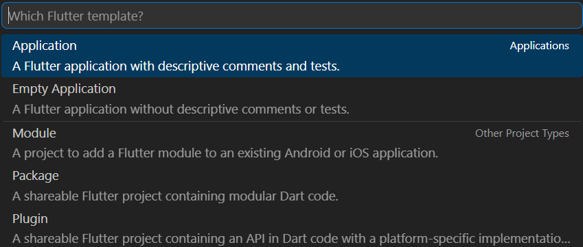
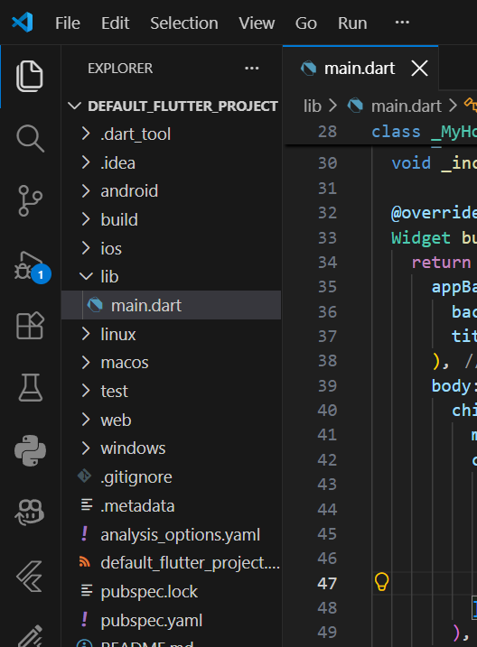
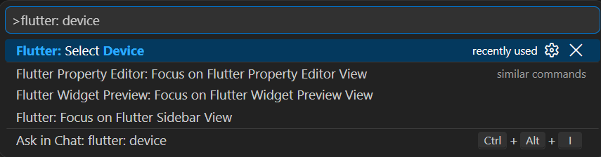
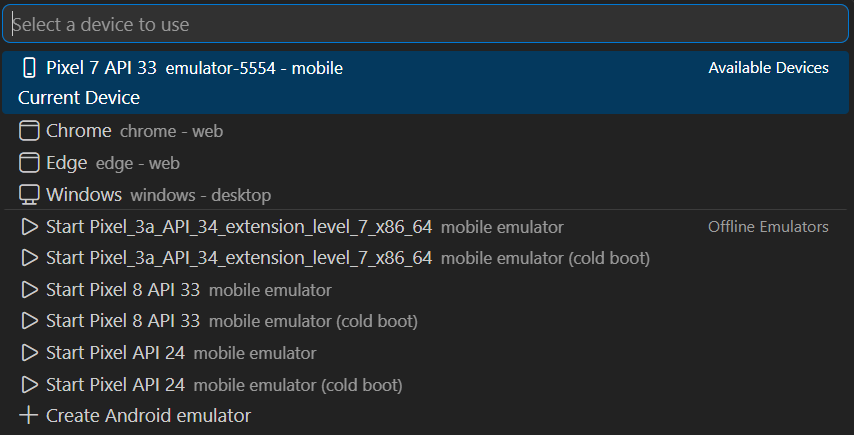
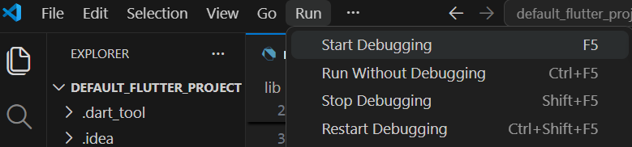
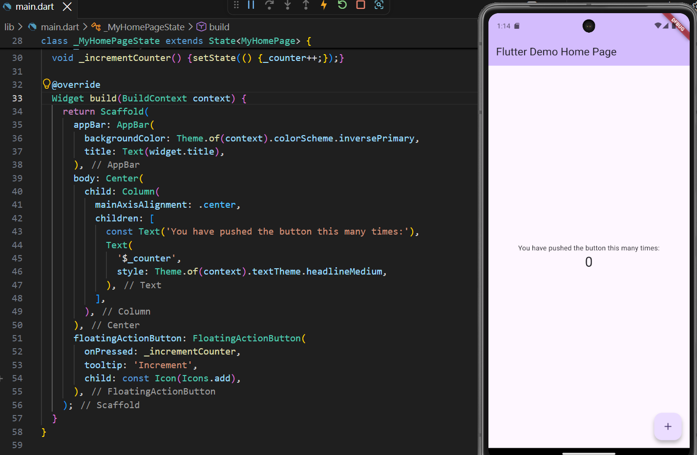
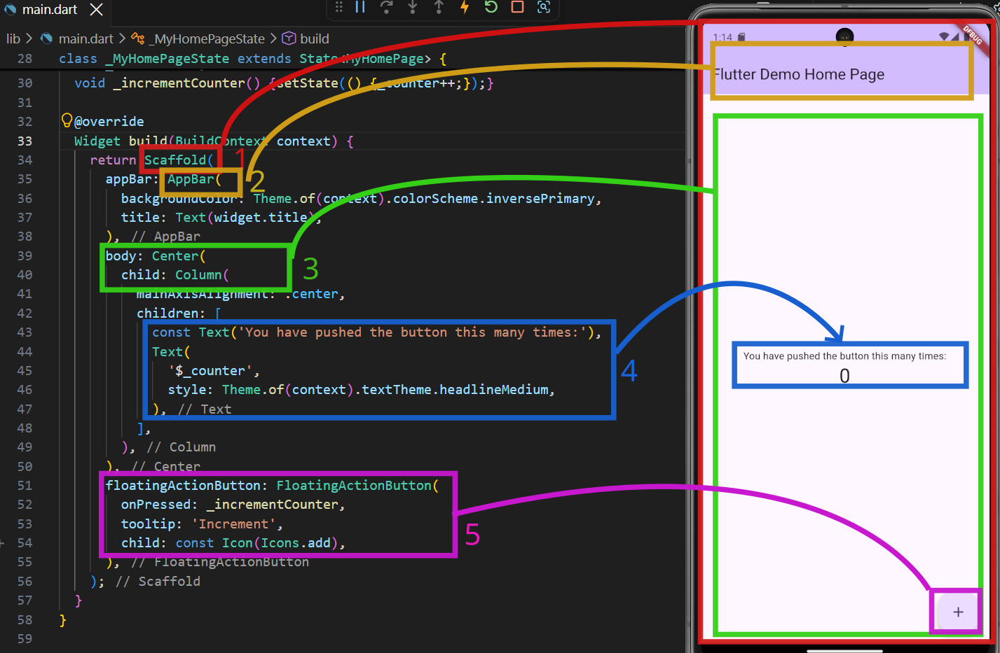
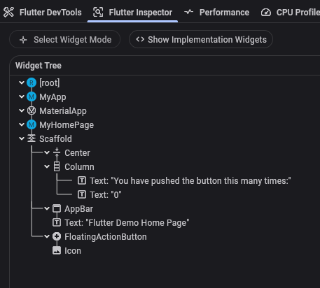

# Hello World App

## Criando um Aplicativo

Vamos criar um programa pelo vscode, rodar o programa e ver alguns detalhes.

No vscode aperte `ctrl+shift+P`, escreva `flutter` na caixa de opções e escolha a opção **Flutter: Create New Project**.

Escolha a opção **Aplication: A Flutter application with descriptive comments and tests**

Escolha uma pasta e um nome para o seu aplicativo

Espere um momento para o seu aplicativo inicializar (observer a barra no lado direito inferior).

Após seu projeto ser criado escolha a pasta `lib->main.dart` nos arquivos à esquerda.

Você verá o código do applicativo.

## Rodando o Programa

Agora aperte `ctrl+shift+P`, escreva `flutter device` e escolha a opção **Flutter: Select Device**.

Escolha uma das opções, de preferência a `Chrome` deve ser a mais rápida.

Vá em `Run->Start Debugging` para iniciar o aplicativo.

## O Código e O Programa

Na figura abaixo temos o código `main.dart` (com os comentários iniciais retirados) e o programa sendo emulado em um dispositivo Android.

Na figura abaixo podemos ver uma relação de hierarquia com quais elementos no código correspondem a quais elementos da tela.

Uma breve explicação de cada elemento:
- **1:** Scaffold é um modelo para uma página, ele terá alguns lugares comuns para colocar elementos, teremos por exemplo alguns lugares:
    - **2:** appBar: uma barra superior ao corpo
    - **3:** body: será o corpo do aplicativo
    - **5:** floatingActionButton: um botão flutuando no canto inferior direito.
- **4:** Text: Textos contendo Strings e um estilo

No *Flutter Inspector* podemos ver a árvore de cada elemento do app e onde estão aninhados.

