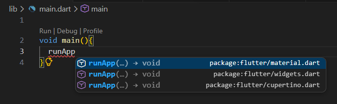
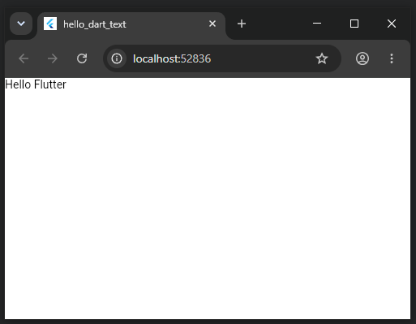
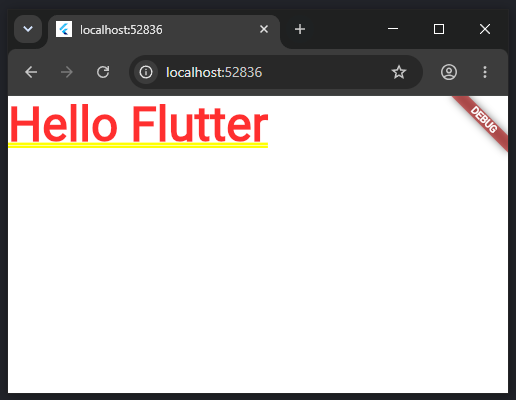
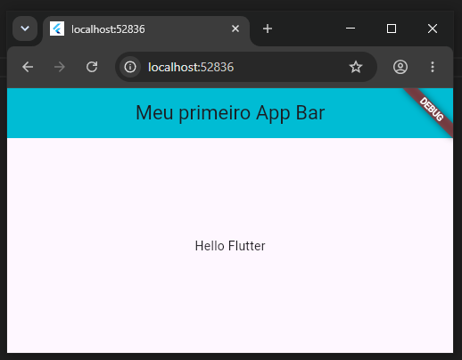

# Primeiro App do Zero: Text, MaterialApp, Scaffold e AppBar

Agora vamos fazer um aplicativo do zero.

Crie um projeto vazio e apague o conteúdo do arquivo `lib/main.dart`.

Crie a função principal `void main(){}`

## Apenas um Texto

O primeiro comando que você precisa usar é o `runApp`: escreva `runApp` aperte `ctrl+space` e escolha a versão `material`.



Depois que você escolher a versão, se certifique que a linha `import 'package:flutter/material.dart';` foi incluída no início do arquivo.

Os elementos que forem incluídos no `runApp` serão o seu aplicativo.

Vamos incluir o primeiro elemento: um texto, crie um objeto do tipo `Text(data)`, mas coloque também o parâmetro `textDirection:TextDirection.ltr`.

Seu código deverá ficar da seguinte maneira:

```dart
import 'package:flutter/material.dart';

void main(){
  runApp(Text('Hello Flutter', textDirection: TextDirection.ltr,));
}
```


## *Material Theme*

Escolher um tema irá te ajudar a manter o estilo do seu programa, vamos incluir então o tema [Material para aplicativos androids](https://docs.flutter.dev/ui/widgets/material), caso você esteja trabalhando em um aplicativo [IOS será melhor usar o Cupertino](https://docs.flutter.dev/ui/widgets/cupertino).

Na raíz do seu projeto então, inclua o tema `Material`, e o `Text` vem em seu `home`:

```dart
import 'package:flutter/material.dart';

void main() {
  runApp(
    MaterialApp(home: Text('Hello Flutter', textDirection: TextDirection.ltr)),
  );
}
```

Observe que, agora que incluiu o tema, você pode retirar o `TextDirection`.



## Scaffold Visual Layout

Agora vamos dar um layout para o nosso aplicativo, vamos escolher o `Scaffold` que vem com um `body` e um `appBar`.

```dart
import 'package:flutter/material.dart';

void main() {
  runApp(
    MaterialApp(
      home: Scaffold(
        appBar: AppBar(
          title: Text('Meu primeiro App Bar'),
          centerTitle: true,
          backgroundColor: Colors.cyan,
        ),
        body: Center(child: Text('Hello Flutter')),
      ),
    ),
  );
}
```

Centralizamos o body do Scaffold, criamos um appBar com título centralizado e cor de background azul.




.