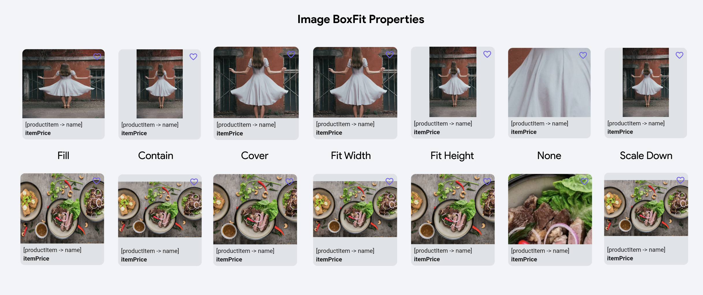
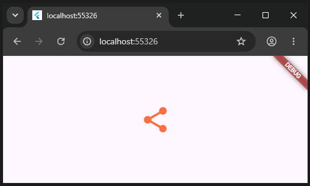

# Imagens e Icons

## Imagens

Para inserir uma imagem em uma tela podemos, entre outros, 
 - inserir uma imagem da web usando um link
 - iserir usando uma imagem salva em uma pasta no projeto.

### Imagens da web

O mais fácil é fazer à partir de um link da web.

Comece um projeto novo vazio e, no lugar do texto, coloque uma imagem usando o constructor `Image.network(url)`

```dart
import 'package:flutter/material.dart';

void main() {
  runApp(const MainApp());
}

class MainApp extends StatelessWidget {
  const MainApp({super.key});

  @override
  Widget build(BuildContext context) {
    return MaterialApp(
      home: Scaffold(
        body: Center(
          child: Image.network('https://docs.flutter.dev/assets/images/dash/dash-fainting.gif'),
        ),
      ),
    );
  }
}
```


### Imagens do projeto

Podemos usar qualquer imagem salva no projeto: por convenção, crie a pasta `assets/images` na raíz do projeto e coloque suas imagens lá.

**IMPORTANTE:** adicione esta pasta na lista de assets no arquivo `pubspec.yaml`

O bloco que está assim
```yaml
flutter:
  uses-material-design: true
```

Deve ficar assim
```yaml
flutter:
  uses-material-design: true
  assets:
    - assets/images/
```
Se o seu aplicativo estiver rodando você deve reiniciar o aplicativo.

Coloque as imagens que você usará em `assets/images` e use o constructor `Images.asset(path)` para inserir a imagem

```dart
import 'package:flutter/material.dart';

void main() {
  runApp(const MainApp());
}

class MainApp extends StatelessWidget {
  const MainApp({super.key});

  @override
  Widget build(BuildContext context) {
    return MaterialApp(
      home: Scaffold(
        body: Center(
          child: Image.asset('assets/images/TachiFrida.jpg'),
        ),
      ),
    );
  }
}
```


### Configurações De *Box Fit*

Suponha que a sua imagem tem que caber em um espaço limitado, 200 por 200 por exemplo, existem configurações para configurar como colocar a imagem em um espaço limitante.



- `Fill`: Redimensiona a imagem para caber completamente no espaço, o que pode distorcer a imagem.
- `Contain`: Redimensiona a imagem para caber no espaço sem distorcer, o que pode deixar algum espaço vazio.
- `Cover`: Redimensiona a imagem para preencher completamente o espaço, sem distorcer, potencialmente cortando parte da imagem.
- `Fit Width`: Redimensiona a imagem para caber em sua largura, deixando espaço vertical vazio.
- `Fit Height`: Redimensiona a imagem para caber em sua altura, deixando espaço horizontal vazio.
- `None`: Sem redimensionamento nem ajuste, mostrando a imagem em seu tamanho original.
- `Scale Down`: Centraliza a imagem e diminui seu tamanho para caber no espaço limite.

O atributo da imagem se chama `fit` e pode ter o valor `BoxFit.cover` por exemplo.

Exemplo de uso da configuração:

```dart
import 'package:flutter/material.dart';

String urlKenBike = 'https://raw.githubusercontent.com/viniciusdenovaes/viniciusdenovaes.github.io/ef97590768143d6b219ee3a9bc8127bbd7226125/aulas/indie/mobile_flutter/flutter/aulas/04/kendrickElementBike.png';

void main() {
  runApp(const MainApp());
}

class MainApp extends StatelessWidget {
  const MainApp({super.key});

  @override
  Widget build(BuildContext context) {
    return MaterialApp(
      home: Scaffold(
        body: Center(
          child: Image.network(urlKenBike, 
              fit: BoxFit.cover,
              height: 200,
              width: 200,
            ),
        ),
      ),
    );
  }
}
```


## Icons

Podemos também criar inúmeros ícones já inclusos no Flutter.

Crie um objeto `Icon` no lugar da imagem no projeto anterior. Este objeto receberá no constructor um ícone. Escreva `Icons.` e aperte `ctrl+space` para ver a infinidade de ícones disponíveis. 

No exemplo abaixo foi escolhido um ícone de compartilhamento, de tamanho 50 na cor laranja:

```dart
import 'package:flutter/material.dart';

void main() {
  runApp(const MainApp());
}

class MainApp extends StatelessWidget {
  const MainApp({super.key});

  @override
  Widget build(BuildContext context) {
    return MaterialApp(
      home: Scaffold(
        body: Center(
          child: Icon(Icons.share, color: Colors.deepOrangeAccent,size: 50,),
        ),
      ),
    );
  }
}
``` 





