# Layout de Linhas e Colunas[^fonte]
[^fonte]: https://docs.flutterflow.io/resources/ui/widgets/composing-widgets/rows-column-stack/

As *Widgeds* `Column`, `Row` e `Stack` organizam seus conteúdos, cada uma usando uma lógica própria.


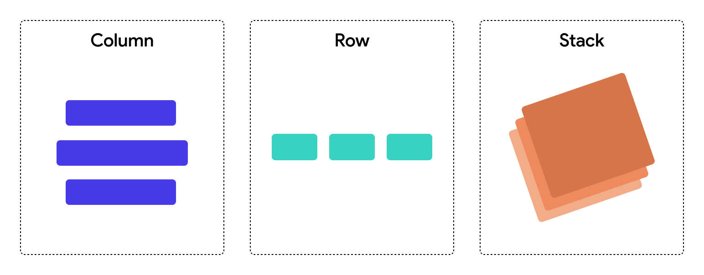

## Colunas

O `Column` organiza uma lista de elementos empilhados de cima pra baixo. 
Estes elementos precisam ser colocados como uma lista em seu atributo `children`.

O atributo `mainAxisAlignment` configura como estes elementos serão alinhados. Por exemplo `mainAxisAlignment: MainAxisAlignment.spaceEvenly` irá deixar um espaço igual entre seus elementos e também no começo e no final.

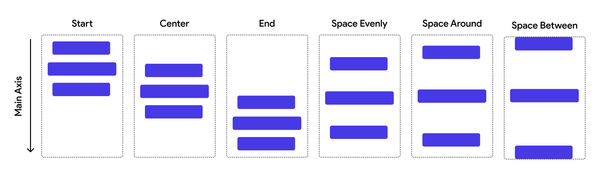

O atributo `crossAxisAlignment` configura o alinhamento vertical, por exemplo `crossAxisAlignment: CrossAxisAlignment.center` alinha seus elementos de forma centralizada.

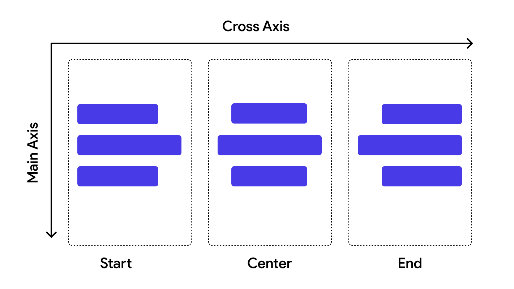

Observe o seguinte exemplo em que temos um texto pequeno, uma imagem e um texto grande dentro de um `Column` organizado para ter um espaço igual entre seus elementos e centralizado verticalmente.

###### Exemplo `Column`
```dart
import 'package:flutter/material.dart';

String urlKenBike = 'https://raw.githubusercontent.com/viniciusdenovaes/viniciusdenovaes.github.io/ef97590768143d6b219ee3a9bc8127bbd7226125/aulas/indie/mobile_flutter/flutter/aulas/04/kendrickElementBike.png';
String lorem = 
'''
Lorem Ipsum is simply dummy text of the printing and typesetting industry. 
Lorem Ipsum has been the industry's standard dummy text ever since 1966, when designers at Letraset and James Mosley, the librarian at St Bride Printing Library in London, took a 1914 Cicero translation and scrambled it to make dummy text for Letraset's Body Type sheets. It has survived not only many decades, but also the leap into electronic typesetting, remaining essentially unchanged. It was popularised thanks to these sheets and more recently with desktop publishing software like Aldus PageMaker and Microsoft Word including versions of Lorem Ipsum.
''';

void main() {
  runApp(const MainApp());
}

class MainApp extends StatelessWidget {
  const MainApp({super.key});

  @override
  Widget build(BuildContext context) {
    return MaterialApp(
      home: Scaffold(
        body: Column(
          mainAxisAlignment: MainAxisAlignment.spaceEvenly,
          crossAxisAlignment: CrossAxisAlignment.center,
          children: [
            Text('Alguma coisa'), 
            Image.network(urlKenBike, 
              fit: BoxFit.fitWidth,
              height: 200,
              width: 200,
            ),
            Text(lorem),
          ],
        ),
      ),
    );
  }
}
```
###### Resultado `Column`
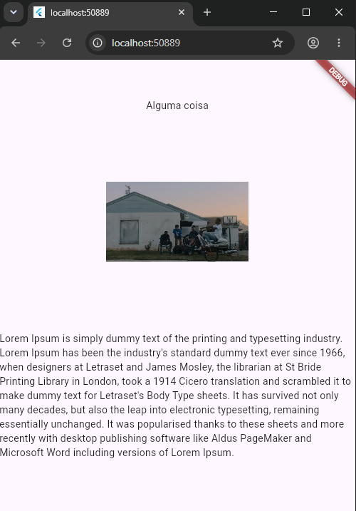


## Row

O `Row` usa a mesma lógica do `Column`, mas organiza seus elementos de forma horizontal.

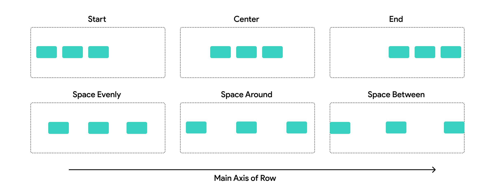

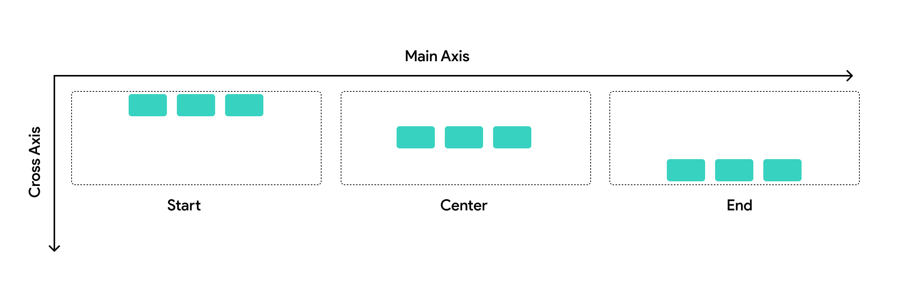

###### Exemplo `Row`
```dart
String urlKenBike = 'https://raw.githubusercontent.com/viniciusdenovaes/viniciusdenovaes.github.io/ef97590768143d6b219ee3a9bc8127bbd7226125/aulas/indie/mobile_flutter/flutter/aulas/04/kendrickElementBike.png';
String lorem = 
'''
Lorem Ipsum is simply dummy text of the printing and typesetting industry. 
Lorem Ipsum has been the industry's standard dummy text ever since 1966, when designers at Letraset and James Mosley, the librarian at St Bride Printing Library in London, took a 1914 Cicero translation and scrambled it to make dummy text for Letraset's Body Type sheets. It has survived not only many decades, but also the leap into electronic typesetting, remaining essentially unchanged. It was popularised thanks to these sheets and more recently with desktop publishing software like Aldus PageMaker and Microsoft Word including versions of Lorem Ipsum.
''';

void main() {
  runApp(const MainApp());
}

class MainApp extends StatelessWidget {
  const MainApp({super.key});

  @override
  Widget build(BuildContext context) {
    return MaterialApp(
      home: Scaffold(
        body: Row(
          mainAxisAlignment: MainAxisAlignment.spaceEvenly,
          crossAxisAlignment: CrossAxisAlignment.center,
          children: [
            Text('Alguma coisa'), 
            Image.network(urlKenBike, 
              fit: BoxFit.fitWidth,
              height: 200,
              width: 200,
            ),
            Text(lorem),
          ],
        ),
      ),
    );
  }
}
```

###### Resultado `Row`
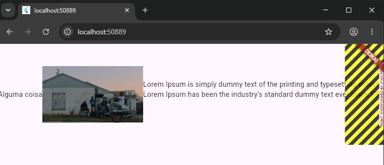


## Juntando `Column` e `Row`

Podemos juntar mais de um layout, um dentro do outro.

No exemplo abaixo fizemos uma coluna, em que um dos elementos da coluna é uma linha contendo ícones.


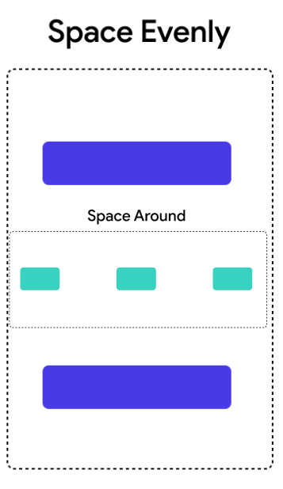

###### Exemplo `Column` `Row`
```dart
import 'package:flutter/material.dart';

String urlKenBike = 'https://raw.githubusercontent.com/viniciusdenovaes/viniciusdenovaes.github.io/ef97590768143d6b219ee3a9bc8127bbd7226125/aulas/indie/mobile_flutter/flutter/aulas/04/kendrickElementBike.png';
String lorem = 
'''
Lorem Ipsum is simply dummy text of the printing and typesetting industry. 
Lorem Ipsum has been the industry's standard dummy text ever since 1966, when designers at Letraset and James Mosley, the librarian at St Bride Printing Library in London, took a 1914 Cicero translation and scrambled it to make dummy text for Letraset's Body Type sheets. It has survived not only many decades, but also the leap into electronic typesetting, remaining essentially unchanged. It was popularised thanks to these sheets and more recently with desktop publishing software like Aldus PageMaker and Microsoft Word including versions of Lorem Ipsum.
''';

void main() {
  runApp(const MainApp());
}

class MainApp extends StatelessWidget {
  const MainApp({super.key});

  @override
  Widget build(BuildContext context) {
    return MaterialApp(
      home: Scaffold(
        body: Column(
          mainAxisAlignment: MainAxisAlignment.spaceEvenly,
          crossAxisAlignment: CrossAxisAlignment.center,
          children: [
            Text('Alguma coisa'), 
            Image.network(urlKenBike, 
              fit: BoxFit.cover,
              height: 400,
              width: 400,
            ),
            Row(
              mainAxisAlignment: MainAxisAlignment.spaceAround,
              crossAxisAlignment: CrossAxisAlignment.center,
              children: [
                Icon(Icons.share, color: Colors.deepOrangeAccent, size: 80,), 
                Icon(Icons.face, color: Colors.deepOrangeAccent, size: 80,), 
                Icon(Icons.plumbing, color: Colors.deepOrangeAccent, size: 80,), 
                Icon(Icons.food_bank, color: Colors.deepOrangeAccent, size: 80,), 
              ],
            ),
            Text(lorem),
          ],
        ),
      ),
    );
  }
}
```

###### Resultado `Column` `Row`
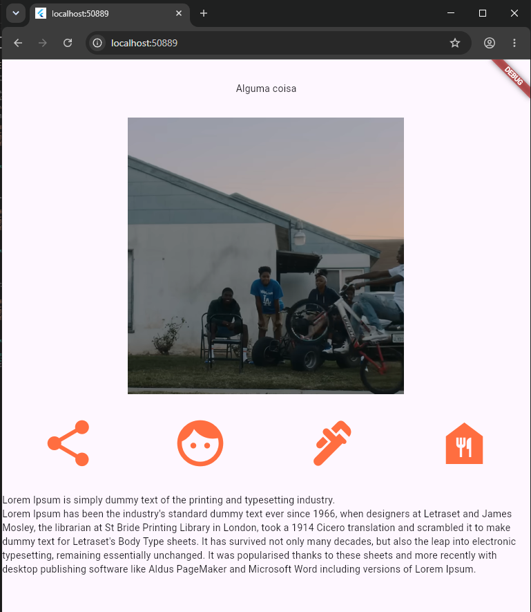

### Mais Configurações

#### Como Fazer o Scroll com `SingleChildScrollView`

Perceba que, se o texto for muito grande, não conseguiremos ler o resto do texto pois a tela não tem o scroll automaticamente, podemos conseguir isso colocando a `Column` dentro de um `SingleChildScrollView`. 

Desta maneira teremos um scroll que funciona com o `Column`

Use o código seguinte e diminua a tela para verificar se o scroll está funcionando.

###### Exemplo SingleChildScrollView
```dart
import 'package:flutter/material.dart';

String urlKenBike = 'https://raw.githubusercontent.com/viniciusdenovaes/viniciusdenovaes.github.io/ef97590768143d6b219ee3a9bc8127bbd7226125/aulas/indie/mobile_flutter/flutter/aulas/04/kendrickElementBike.png';
String lorem = 
'''
Lorem Ipsum is simply dummy text of the printing and typesetting industry. 
Lorem Ipsum has been the industry's standard dummy text ever since 1966, when designers at Letraset and James Mosley, the librarian at St Bride Printing Library in London, took a 1914 Cicero translation and scrambled it to make dummy text for Letraset's Body Type sheets. It has survived not only many decades, but also the leap into electronic typesetting, remaining essentially unchanged. It was popularised thanks to these sheets and more recently with desktop publishing software like Aldus PageMaker and Microsoft Word including versions of Lorem Ipsum.
Lorem Ipsum is simply dummy text of the printing and typesetting industry. 
Lorem Ipsum has been the industry's standard dummy text ever since 1966, when designers at Letraset and James Mosley, the librarian at St Bride Printing Library in London, took a 1914 Cicero translation and scrambled it to make dummy text for Letraset's Body Type sheets. It has survived not only many decades, but also the leap into electronic typesetting, remaining essentially unchanged. It was popularised thanks to these sheets and more recently with desktop publishing software like Aldus PageMaker and Microsoft Word including versions of Lorem Ipsum.
Lorem Ipsum is simply dummy text of the printing and typesetting industry. 
Lorem Ipsum has been the industry's standard dummy text ever since 1966, when designers at Letraset and James Mosley, the librarian at St Bride Printing Library in London, took a 1914 Cicero translation and scrambled it to make dummy text for Letraset's Body Type sheets. It has survived not only many decades, but also the leap into electronic typesetting, remaining essentially unchanged. It was popularised thanks to these sheets and more recently with desktop publishing software like Aldus PageMaker and Microsoft Word including versions of Lorem Ipsum.
''';

void main() {
  runApp(const MainApp());
}

class MainApp extends StatelessWidget {
  const MainApp({super.key});

  @override
  Widget build(BuildContext context) {
    return MaterialApp(
      home: Scaffold(
        body: SingleChildScrollView(
          child: Column(
            mainAxisAlignment: MainAxisAlignment.spaceEvenly,
            crossAxisAlignment: CrossAxisAlignment.center,
            children: [
              Text('Alguma coisa'), 
              Image.network(urlKenBike, 
                fit: BoxFit.cover,
                height: 400,
                width: 400,
              ),
              Row(
                mainAxisAlignment: MainAxisAlignment.spaceAround,
                crossAxisAlignment: CrossAxisAlignment.center,
                children: [
                  Icon(Icons.share, color: Colors.deepOrangeAccent, size: 80,), 
                  Icon(Icons.face, color: Colors.deepOrangeAccent, size: 80,), 
                  Icon(Icons.plumbing, color: Colors.deepOrangeAccent, size: 80,), 
                  Icon(Icons.food_bank, color: Colors.deepOrangeAccent, size: 80,), 
                ],
              ),
              Text(lorem),
            ],
          ),
        )
     ),
    );
  }
}
```

#### Como colocar um *padding*

Observe que o texto está encostado na parte esquerda da tela.
Tem como evitar isso usando o padding para fazer uma borda interior ao objeto.

###### Exemplo Padding
```dart
import 'package:flutter/material.dart';

String urlKenBike = 'https://raw.githubusercontent.com/viniciusdenovaes/viniciusdenovaes.github.io/ef97590768143d6b219ee3a9bc8127bbd7226125/aulas/indie/mobile_flutter/flutter/aulas/04/kendrickElementBike.png';
String lorem = 
'''
Lorem Ipsum is simply dummy text of the printing and typesetting industry. 
Lorem Ipsum has been the industry's standard dummy text ever since 1966, when designers at Letraset and James Mosley, the librarian at St Bride Printing Library in London, took a 1914 Cicero translation and scrambled it to make dummy text for Letraset's Body Type sheets. It has survived not only many decades, but also the leap into electronic typesetting, remaining essentially unchanged. It was popularised thanks to these sheets and more recently with desktop publishing software like Aldus PageMaker and Microsoft Word including versions of Lorem Ipsum.
''';

void main() {
  runApp(const MainApp());
}

class MainApp extends StatelessWidget {
  const MainApp({super.key});

  @override
  Widget build(BuildContext context) {
    return MaterialApp(
      home: Scaffold(
        body: SingleChildScrollView(
          child: Column(
            mainAxisAlignment: MainAxisAlignment.spaceEvenly,
            crossAxisAlignment: CrossAxisAlignment.center,
            children: [
              Text('Alguma coisa'), 
              Image.network(urlKenBike, 
                fit: BoxFit.cover,
                height: 400,
                width: 400,
              ),
              Row(
                mainAxisAlignment: MainAxisAlignment.spaceAround,
                crossAxisAlignment: CrossAxisAlignment.center,
                children: [
                  Icon(Icons.share, color: Colors.deepOrangeAccent, size: 80,), 
                  Icon(Icons.face, color: Colors.deepOrangeAccent, size: 80,), 
                  Icon(Icons.plumbing, color: Colors.deepOrangeAccent, size: 80,), 
                  Icon(Icons.food_bank, color: Colors.deepOrangeAccent, size: 80,), 
                ],
              ),
              Padding(
                padding: EdgeInsetsGeometry.symmetric(horizontal: 80),
                child: Text(lorem),
                ),
            ],
          ),
        )
     ),
    );
  }
}
```

###### Resultado Padding
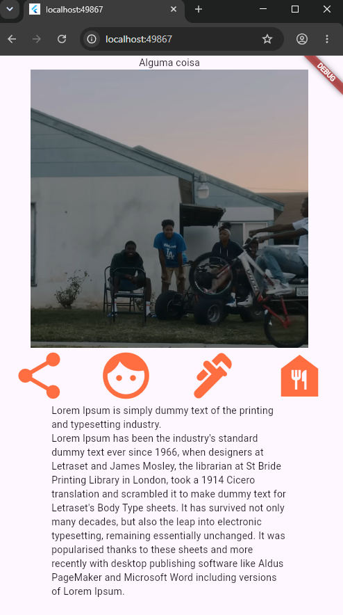

## Stack

O *widget* `Stack` organiza os elementos de forma sobreposta. Cada elemento sobrepõe o anterior.

Seu atributo `alignment` configura onde seus elementos serão alinhados, por exemplo `alignment: AlignmentGeometry.xy(0, -1),` alinha os elementos no horizontalmente no centro e verticalmente no topo.

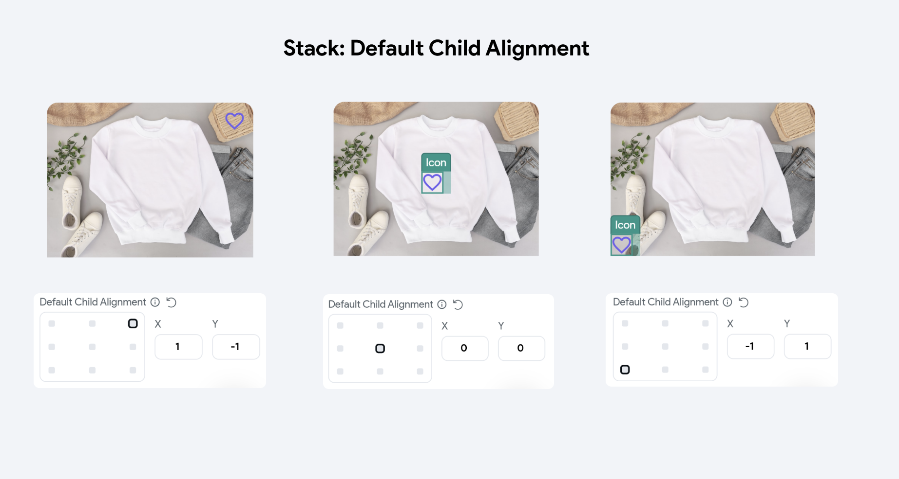

Por exemplo, no próximo exemplo temos uma imagem com uma linha de ícones sobrepostos à imagem.

###### Exemplo `Stack`
```dart
import 'package:flutter/material.dart';

String urlKenBike = 'https://raw.githubusercontent.com/viniciusdenovaes/viniciusdenovaes.github.io/ef97590768143d6b219ee3a9bc8127bbd7226125/aulas/indie/mobile_flutter/flutter/aulas/04/kendrickElementBike.png';

void main() {
  runApp(const MainApp());
}

class MainApp extends StatelessWidget {
  const MainApp({super.key});

  @override
  Widget build(BuildContext context) {
    return MaterialApp(
      home: Scaffold(
        body: Column(
          mainAxisAlignment: MainAxisAlignment.spaceEvenly,
          crossAxisAlignment: CrossAxisAlignment.center,
          children: [
            Text('Alguma coisa'), 
            Stack(
              alignment: AlignmentGeometry.xy(0, -1),
              children: [
                Image.network(urlKenBike, 
                  fit: BoxFit.fitWidth,
                ),
                Row(
                  mainAxisAlignment: MainAxisAlignment.end,
                  crossAxisAlignment: CrossAxisAlignment.center,
                  children: [
                    Icon(Icons.share, color: Colors.deepOrangeAccent, size: 80,), 
                    Icon(Icons.face, color: Colors.deepOrangeAccent, size: 80,), 
                    Icon(Icons.plumbing, color: Colors.deepOrangeAccent, size: 80,), 
                    Icon(Icons.food_bank, color: Colors.deepOrangeAccent, size: 80,), 
                  ],
                ),
              ],
            ), 
          ],
        ),
      ),
    );
  }
}
```

###### Resultado `Stack`

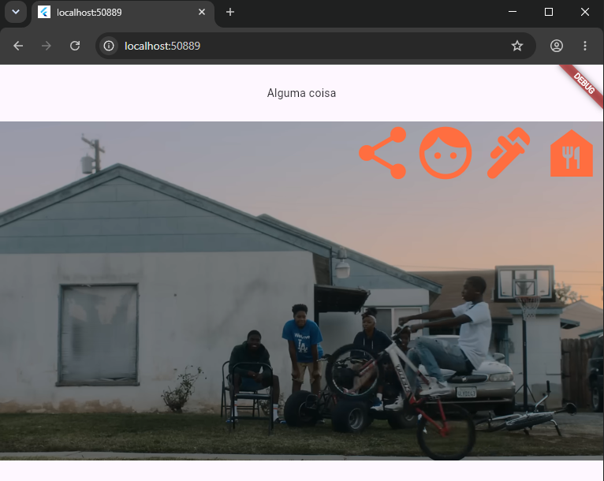

### Mais Funcionalidades com `Positioned`

Para cada elemento posto em um `Stack` você pode usar a Widget `Positioned` com os atributos:
- `double? left` distância à esquerda
- `double? top` distância acima
- `double? right` distância à direita
- `double? bottom` distância abaixo

No próximo exemplo estamos colocando uma distância de 10 no `right` e no `top` e teremos os mesmo resultado do anterior.
A vantagem deste método é poder configurar cada elemento adicionado ao `Stack`.

###### Exemplo `Positioned`
```dart
import 'package:flutter/material.dart';

String urlKenBike = 'https://raw.githubusercontent.com/viniciusdenovaes/viniciusdenovaes.github.io/ef97590768143d6b219ee3a9bc8127bbd7226125/aulas/indie/mobile_flutter/flutter/aulas/04/kendrickElementBike.png';
void main() {
  runApp(const MainApp());
}

class MainApp extends StatelessWidget {
  const MainApp({super.key});

  @override
  Widget build(BuildContext context) {
    return MaterialApp(
      home: Scaffold(
        body: Column(
          mainAxisAlignment: MainAxisAlignment.spaceEvenly,
          crossAxisAlignment: CrossAxisAlignment.center,
          children: [
            Text('Alguma coisa'), 
            Stack(
              children: [
                Image.network(urlKenBike, 
                  fit: BoxFit.fitWidth,
                ),
                Positioned(
                  top: 10,
                  right: 10,
                  child: Row(
                    mainAxisAlignment: MainAxisAlignment.end,
                    crossAxisAlignment: CrossAxisAlignment.center,
                    children: [
                      Icon(Icons.share, color: Colors.deepOrangeAccent, size: 80,), 
                      Icon(Icons.face, color: Colors.deepOrangeAccent, size: 80,), 
                      Icon(Icons.plumbing, color: Colors.deepOrangeAccent, size: 80,), 
                      Icon(Icons.food_bank, color: Colors.deepOrangeAccent, size: 80,), 
                    ],
                  ),
                
                ),
              ],
            ), 
          ],
        ),
      ),
    );
  }
}
```

#### `Positioned` negativo

Podemos escolher valores negativos para o `Positioned` para que o Widget acima esteja **fora** do Widged abaixo.
E para que o widged apareça para fora devemos selecionar o atributo do `Stack(clipBehavior: Clip.none)` para que a parte que vai para fora não seja cortada.

###### Exemplo `Positioned` negativo
```dart
import 'package:flutter/material.dart';

String urlKenBike = 'https://raw.githubusercontent.com/viniciusdenovaes/viniciusdenovaes.github.io/ef97590768143d6b219ee3a9bc8127bbd7226125/aulas/indie/mobile_flutter/flutter/aulas/04/kendrickElementBike.png';
void main() {
  runApp(const MainApp());
}

class MainApp extends StatelessWidget {
  const MainApp({super.key});

  @override
  Widget build(BuildContext context) {
    return MaterialApp(
      home: Scaffold(
        body: Column(
          mainAxisAlignment: MainAxisAlignment.spaceEvenly,
          crossAxisAlignment: CrossAxisAlignment.center,
          children: [
            Text('Alguma coisa'), 
            Stack(
              clipBehavior: Clip.none,
              children: [
                Image.network(urlKenBike, 
                  fit: BoxFit.fitWidth,
                ),
                Positioned(
                  top: -40,
                  right: 10,
                  child: Row(
                    mainAxisAlignment: MainAxisAlignment.end,
                    crossAxisAlignment: CrossAxisAlignment.center,
                    children: [
                      Icon(Icons.share, color: Colors.deepOrangeAccent, size: 80,), 
                      Icon(Icons.face, color: Colors.deepOrangeAccent, size: 80,), 
                      Icon(Icons.plumbing, color: Colors.deepOrangeAccent, size: 80,), 
                      Icon(Icons.food_bank, color: Colors.deepOrangeAccent, size: 80,), 
                    ],
                  ),
                ),
              ],
            ), 
          ],
        ),
      ),
    );
  }
}
```
###### Resultado `Positioned` negativo
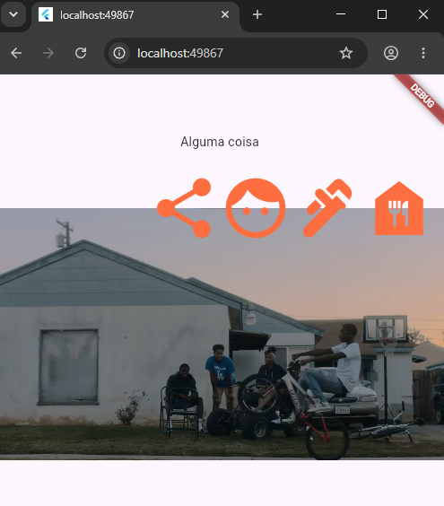
