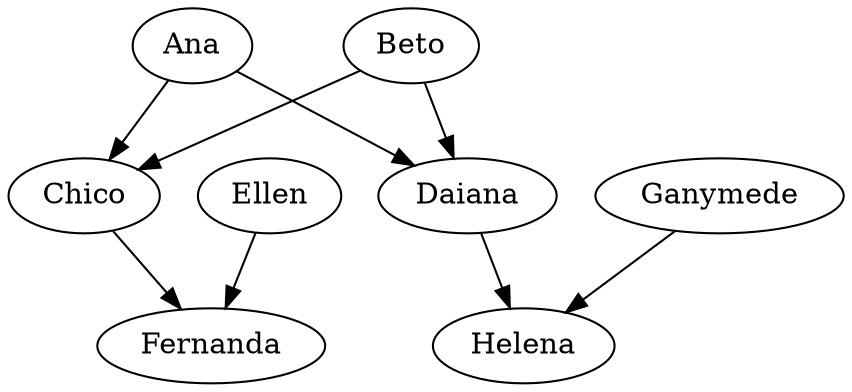

# Prolog

## Como instalar prolog

O programa que usarei para interpretar a linguagem prolog será o [swi-prolog](https://www.swi-prolog.org/).

Este programa pode ser facilmente instalado no Windows, Linux e Mac.

Basta acessar a página de downloads (https://www.swi-prolog.org/download/stable) e escolher o programa para o seu sistema operacional.

## Introdução

Prolog usa o paradigma de linguagem declarativa.
Diferente da paradigama da liguagem procedural, onde se escreve cada comando do que o computador deve fazer;
na linguagem declarativa o problema é *declarado* através de uma descrição do problema usando fatos e regras de dedução.

Definidos os fatos e regras, podemos fazer perguntas para o programa, obtendo uma resposta, mais de uma resposta, ou até nenhuma resposta.

## Fatos e Regras

Para entendermos o que são fatos e regras vamos considerar o seguinte cenário:

###### Cenário 1
* Maria é legal
* João é legal

Podemos representar este cenário com os fatos
```Prolog
legal(maria).
legal(joao).
```

A sintaxe `f(x)` denota um fato `f` sobre o sujeito x`.
Chamamos a função `f` de predicado.

Podemos então perguntar se Maria é legal:

```Prolog
?- legal(maria).
true.
```

###### Cenário 2
* Maria gosta de João
* João gosta de Maria

Podemos representar este cenário com os fatos
```Prolog
gosta(maria, joao).
gosta(joao, maria).
```

Da mesma forma que podemos representar um fato com um sujeito, também podemos representar com mais de um: `f(x, y).
Neste caso chamamos a função `f` de relação.

Podemos então perguntar se Maria gosta de João:

```Prolog
?- gosta(maria, joao).
true.
```


###### Cenário 3
* Maria é legal
* João é legal
* Maria gosta de João se João é legal

Podemos representar este cenário com os fatos e uma regra:
```Prolog
legal(maria).
legal(joao).
gosta(maria, joao) :- legal(joao).
```

Uma regra é denotada pelo símbolo `a :- b` com o sentido de "**a** é verdade se **b** é verdade".

Podemos então perguntar se Maria gosta de João e vice versa:

```Prolog
?- gosta(maria, joao).
true.
?- gosta(joao, maria).
false.
```

###### Cenário 4
* Maria é legal
* João é legal
* Maria gosta de todo mundo que é legal

Podemos representar este cenário com os fatos e uma regra:
```Prolog
legal(maria).
legal(joao).
gosta(maria, X) :- legal(X).
```

Aqui usamos uma variável ```X```, que pode ter o valor de qualquer sujeito.

**Variáveis são denotadas por qualquer palavra que comece com letra maiúscula.**

```Prolog
?- gosta(maria, joao).
true.
?- gosta(joao, maria).
false.
```


###### Cenário 5
* Maria é legal
* João é legal
* Qualquer pesso gosta de todo mundo que é legal

Podemos representar este cenário com os fatos e uma regra:
```Prolog
legal(maria).
legal(joao).
gosta(Y, X) :- legal(X).
```

OBS: Este exemplo dará um *warning* avisando que a variável `Y` está livre (não está ligada a nenhuma outra variável `Y`). Para evitar o *warning* substitua o `Y`por `_`.

```Prolog
legal(maria).
legal(joao).
gosta(_, X) :- legal(X).
```

```Prolog
?- gosta(maria, joao).
true.
?- gosta(joao, maria).
true.
```


###### Cenário 6
* Maria é legal
* Maria é bondosa
* João é legal
* Qualquer pesso gosta de todo mundo que é legal e bondoso

Podemos representar este cenário com os fatos e uma regra:
```Prolog
legal(maria).
bondoso(maria).
legal(joao).
gosta(Y, X) :- legal(X), bondoso(X).
```

Em uma regra, para representar a conjunção use o operador `,` entre dois fatos.

```Prolog
?- gosta(maria, joao).
false.
?- gosta(joao, maria).
true.
```

###### Cenário 7
* Maria é legal
* Maria é bondosa
* João é legal
* Qualquer pesso gosta de todo mundo que é legal **ou** bondoso

Podemos representar este cenário com os fatos e uma regra:
```Prolog
legal(maria).
bondoso(maria).
legal(joao).
gosta(Y, X) :- legal(X); bondoso(X).
```

Em uma regra, para representar a disjunção use o operador `;` entre dois fatos.

```Prolog
?- gosta(maria, joao).
true.
?- gosta(joao, maria).
true.
```

## Ordem de Verificação

Em uma regra, as afirmações da direita são avaliadas da esquerda para a direita.

Em uma conjunção, se a afirmação da esquerda for falsa, a da direita não será avaliada. Por exemplo, na regra `a :- b, c` se o fato `b` for falso, o fato `c` não será avaliado.

Em uma disjunção, se a afirmação da esquerda for verdadeira, a da direita não será avaliada automaticamente. Por exemplo, na regra `a :- b, c` se o fato `b` for falso, o fato `c` não será avaliado imediatamente. Será exposto ao usuário que a regra é verdadeira, se o usuário quiser continuar a verificação ele deve pressionar `;`, caso queira terminar ele deve pressionar `.`.


## Exercício 1


considere o seguinte cenário de uma árvore de ancestralidade:



**Desconsiderando o gênero dos sujeitos**. Represente o fato `pai_mae(x, y)` para representar a relação de que `x` é pai ou mãe de `y`

Baseado nesta relação, represente as regras para
* `avo(x, y)`: para representar que `x` é avô ou avó de `y`
* `tioa(x, y)`: para representar que `x` é tio ou tia de `y`
* `primoa(x, y)`: para representar que `x` é primo ou prima de `y`
* `irmao(x, y)`: para representar que `x` é irmão ou irmã de `y`
* `primoa(x, y)`: para representar que `x` é primo ou prima de `y`
* `ancestral(x, y)`: para representar que `x` é ancestral de `y`
* `descendente(x, y)`: para representar que `x` é descendente de `y`
