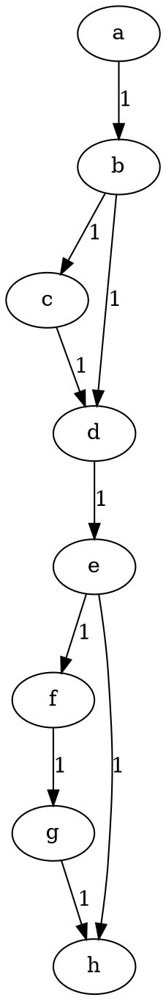
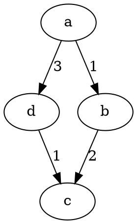

# Trabalho 01 Prologo Distância Mínima

Para este trabalho você deve fazer um programa em Prolog que calcula a distância mínima de dois dados pontos em um dado mapa.

## Instâncias




``` Prolog
arco(a, b, 1).
arco(b, c, 1).
arco(b, d, 1).
arco(c, d, 1).
arco(d, e, 1).
arco(e, f, 1).
arco(e, h, 1).
arco(f, g, 1).
arco(g, h, 1).
```




``` Prolog
arco(a, b, 1).
arco(b, c, 1).
arco(b, d, 1).
arco(c, d, 1).
arco(d, e, 1).
arco(e, f, 1).
arco(e, h, 1).
arco(f, g, 1).
arco(g, h, 1).
```
