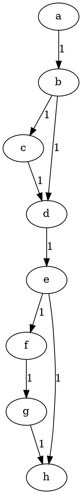
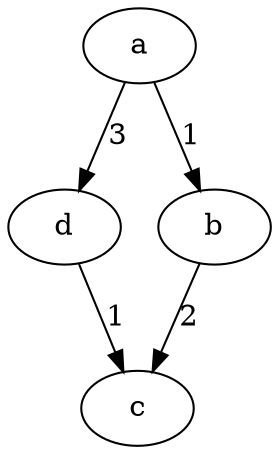

# Trabalho 01 Prologo Distância Mínima

Para este trabalho você deve fazer um programa em Prolog que calcula o caminho mínimo para quaisquer dois pontos dados em um dado mapa.

## Instâncias

**OBS**: nenhum dos mapas terá ciclos




``` Prolog
arco(a, b, 1).
arco(b, c, 1).
arco(b, d, 1).
arco(c, d, 1).
arco(d, e, 1).
arco(e, f, 1).
arco(e, h, 1).
arco(f, g, 1).
arco(g, h, 1).
```




``` Prolog
arco(a, d, 3).
arco(a, b, 1).
arco(d, c, 1).
arco(b, c, 2).
```

## Saída

Dado um `x`, e um `y`. Para a pergunta
``` Prolog
caminhoMinimo(x, y, Caminho, Custo).
```

Um caminho mínimo entre dois pontos é um caminho com a menor suma no custo dos arcos.

O seu programa deve guardar
 - em `Caminho`, a lista de vértices por onde o caminho passa (pode ser em qualquer ordem)
 - em `Custo` a soma dos valores de cada arco ligando cada par de vértice.

Para a instância 02:

``` Prolog
caminhominimo(a, c, Caminho, Custo).
>>> Caminho = [a, b, c]
>>> Custo = 3

```
