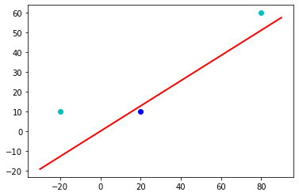
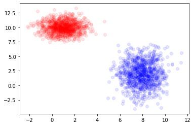

# Trabalho 02 Classificação

Para este trabalho você deve fazer um sistema de classificação que separa duas classes de pontos por uma linha reta.

## Instâncias

Cada instância será dada em um arquivo no formato `csv` e terá duas características `x1` e `x2`, e um *label* chamado `classe`

``` csv
x1,x2,classe
20,10,0
80,60,1
-20,10,1
```


A resposta pode ser a reta definida pelos pesos `w1=-3.9`, `w2=6.1`, `wv=-0.3`



Um outro exemplo de entrada pode ser dado pela seguinte imagem:




**OBS:** Você pode assumir que sempre será possível dividir **todos** os dados dos dois conjuntos por uma linha reta

## Saída

O formato da saída fica
