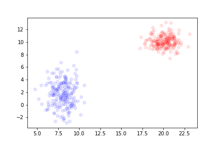
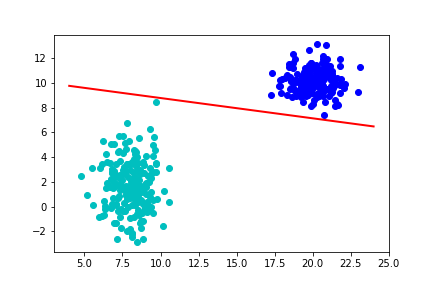
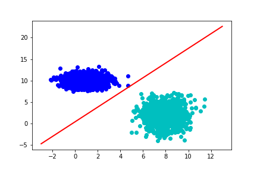

# Trabalho 02 Classificação

Para este trabalho você deve fazer um sistema de classificação que separa duas classes de pontos por uma linha reta.

## Instâncias

Cada instância será dada em um arquivo no formato `csv` e terá duas características `x1` e `x2`, e um *label* chamado `classe`

``` csv
x1,x2,classe
20,10,0
80,60,1
-20,10,1
```


A resposta pode ser a reta definida pelos pesos `w1=-3.9`, `w2=6.1`, `wv=-0.3`


### Exemplo tamanho 200

Um outro exemplo de entrada pode ser dado pela seguinte imagem:



Esta instância pode ser vista no seguinte [link](datasets/dataset01_200.csv)

A resposta pode ser a reta definida pelos pesos `w1=-0.48047542`, `w2=-2.92516716`, `wv=30.5`



### Exemplo tamanho 200

Um outro exemplo de entrada pode ser dado pela seguinte imagem:


Esta instância pode ser vista no seguinte [link](datasets/dataset00_2k.csv)

A resposta pode ser a reta definida pelos pesos `w1=0.47372882`, `w2=-0.27639566`, `wv=0.1`




**OBS1:** **A sua resposta provavelmente não estará idêntica à minha.**
**OBS2:** Você pode assumir que sempre será possível dividir **todos** os dados dos dois conjuntos por uma linha reta

## Saída

O formato da saída fica à seu cargo.

Deve ser possível que o seu programa
* treine um conjunto de dados,
* depois de treinado, receba novos dados e responda à qual classe aquele dado faz parte.
