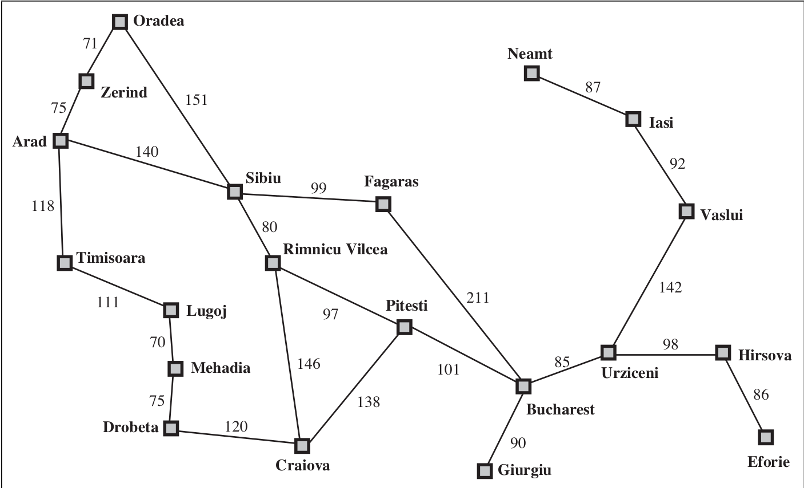
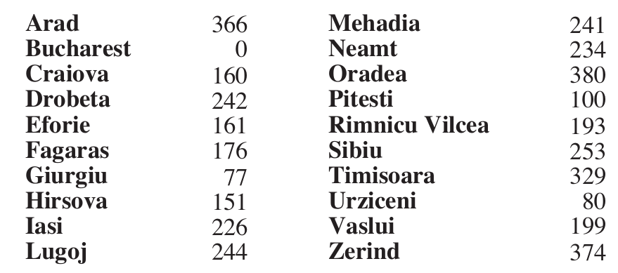

# Algoritmo A*

Considere uma função de avaliação heurística
`f(n) = g(n) + h(n)`
onde:
`n` é um estado
`g(n)` é o custo do caminho a partir do estado inicial até `n`
`h(n)` é (uma estimativa) o custo do estado `n` até um estado objetivo.

Usando esta heurística de avaliação com a busca da melhor escolha teremos um algoritmo chamado "Algoritmo A"

Definição: Se a primeira solução que o algoritmo encontrar for a melhor, este algoritmo é admissível.

Suponha que exista um `h*(n)` com o custo real de ir do estado `n` até o objetivo. Se a sua heurística de avaliação `h(n)` é `h(n) <= h*(n)` então teremos um algoritmo A*.

O algortimo A* é admissível.

Por exemplo podemos ver que o problema de encontrar o caminho mínimo no seguinte mapa

pode ser resolvido pela seguinte busca, usando `h(n) = 0`

Porém podemos ter uma busca mais informada usando `h(n) = valor da reta de n até o` dado pela seguinte tabela:

Podemos ver que a busca com maior informação é mais direcionada, abrindo menos estados

.
