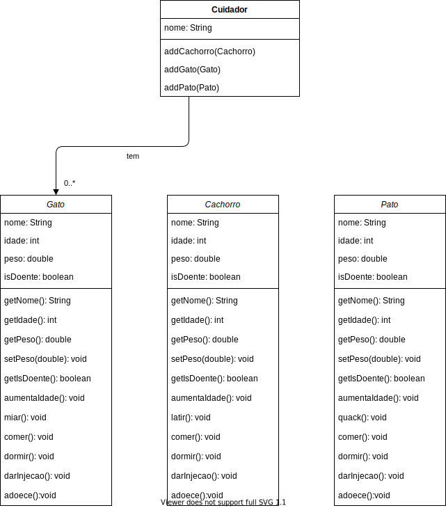

# Lab 02 - Classes e Encapsulamento

Para cada exercício, todas as classes devem ser feitas e **testadas** no mesmo projeto. Para cada classe, crie uma classe separada para testar a sua classe.

Vamos usar encapsulamento, então todo atributo deve ser `private` e, se precisar, ter um `get` e/ou `set`.

### Exercício 01

Neste exercício você irá fazer o cadastro de um aluno, e seu histórico escolar.

Cada aluno tem os seguintes dados:
* `id` que pode ter números e letras
* `nome` que é composto por nome e sobrenome.
* `historico` que é composto por uma lista de `materias`
* Um aluno não pode ser criado sem que tenha `id` e `nome`

Por sua vez, uma `materia` tem
* o `nome` da matéria
* o `ano` que ela foi lecionada
* uma `materia` nao pode ser criada sem que tenha `nome` e `ano`

Cada aluno deverá ter um método chamado `fazRelatorio` que imprime na tela os dados de um aluno. E as matérias que ele cursou.

### Exercício 02

Neste exercício você irá fazer o cadastro de um aluno, e seu histórico escolar com notas em cada matéria.

Cada aluno tem os seguintes dados:
* `id` que pode ter números e letras
* `nome` que é composto por nome e sobrenome.
* `historico` que é composto por uma lista de `rendimentos`
* um aluno não pode ser criado sem que tenha `id` e `nome`

Um `rendimento` é composto por uma `materia` e suas `notas`

Uma `materia` tem
* o `nome` da matéria
* o `ano` que ela foi lecionada

E as `notas` são compostos por três valores:
* `np1`
* `np2`
* `exame`

Cada rendimento deverá ter o método `public boolean getAprovacao` que responde se o aluno passou naquela matéria. A regra para um aluno ser aprovado é
* se a média da `np1` com a `np2` for maior que 7, o aluno será aprovado
* caso contrário,
  * vamos chamar a média da `np1` com a `np2` de `m`, se a média de `m` com `exame` for maior que 5, o aluno será aprovado
  * caso contrário, o aluno será reprovado.

Cada aluno deverá ter um método chamado `fazRelatorio` que imprime na tela os dados de um aluno, as matérias que ele cursou e a nota e situação de cada matéria.

### Exercício 03

Neste exercício você irá fazer um programa que simula uma uma clínica veterinária.

Faça a classe `Cuidador`, esta classe deve ter:
* um `nome` que deve ser uma `String`
* uma `Collection` de `cachorros`, `gatos` e `patos`

Um `Cachorro` deve ter
* `nome`
* `idade`
* `peso`
* e uma variável `boolean` que indica se este animal está doente
* Um cachorro não pode ser criado sem um `nome`, `idade` e `peso`, e ele deve sempre ser criado saudável.
* Deve ser possível acessar `nome`, `idade`, `peso` e `isDoente`
* Deve ser possível setar o valor do `peso`.
* O método `aumentaIdade()` deve aumentar a idade em um ano
* O método `latir()` deve
  * escrever `au au au` na tela, se o `peso` for menor que 4
  * escrever `AU AU AU` se o peso for maior ou igual a 4, e a idade for menor ou igual a 10.
  * escrever `ROOF ROOF ROOF` se o peso for maior ou igual a 4 e a idade for maior que 10.
* O método `dormir` deve escrever na tela `foi dormir no sofá`
* O método `comer` deve escrever na tela `comendo ração de cachorro`
* O método `darInjecao` deve setar a variável `isDoente` para `false`
* O método `adoece` deve setar a variável `isDoente` para `true`

O `Gato` deve ser igual ao cachorro, com algumas diferenças:
* O método `miar()` deve escrever `miaaauu` na tela
* O método `dormir` deve escrever na tela `foi dormir no alto`
* O método `comer` deve escrever na tela `comendo ração de gato`

O `Gato` deve ser igual ao cachorro, com algumas diferenças:
* O método `quack()` deve escrever `quaaack quaack` na tela
* O método `dormir` deve escrever na tela `foi dormir no quintal`
* O método `comer` deve escrever na tela `comendo o que o pato come`
