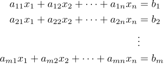
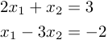
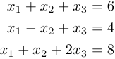

# Trabalho 01 de CN: Resolução de Sistemas Lineares

Um sistema linear é uma equação dada por
$$Ax = b$$
onde
- $A$ é uma matriz de $m$ linhas e $n$ colunas
- $x$ é o vetor de variáveis, de tamanho $n$
- $b$ é um vetor constante de tamanho $m$.

Então você terá um sistema com $m$ equações lineares e $n$ variáveis do tipo



Para este trabalho você deve receber um sistema linear (definido por $A$ e $b$) e retornar uma solução deste sistema.

Você pode assumir que todo sistema de entrada terá solução única.

Mais que isso, você pode assumir que a quantidade de equações é **igual** à quantidade de variáveis.

### Entradas

A entrada estará em formato `csv` e será dado na forma
```
a11, a12, ..., a1n, b1
a21, a22, ..., a2n, b1
.
.
.
am1, am2, ..., amn, bm
```

Por exemplo, o sistema linear



Será dado pelo seguinte $csv$:
```
2,1,3
1,-3,-2
```

O sistema linear



Será dado pelo seguinte $csv$:
```
1,1,1,6
1,-1,1,4
1,1,2,8
```

### Passos

O seu programa deve **obrigatoriamente** e **explicitamente** seguir os seguintes passos, ter as seguintes funções/métodos, e usar as seguintes funções:

 - Ler uma entrada em csv no formato especificado pelo trabalho.

 - imprimir a solução (os valores de $x$) na tela


### Regras

 - Você pode fazer em qualquer uma das seguintes linguagens: python, java, C++, C ou C#.

 - Você pode usar **qualquer biblioteca** interna ou externa à linguagem que você utilizará. Porem, deve **obrigatoriamente** seguir os passos listados anteriormente.
