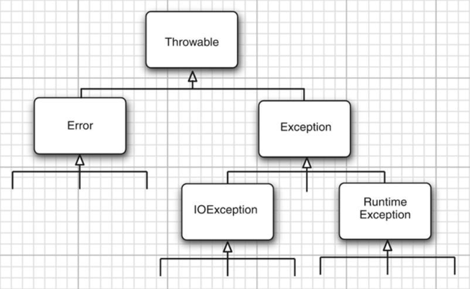

# Controle de Erros

O objetivo do controle de erros é fazer com que o programa verifique se é possível executar a ordem à qual foi destinado. Caso não seja possível, o programa entra em estado de erro. Neste estado o ideal é

1. Mandar um aviso do problema.
1. Explicar o problema, se possível.
1. Talvez voltar para um estado de funcionamento, se possível.
1. Talvez salvar o trabalho feito, se possível.
1. Talvez terminar graciosamente o programa, se possível.

Você já deve ter se deparado com vários tipos de erros. Temos basicamente três tipos de erros em programação, vamos ver cada um deles. Mas o **único** erro que é possível fazer tratamento é o erro de execução:

#### Erros de Compilação

Quando o programa **não compila**. Este é o erro mais fácil de consertar com a ajuda de uma IDE. Normalmente a IDE sublinha exatamente a linha que está errada em vermelho e ainda dá dicas de como consertar.


No exemplo acima a IDE avisa que o comando não tem um `;`


No exemplo acima a IDE avisa que não existe a variável `coisa`.

Nestes casos o programa não roda (ele nem inicia).

#### Erros de Lógica

Este é o tipo mais nocivo de erro. É quando a lógica do programa está errada (faz uma conta errada por exemplo) e o programa não reconhece que tem um erro.

#### Erros de Execução (<-- Este que será tratado)

O erro de execução é quando o programa dá erro enquanto executa, isso quer dizer que o programa inicia, mas no meio do programa ocorre algum erro em que não é possível o programa continuar funcionando normalmente.

**Este é o tipo de erro que será tratado nesta seção.**

## Os Tipos de Erros de Execução (Em Java Chamamos de Exceptions)

Em java temos três grandes tipos de erros de execução que podem ser tratados:



#### `Error` (Você Não Precisa se Preocupar Com Este)

Em primeiros temos o `Error`, são erros que acontecem dentro do sistema, que estão fora do código, estes você **não precisa se preocupar**.

#### `Runtime Exception` (Você Deve se Preocupar, Mas Não  Deve Ser Tratado, Deve Ser Consertado)

Em segundo temos o `Runtime Exception`, este é o tipo de erro que é **culpa do programador**. Este erro deve ser considerado mas **não deve ser tratado, deve ser consertado**.

Caso um erro deste ocorra, o programa deve ser terminado e o **programador deve ser avisado do erro**.

Por exemplo
* `IndexOutOfBound`: possivelmente o programa tenta acessar uma parte de uma lista que não existe

``` java
import java.util.ArrayList;
import java.util.List;

public class Main {
	public static void main(String[] args) {
		List<Integer> numeros = new ArrayList<>();
		numeros.get(1);
	}
}
```

```
Exception in thread "main" java.lang.IndexOutOfBoundsException: Index 1 out of bounds for length 0
	at java.base/jdk.internal.util.Preconditions.outOfBounds(Preconditions.java:64)
	at java.base/jdk.internal.util.Preconditions.outOfBoundsCheckIndex(Preconditions.java:70)
	at java.base/jdk.internal.util.Preconditions.checkIndex(Preconditions.java:248)
	at java.base/java.util.Objects.checkIndex(Objects.java:373)
	at java.base/java.util.ArrayList.get(ArrayList.java:427)
	at erros.Main.main(Main.java:10)

```

* `NulPointerException`: possivelmente tentar usar uma variável de um objeto que não foi inicializado
``` java
public class Main {
	public static void main(String[] args) {
		Gato gato = null;
		gato.miar();
	}
}

```

```
Exception in thread "main" java.lang.NullPointerException
	at erros.Main.main(Main.java:7)
```


* `StackOverFlow`: uma função está chamando ela mesmo infinitamente (até encher a pilha de chamadas).

``` java
public class Main {

	public static void main(String[] args) {
		f();
	}

	static void f() {
		f();
	}
}
```

```
Exception in thread "main" java.lang.StackOverflowError
        at erros.Main.f(Main.java:10)
        at erros.Main.f(Main.java:10)
        at erros.Main.f(Main.java:10)
        at erros.Main.f(Main.java:10)
        .
        .
        .
        at erros.Main.f(Main.java:10)
        at erros.Main.f(Main.java:10)
```


* `ArithmeticException`: alguma operação aritmética deu erro.

``` java
public class Main {

	public static void main(String[] args) {
		System.out.println(divide(1, 0));
	}

	static int divide(int a, int b) {
		return a/b;
	}
}
```

```
Exception in thread "main" java.lang.ArithmeticException: / by zero
	at erros.Main.divide(Main.java:10)
	at erros.Main.main(Main.java:6)
```


#### `IOException` (Este Erro Deve Ser Previsto e Tratado!!!)

Em terceiro lugar temos o `IOException` (pode ser traduzido como Exceções de entrada e saída). Este é o tipo de erro que não é de responsabilidade do programador. Por este motivo o programador deve prever e tratar.

Por exemplo:

* não existe o arquivo que o programa está tentando abrir,
* o computador está sem acesso à internet,
* impressora está sem tinta,


## Como Lançar um Erro? (`throw exception`)

Vamos aprender como lançar uma `exception` (um erro).

O comando `throw` lança um objeto do tipo `Throwable`

Por exemplo, vamos fazer uma função que divide dois números inteiros, se o divisor for igual a zero vamos lançar uma `ArithmeticException` com a mensagem `"O Divisor da divisão é igual a zero"`

``` java
public class Main {

	public static void main(String[] args) {
		System.out.println(divide(1, 0));
	}

	static int divide(int a, int b) {
		if(b==0) {
			throw new ArithmeticException("O Divisor da divisão é igual a zero");
		}
		return a/b;
	}

}
```

```
Exception in thread "main" java.lang.ArithmeticException: O Divisor da divisão é igual a zero
	at erros.Main.divide(Main.java:11)
	at erros.Main.main(Main.java:6)
```

Como visto ateriormente, o objeto `ArithmeticException` é do tipo `RunTime Exception`, que não precisa ser tratado.


.
