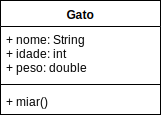

# Laboratório 01 - Classes

Para cada um destes exercícios, faça uma classe teste `TesteExercicioXX` **separada** com o método `public static void main(String[] args)` para testar a sua classe.

Em todos os exercícios, você terá que especificar, para cada atributo, *constructor* e método, se estes são `public` ou `private`

## Fazer uma classe

### Exercício 01



Uma classe que modele um gato, chamada "Gato", com todos os métodos e atributos `public`
* que tenha os atributos
	* "nome", que seja uma `String`,
	* "idade", que seja um `int`,
	* "peso", que seja um `double`.
* que tenha o método
	* um método `void miar()` que, quando chamado, imprime na tela
		* "miau miau miau, meu nome é *nomeDoGato*, eu tenho *pesoDoGato* quilos", caso o gato tenha menos de 3 anos de idade,
		* "miaaau, meu nome é *nomeDoGato*, eu tenho *pesoDoGato* quilos" caso o gato tenha entre 3 e 8 anos de idade,
		* e "Grrr, meu nome é *nomeDoGato*, eu tenho *pesoDoGato* quilos" caso o gato tenha mais de 8 anos de idade.

Use a sua classe teste para testar as várias possibilidades.

### Exercício 02

Uma classe que modele um aluno, chamada "Aluno", com todos os métodos e atributos `public`
* que tenha os atributos `public`
	* "ra", que seja uma `String`
	* "nome", que seja do tipo `String`
	* "notaNP1", que seja do tipo `double`
	* "notaNP2", que seja do tipo `double`
* que tenha o método `public void relatorio()`, que imprime na tela:
	* o ra, o nome e as notas e
	* "O aluno passou" caso a média das notas seja maior ou igual a 7.0, ou
	* "O aluno não passou" caso a média das notas seja menor que 7.0

Use a sua classe teste para testar as várias possibilidades.


## Fazer uma classe que tenha uma classe

### Exercício 03

(DICA: é a mesma coisa do exercício anterior, muda apenas o que estiver em **negrito**)

Uma classe que modele um aluno, chamada "Aluno", com todos os métodos e atributos `public`
* que tenha os atributos `public`
	* "ra", que seja uma `String`
	* **"nome", que seja do tipo `Nome`**
	* "notaNP1", que seja do tipo `double`
	* "notaNP2", que seja do tipo `double`
* que tenha o método `public void relatorio()`, que imprime na tela:
	* o ra, o nome e as notas e
	* "O aluno passou" caso a média das notas seja maior ou igual a 7.0, ou
	* "O aluno não passou" caso a média das notas seja menor que 7.0

**Uma classe que modele o nome de um aluno, chamada "Nome"**
* **que tenha o atributo `String primeiroNome`**
* **que tenha o atributo `String sobrenome`**

Use a sua classe teste para testar as várias possibilidades.

### Exercício 04

(DICA: é a mesma coisa do exercício anterior, muda apenas o que estiver em **negrito**)

Uma classe que modele um aluno, chamada "Aluno", com todos os métodos e atributos `public`
* que tenha os atributos `public`
	* "ra", que seja uma `String`
	* **"cadastro", que seja do tipo `Cadastro`**
	* "notaNP1", que seja do tipo `double`
	* "notaNP2", que seja do tipo `double`
* que tenha o método `public void relatorio()`, que imprime na tela:
	* o ra, o nome e as notas e
	* "O aluno passou" caso a média das notas seja maior ou igual a 7.0, ou
	* "O aluno não passou" caso a média das notas seja menor que 7.0

**Uma classe que modele o cadastro de um aluno, chamada "Cadastro"**
* que tenha o atributo `Nome nome`
* que tenha o atributo `Endereco endereco`

Uma classe que modele o nome de um aluno, chamada "Nome"
* que tenha o atributo `String primeiroNome`
* que tenha o atributo `String sobrenome`


**Uma classe que modele o nome de um aluno, chamada "Endereco"**
* que tenha o atributo `String rua`
* que tenha o atributo `int numero`

Use a sua classe teste para testar as várias possibilidades.


### Exercício 05

(DICA: é a mesma coisa do exercício anterior, muda apenas o que estiver em **negrito**)

Uma classe que modele um aluno, chamada "Aluno", com todos os métodos e atributos `public`
* que tenha os atributos `public`
	* "ra", que seja uma `String`
	* "cadastro", que seja do tipo `Cadastro`
	* "boletim", que seja do tipo `Boletim`
* que tenha o método `public void relatorio()`, que imprime na tela:
	* o ra, o nome e as notas e
	* "O aluno passou" caso a média das notas seja maior ou igual a 7.0, ou
	* "O aluno não passou" caso a média das notas seja menor que 7.0

Uma classe que modele o cadastro de um aluno, chamada "Cadastro"
* que tenha o atributo `Nome nome`
* que tenha o atributo `Endereco endereco`

**Uma classe que modele o boletim de um aluno, chamada "Boletim"**
* que tenha o atributo `double notaNP1`
* que tenha o atributo `double notaNP2`
* que tenha o **método** `double media()` que retorna a média deste alunos
* que tenha o **passou** `boolean passou()` que retorna a se o aluno passou de ano ou não


## Fazer uma classe com atributos `private`, e métodos de acesso

### Exercício 06

Uma classe que modele um aluno, chamada "Aluno",
* **que tenha os campos `private`**
	* "ra", que seja uma `String`
	* "nome", que seja do tipo `String`
	* "boletim", que seja do tipo `Boletim`
* que tenha um *constructor* `public Aluno(String aRa, String aNome)` que
	* inicializa o campo `this.ra` com o valor de `aRa`, e
	* inicializa o campo `this.nome` com o valor de `aNome`
* **que tenha um método `public void setNotaNP1(double aNota)` para definir a nota NP1 do boletim, através do método `public void setNotaNP1(double aValor)`**
* **que tenha um método `public void setNotaNP2(double aNota)` para definir a nota NP2 do boletim, através do método `public void setNotaNP2(double aValor)`**
* que tenha o método `public void relatorio()`, que imprime na tela:
	* o ra, o nome e as notas e
	* "O aluno passou" caso a média das notas seja maior ou igual a 7.0, ou
	* "O aluno não passou" caso a média das notas seja menor que 7.0

Uma classe que modele o boletim de um aluno, chamada "Boletim"
* **que tenha os campos `private`**
	* `Nota notaNP1`
	* `Nota notaNP2`
* **que tenha os métodos de acesso aos campos**
	* *`public void setNotaNP1(double aValor)` para construir a variável "notaNP1" do boletim*
	* *`public void setNotaNP2(double aValor)` para construir a variável "notaNP2" do boletim*
	* *`public double getNotaNP1()` para recuperar o valor da nota NP1, como um `double`*
	* *`public double getNotaNP2()` para recuperar o valor da nota NP2, como um `double`*

Uma classe que modele a nota no boletim, chamada "Nota"
* **que tenha o campo `private double valor`**
* que tenha um *constructor* `public Nota(double aValor)` que
	* o `this.valor` tome o valor de `aValor` caso este esteja entre 0.0 e 10.0
	* `this.valor` tome valor `0.0` caso `aValor` seja menor que 0
	* `this.valor` tome valor `10.0` caso `aValor` seja maior que 10
* **tenha um método de acesso `public double getValor()` que retorna o valor da nota**

Use a sua classe teste para testar as várias possibilidades.

## Fazer uma classe com atributos `private`, e métodos de acesso

### Exercício 07

Fazer a mesma classe do exercício anterior, mas incluir o `@Override` do método `public String toString()`, que imprime os dados do objeto.

Para fazer o `@Override` deste método implemente o método com a seguinte assinatura:
``` java
@Override
public String toString(){
  // implementação do método
}
```


## Fazer uma classe com uma variável e método `static`

### Exercício 08

Uma classe que modele um aluno, chamada "Aluno",
* que tenha os campos `private`
	* *"quantidadeDeAlunos" que seja do tipo `private static int`, e seja inicializada para `0`*
	* "ra", que seja uma `String`
	* "nome", que seja do tipo `String`
	* "boletim", que seja do tipo `Boletim`
* que tenha um *constructor* `public Aluno(String aRa, String aNome)` que
	* que aumente em `1` a variável de classe `quantidadeDeAlunos`
	* inicializa o campo `this.ra` com o valor de `aRa`, e
	* inicializa o campo `this.nome` com o valor de `aNome`
* que tenha um método `public void setNotaNP1(double aNota)` para definir a nota NP1 do boletim, através do método `public void setNotaNP1(double aValor)`
* que tenha um método `public void setNotaNP2(double aNota)` para definir a nota NP2 do boletim, através do método `public void setNotaNP2(double aValor)`
* que tenha o método `public void relatorio()`, que imprime na tela:
	* o ra, o nome e as notas e
	* "O aluno passou" caso a média das notas seja maior ou igual a 7.0, ou
	* "O aluno não passou" caso a média das notas seja menor que 7.0
* **que tenha o método `public static void relatorioDaClasse()`, que imprime na tela:**
	* *"A quantidade de alunos construída foi *quantidadeDeAlunos*"*

Uma classe que modele o boletim de um aluno, chamada "Boletim"
* que tenha os campos `private`
	* `Nota notaNP1`
	* `Nota notaNP2`
* que tenha os métodos de acesso aos campos
	* `public void setNotaNP1(double aValor)` para construir a variável "notaNP1" do boletim
	* `public void setNotaNP2(double aValor)` para construir a variável "notaNP2" do boletim
	* `public double getNotaNP1()` para recuperar o valor da nota NP1, como um `double`
	* `public double getNotaNP2()` para recuperar o valor da nota NP2, como um `double`

Uma classe que modele a nota no boletim, chamada "Nota"
* que tenha o campo `private double valor`
* que tenha um *constructor* `public Nota(double aValor)` que
	* o `this.valor` tome o valor de `aValor` caso este esteja entre 0.0 e 10.0
	* `this.valor` tome valor `0.0` caso `aValor` seja menor que 0
	* `this.valor` tome valor `10.0` caso `aValor` seja maior que 10
* tenha um método de acesso `public double getValor()` que retorna o valor da nota;

Use a sua classe teste para testar as várias possibilidades.
