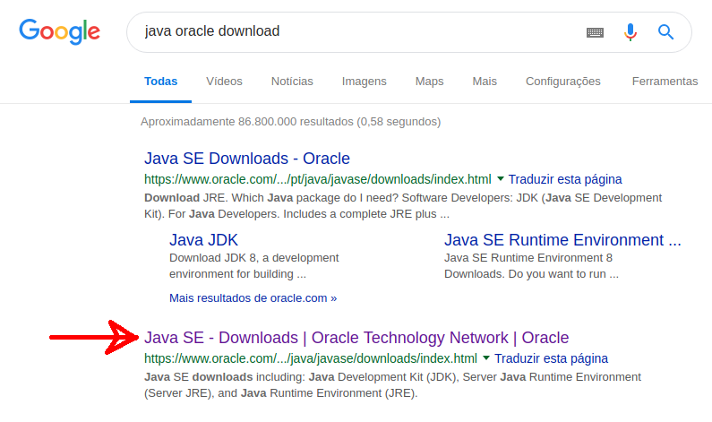
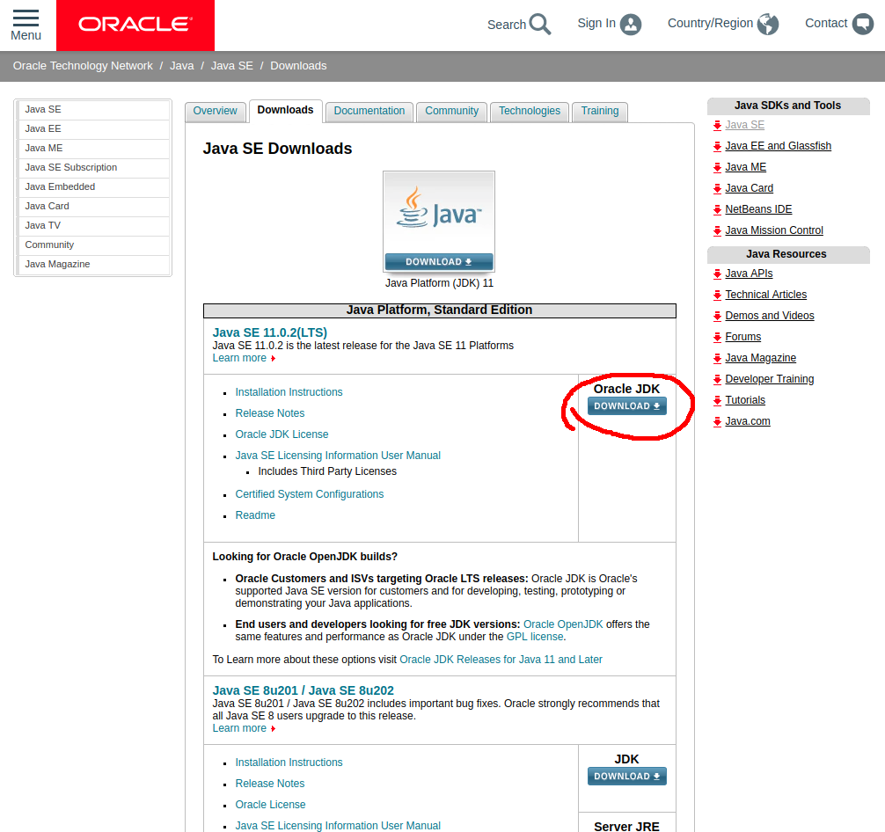
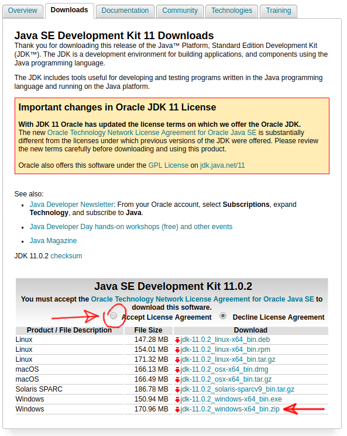
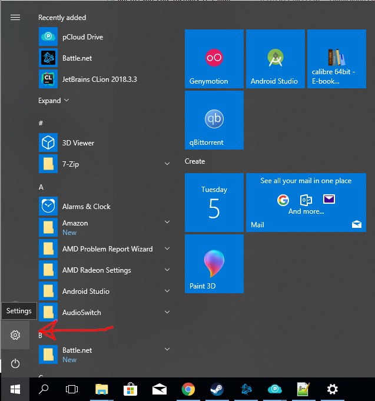
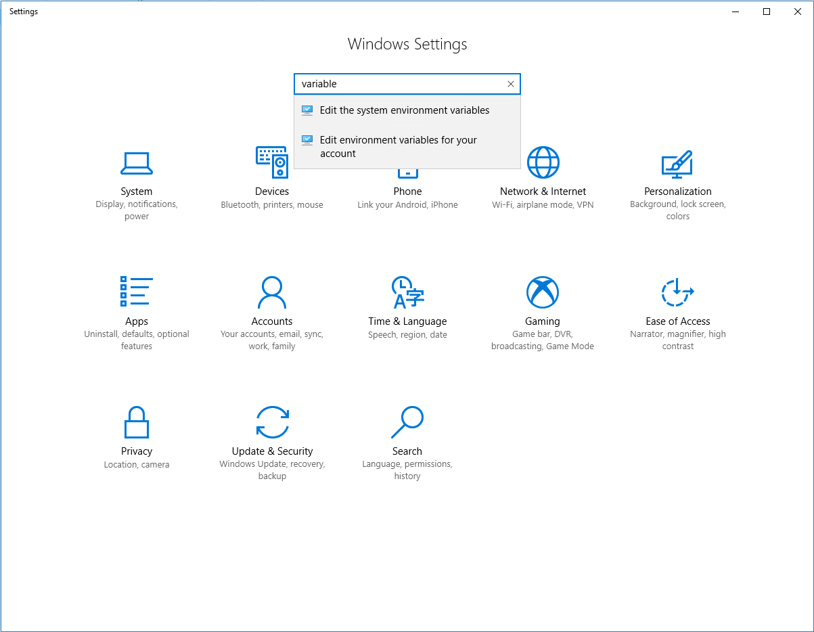
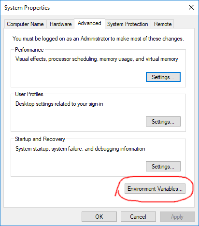
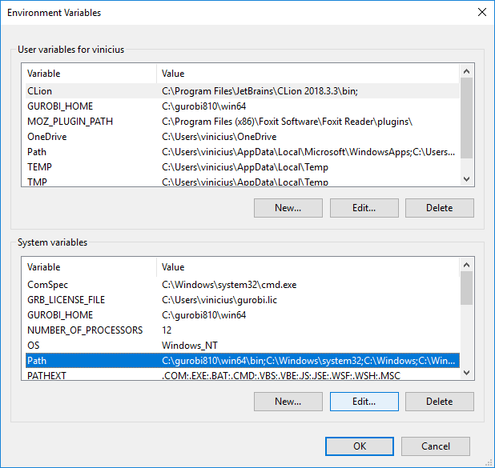
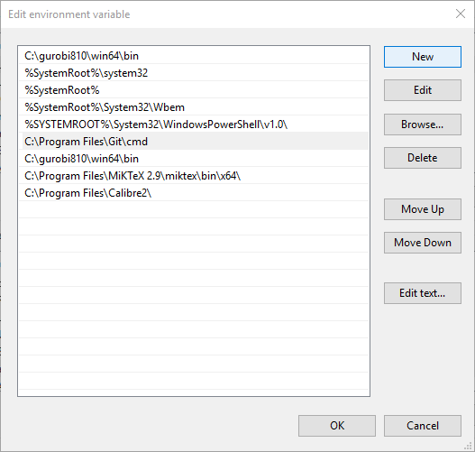
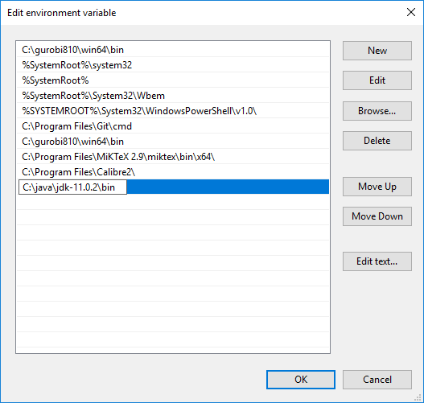

# Como instalar java no Windows (Windows 10)

Para programar em java você precisa do Java Development Kit (JDK).

A versão mais atualizada pode ser encontrada no link http://www.oracle.com/technetwork/java/javase/downloads.
(No momento da escrita neste tutorial, a versão mais nova é a 11)

### Passo a passo

Para instalar o Java no Windows, siga os seguintes passos (as imagens do tutorial foram feitas no Windows 10):

 - Baixe o JDK no link [www.oracle.com/technetwork/java/javase/downloads]
    

 - Escolha a versão do Java, é recomendável pegar a versão mais nova, ela possibilita compilar o seu programa usando qualquer versão anterior
    

 - Aceite o termo de uso e escolha o tipo de arquivo, aqui escolhemos o ".zip" para o Windows
    

 - Agora colocamos o programa na pasta +C:\\java+, para isto basta recortar e colar o arquivo no endereço

 - Agora podemos extrair o arquivo, no meu caso ele foi extraído para a pasta "jdk-11.0.2"

 - Agora precisamos configurar a variável de ambiente "PATH" para que o Windows saiba onde encontrar o programa.
 O caminho para configurar o "PATH" é

 - "Control Panel",
    

 - Busque pelo termo "variable",
    
 - Escolha "Environment Variables",
    

 - edit "Path",
    

 - "New" e
    

 - adicione o caminho +C:\\Java\\jdk-11.0.2\\bin+
    

 - (ATENÇÃO: pode ser que a sua versão seja diferente, para acertar basta copiar o endereço de onde está a pasta "bin" dentro da pasta "jdk")

 - Para verificar a instalação vá ao terminal e verifique a versão instalado do Java
 (caso o terminal já esteja aberto, você precisará fechar e abrir de novo para que ele atualize com a modificação da variável de ambiente)
 -- A versão do compilador +javac+ com o comando `javac -version`
~~~ shell_session
PS C:\Users\vinicius> javac -version
javac 11.0.2
~~~
 -- A versão do +java+ com o comando `java -version`
~~~
PS C:\Users\vinicius> java -version
java version "11.0.2" 2018-10-16 LTS
Java(TM) SE Runtime Environment 18.9 (build 11.0.2+7-LTS)
Java HotSpot(TM) 64-Bit Server VM 18.9 (build 11.0.2+7-LTS, mixed mode)
~~~

### Informação extra

Pode ser que você se depare com outras versões mais antigas, a tabela abaixo explica cada nomenclatura.

|Nome                    | Acrônimo | Explicação |
|---                     |:---:     |:---        |
Java Development Kit     | JDK | Software para programadores que querem escrever programas em Java |
Java Runtime Environment | JRE | Software para o susuário final que quer rodar um programa em Java |
Standard Edition         | SE  | Plataforma Java para ser usada em computador e aplicações mais simples |
Enterprise Edition       | EE  | Plataforma Java para ser usada em computador ou aplicações mais complexas |
Micro Edition            | ME  | Plataforma Java para ser usada em celulares e dispositivos portáteis |
Java 2                   | J2  | Um termo desatualizado que descreve as versões Java de 1998 a 2006 |
Software Development Kit | SDK | Um termo desatualizado que descreve JDK de 1998 a 2006 |
Update                   | u   | Termo para indicar que algum bug foi consertado |
NetBeans                 | --  | Um ambiente de desenvolvimento da Oracle|
