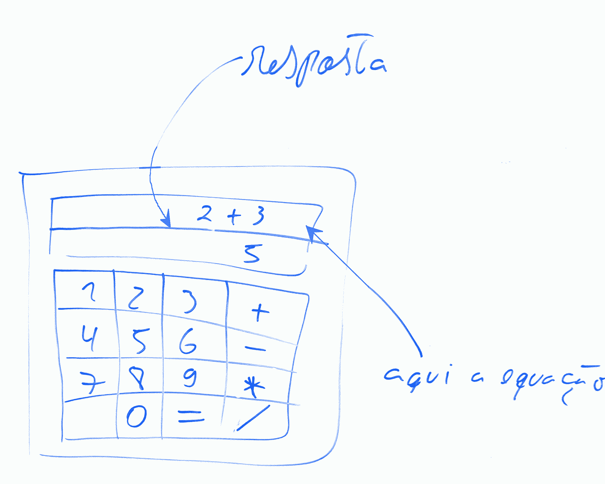
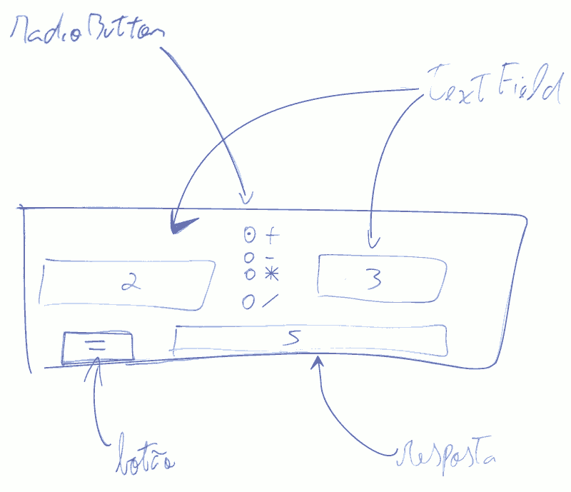

# Laboratório 02.02 - Calculadora

Fazer uma calculadora que
- Faça apenas uma operação por vez
- Depois de fazer a operação você pode decidir terminar o programa ou não
- Fazer apenas as operações: **+**, **-**, **\*** e **/**.
- Usar apenas números inteiros
- Tratar erros, por exemplo: impedir números não válidos, impedir divisão por zero, operações com mais de um operador (1+2*3), etc...

### Exercício 01 Calculadora Grid

Fazer uma interface como no desenho abaixo:

[Resposta](https://github.com/viniciusdenovaes/Unip222ALPOO/tree/master/Lab02.02/src/calculadora_grid)

### Exercício 02 Calculadora Radio

Fazer uma interface como no desenho abaixo:

[Resposta](https://github.com/viniciusdenovaes/Unip222ALPOO/tree/master/Lab02.02/src/calculadora_radio)

### Desafio

Fazer a calculadora grid com números reais (com pontos decimais)

.
