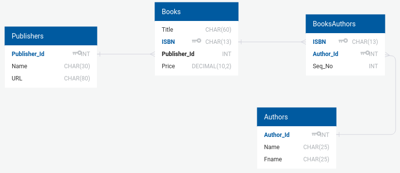

# Trabalho Livraria

## Trabalho em grupo de, no máximo, ? pessoas

Neste trabalho você deve fazer um programa que manipula dados de uma livraria.

A estrutura do seu projeto deve estar nos padrões MVC e DAO.

O seu programa deve ter uma interface de usuário em que seja possível pesquisar, incluir, modificar e apagar livros, autores e editoras conforme as tabelas especificadas no diagrama a seguir:

- A imagem do diagrama foi produzida pelo site [https://www.quickdatabasediagrams.com quickdatabasediagrams.com]

O banco de dados deve ser populado com as informações em [livraria.zip](bd/livraria.zip)

O trabalho deve ser apresentado em aula de laboratório, onde o código fonte será avaliado.

A data da **apresentação** ainda será definida.

### Instruções

O programa deve ser capaz de fazer as seguintes ações no banco de dados:
 - Buscar
    - livros,
    - autores,
    - editoras,
    - (bônus) mais uma busca ou *filtro* de busca, ou busca combinada à sua escolha.
 - Incluir
    - livros,
    - autores,
    - editoras;
 - Excluir
    - livros,
    - autores,
    - editoras.

Buscar: para a ação de buscar um objeto, o programa deve buscar pelos seguintes campos:
 - Livros:
    - título,
 - Autor:
    - nome e
    - sobrenome
 - Editora:
    - nome.

Incluir: para a ação de incluir, o seu programa deve respeitar as seguintes regras:
 - Livro, o usuário deve ser capaz de fornecer:
    - o nome do livro,
    - o ISBN,
    - o preço,
    - deve ser escolhida uma editora já existente,
    - um conjunto de um ou mais autores de uma lista, em uma ordem que o usuário escolher.

 - Autor, o identificador do autor deve ser gerado automaticamente, o usuário deve fornecer:
    - nome do autor,
    - sobrenome do autor.

 - Editora, o identificador da editora deve ser gerado automaticamente, o usuário deve fornecer:
    - o nome da editora,
    - o site da editora.

Excluir: para a ação de excluir, o seu programa deve respeitar as seguintes regras:
 - Livro: um livro pode ser excluído livremente,
    - um cuidado deve ser tomado: excluir as entradas da tabela de relação LivrosxAutores em que aquele livro aparece.

 - Autor, podem existir livros que dependam deste autor, então você terá que escolher:
    - caso escolha apagar, os livros deverão ser apagados
    - caso escolha não apagar, nada deve acontecer
    - (bônus) abrir uma janela de diálogo com o usuário para que ele escolha se deve apagar os livros ou não

 - Editora, podem existir livros que dependam da editora, então você terá que escolher:
    - caso escolha apagar, os livros deverão ser apagados
    - caso escolha não apagar, nada deve acontecer
    - (bônus) abrir uma janela de diálogo com o usuário para que ele escolha se deve apagar os livros ou não

### Avaliação

O trabalho deverá usar os padrões MVC e DAO quanto à separação das responsabilidades do programa.

Cada componente do padrão deverá estar em uma classe diferente ou (melhor) em um pacote diferente.

OBS: Não será avaliado o "flow" (direção e percurso da comunicação) entre os componentes, mas sim a divisão de responsabilidades.

 - Pontuação:
    - Estrutura do programa: uso do MVC e DAO: 30%
    - acesso bem sucedido ao banco de dados proposto e manipulação dos seus dados: 20%
    - interface gráfica completa: 20%
    - uso adequado do "PreparedStatement": 20%
    - controle de erros das entradas do usuário: 10%
    - (bônus) mais tipos ou funcionalidades de modificação dos dados e busca, filtros e busca combinada na busca por livros, autores, ou editora: 10%
    - (bônus) diálogo com o usuário ao excluir autor e editora, para saber se deve ou não excluir os livros associados: 10%
