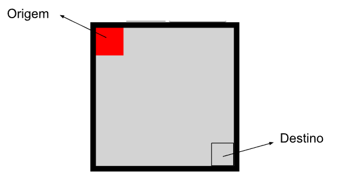
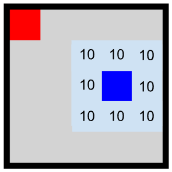
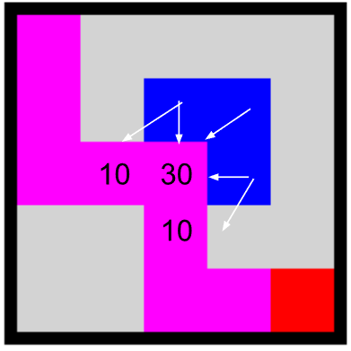

# Hokama`s Tower Defense (Sem fonte de vida)

No Hokama’s Tower Defense o jogo se dá em um tabuleiro de `nxn`, o jogador sai do quadrado superior esquerdo na coordenada `(0, 0)` e precisa chegar no quadrado `(n-1, n-1)`.

O tabuleiro possui torres de ataque que causam 10 pontos de dano no jogador para cada jogada em que ele esteja em um quadrado adjacente à torre.

No desenho abaixo, o quadrado azul representa uma torre e a área azul claro representa a área de alcance da torre. Note que a torre ataca na diagonal.

O dano das torres acumula, ou seja, em um quadrado que tiver 3 torres em quadrados adjacentes, caso o jogador passe por ele, sofrerá 30 de dano. O jogador também pode sofrer danos múltiplos de uma mesma torre, caso passe por mais de um quadrado defendido por ela. Na figura a seguir o caminho realizado pelo atacante está marcado em magenta, note que o atacante sofre 50 de dano.

.
