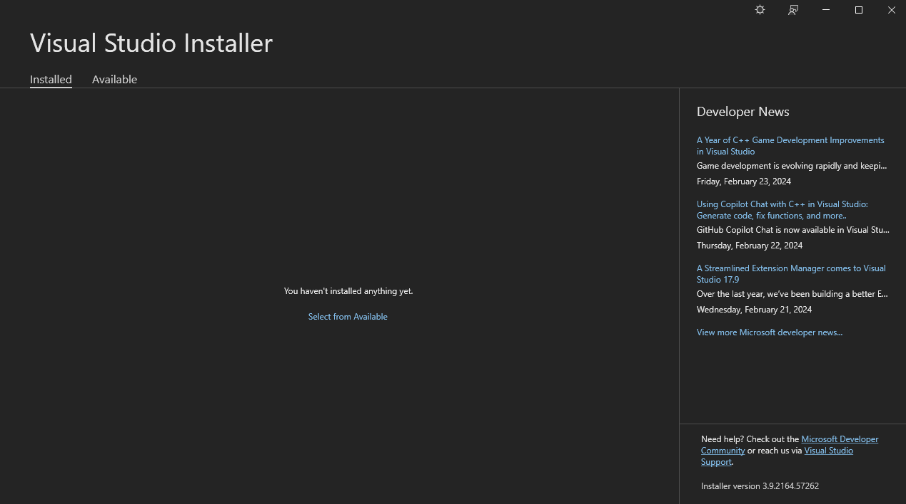
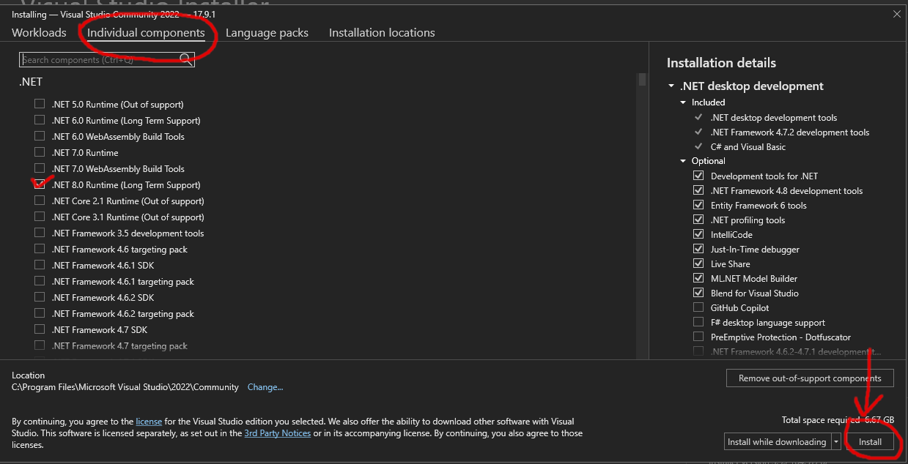
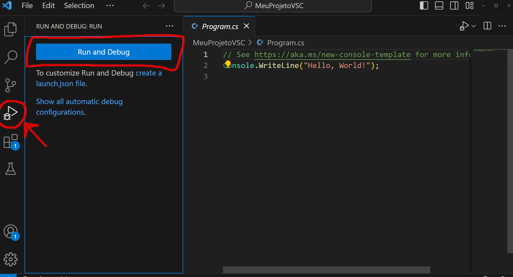

# Como instalar C# no Windows (Windows 10)

Para programar em C# você precisa do programa dotnet (http://www.dot.net),
este é o programa que irá transformar o seu código de C# em um programa executável.

### Para instalar o 'dotnet'

Para saber se você já tem o programa dotnet:
1. abra o terminal no windows (busque o programa ´prompt´ ou 'Command Prompt')
1. digite o comando 'dotnet --version'
Aparecerá a última versão do dotnet disponível.

No meu apareceu isto:
'''code
$ dotnet --version
8.0.200
'''

A última versão que eu tenho no meu computador é a 8.0.200.

Qualquer versão depois da (incluindo a) 6.0 servirá para este curso.

Caso você não tenha nenhum instalado você poderá instalar pelo [Visual Studio 2022 Community Edition](https://visualstudio.microsoft.com/) como veremos mais adiante, **ou** instalar pelo site http://www.dot.net

## IDE

### O que é uma IDE?

Do inglês *integrated development environment* ou *ambiente de desenvolvimento integrado* é uma ferramenta que inclui um poderoso editor de texto para edição de código em um projeto.

Em um projeto o seu código estará em vários arquivos diferentes. Diferente de um simples editor de texto como 'notepad++', uma IDE consegue entender o seu projeto como um todo, ao invés de ver cada arquivo de forma separada. Desta forma ela consegue te ajudar nas referências que você fizer de um arquivo a outro.

As IDEs são essenciais para fazer qualquer projeto profissional, então é melhor se acostumar com alguma desde cedo.

### Qual IDE usar?

Vamos ver aqui como usar duas IDEs: [Visual Studio 2022 Community Edition](https://visualstudio.microsoft.com/), e [Visual Studio Code](https://code.visualstudio.com/).

Dois nome muito parecidos né? Vamos ver a diferença entre as duas:
- [Visual Studio 2022 Community Edition](https://visualstudio.microsoft.com/): é uma IDE desenvolvida pela Microsoft para programar em C# e C++. Esta IDE pode automatizar processor mais complicados como criação e organização de projetos. Esta IDE é mais direcionada para o projeto.
- [Visual Studio Code](https://code.visualstudio.com/): é uma IDE desenvolvida pela Microsoft para ser altamente customizável, ela **não** é somente para programar em C#. Por isto você vai precisar configurar bastante ela antes de usar, para que ela se adeque ao seu objetivo. Além disso ela dificilmente vai automatizar a criação e estruturação de projetos. Esta IDE é mais direcionada ao código.

Para iniciantes, recomendo usar o [Visual Studio 2022 Community Edition](https://visualstudio.microsoft.com/), pois você gastará menos tempo com a parte de configuração do projeto.

Uma outra IDE que pode ser usada é a [Rider da JetBrains](https://www.jetbrains.com/rider/), mas esta é paga e não será coberta por este tutorial.

### Usando [Visual Studio 2022 Community Edition](https://visualstudio.microsoft.com/)

Baixe e rode a última versão do instalador pelo site oficial [Visual Studio 2022 Community Edition](https://visualstudio.microsoft.com/).



Escolha a instalação do Visual Studio Community 2022


Marque a opção de desenvolvimento de aplicativos para consoles (terminal) e
na outra aba certifique-se de ter uma versão Long Term Supported do .NET, como a 8.0 por exemplo.




Espere a instação ser concluída


Não precisa logar


Crie um novo projeto


Escolha a opçao de Console APP **do C#**, e **não** a do **VB**


Coloque um nome do seu projeto, perceba que o nome da solução e os nomes das pastas ficarão iguais.


Escolha a versão do .NET e crie o projeto


Clique na seta verde para rodar o projeto


Modifique o código para ficar mais parecido com o que a gente verá na aula.


### Usando [Visual Studio Code](https://code.visualstudio.com/)

O procedimento deste é mais complicado que o anterior. Para quem está iniciando recomendo que use o [Visual Studio 2022 Community Edition](https://visualstudio.microsoft.com/)

Baixe e instale a última versão pelo site oficial [Visual Studio Code](https://code.visualstudio.com/).

Crie a pasta que você usará para a sua área de trabalho do 'vscode'.

Vamos seguir o mesmo padrão para criar um projeto no VisualStudio:

Abra esta pasta no terminal e entre com o seguinte comando para criar uma solução chamada `MeuProjetoVSC` na pasta `MeuProjetoVSC`

```
dotnet new sln -n MeuProjetoVSC -o .\MeuProjetoVSC
```

Entre com o seguinte comando para criar uma aplicação `MeuProjetoVSC` na pasta `MeuProjetoVSC\MeuProjetoVSC`. Em `-f net8.0` escolha a versão do .net que você quer usar.

```
dotnet new console -lang c# -n MeuProjetoVSC -o .\MeuProjetoVSC\MeuProjetoVSC -f net8.0
```

Entre com o seguinte comando para adicionar a aplicação à sua solução.
```
dotnet sln .\MeuProjetoVSC\MeuProjetoVSC.sln add .\MeuProjetoVSC\MeuProjetoVSC
```

Entre com o seguinte comando para abrir o vscode com o seu projeto.
```
code MeuProjetoVSC
```

Veja seu projeto pronto para rodar no vscode


Clique na seta e em "Run and Debug"


Escolha C#


Escolha C# com o nome do seu projeto


Agora você pode fazer um projeto no VSCode e rodar o seu aplicativo.


.
