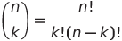

# Lista 00 - Comandos Básicos

Para todas as questões desta lista elabore uma função (método estático em Java) que receba a **entrada** e retorne a **saída**.


* 1. Calcular o estoque médio de uma peça, sendo que o estóque médio é dado pela seguinte fórmula:
estoqueMedio = (quantidadeMinima + quantidadeMaxima)/2
A assinatura da sua função **deve ser**
``` cs
public static double calculaEstoqueMedio(double estoqueMinimo, double estoqueMaximo)
```
O `main` da sua classe deve ser
``` cs
static void Main(string[] args) {
    Console.WriteLine(calculaEstoqueMedio(0, 0));
    Console.WriteLine(calculaEstoqueMedio(1, 1));
    Console.WriteLine(calculaEstoqueMedio(1, 2));
    Console.WriteLine(calculaEstoqueMedio(2, 9));
    Console.WriteLine(calculaEstoqueMedio(101, 102));
}
```
E a saída para este `main` deve ser
``` shell_session
0.0
1.0
1.5
5.5
101.5
```


* 2. Calcular a conversão de dólar para real. A sua função deve receber a cotação do dólar e um valor em dólar, e retornar o valor convertido para real.
A assinatura da sua função **deve ser**
``` cs
public static double conversaoDolar(double cotacaoDolar, double valorDolar)
```
O `main` da sua classe deve ser
``` cs
static void Main(string[] args) {
    Console.WriteLine(conversaoDolar(1, 1));
    Console.WriteLine(conversaoDolar(0.5, 1));
    Console.WriteLine(conversaoDolar(0.5, 2));
    Console.WriteLine(conversaoDolar(2, 1));
    Console.WriteLine(conversaoDolar(5.37, 1));
    Console.WriteLine(conversaoDolar(5.37, 100));
    Console.WriteLine(conversaoDolar(5.37, 0.5));
}
```
E a saída para este `main` deve ser
``` shell_session
1.0
0.5
1.0
2.0
5.37
537.0
2.685
```


* 3. Um conversor de graus Celsius para graus Fahrenheit. A fórmula é dada por `F = (9*C+160)/5`, onde `F` é o grau Fahrenheit e `C` é o grau em Celsius.
A assinatura da sua função **deve ser**
``` cs
public static double conversorCelsiusToFahrenheit(double grauC)
```
O `main` da sua classe deve ser
``` cs
static void Main(string[] args) {
    Console.WriteLine(conversorCelsiusToFahrenheit(0));
    Console.WriteLine(conversorCelsiusToFahrenheit(1));
    Console.WriteLine(conversorCelsiusToFahrenheit(2));
    Console.WriteLine(conversorCelsiusToFahrenheit(20));
    Console.WriteLine(conversorCelsiusToFahrenheit(39));
    Console.WriteLine(conversorCelsiusToFahrenheit(40));
    Console.WriteLine(conversorCelsiusToFahrenheit(100));
}
```
E a saída para este `main` deve ser
``` shell_session
32.0
33.8
35.6
68.0
102.2
104.0
212.0
```

* 4. Um conversor de graus Fahrenheit para graus Celsius. A fórmula é dada por `C = (F-32)*5/9`, onde `F` é o grau Fahrenheit e `C` é o grau em Celsius.
A assinatura da sua função **deve ser**
``` cs
public static double conversorFahrenheitToCelsius(double grauC)
```
O `main` da sua classe deve ser
``` cs
static void Main(string[] args) {
    Console.WriteLine(conversorFahrenheitToCelsius(0));
    Console.WriteLine(conversorFahrenheitToCelsius(1));
    Console.WriteLine(conversorFahrenheitToCelsius(2));
    Console.WriteLine(conversorFahrenheitToCelsius(20));
    Console.WriteLine(conversorFahrenheitToCelsius(32));
    Console.WriteLine(conversorFahrenheitToCelsius(40));
}
```
E a saída para este `main` deve ser
``` shell_session
-17.77777777777778
-17.22222222222222
-16.666666666666668
-6.666666666666667
0.0
4.444444444444445
37.77777777777778
```


* 5. Calcular o volume de uma lata de óleo dado pela fórmula `V = 3.14159*R²*A`, onde `V` é o volume, `R` o raio e `A` a altura da lata.
Dica (opcional): o uso da biblioteca [Math](https://docs.oracle.com/javase/8/docs/api/java/lang/Math.html) pode te ajudar, mais especificamente o atributo estático `Math.PI` e o método estático `Math.pow(double a, double b)`. Para usá-los basta escrever o nome deles, não há a necessidade de importar a biblioteca.
A assinatura da sua função **deve ser**
``` cs
public static double calculaVolumeLata(double raio, double altura)
```
O `main` da sua classe deve ser
``` cs
static void Main(string[] args) {
    Console.WriteLine(calculaVolumeLata(1, 1));
    Console.WriteLine(calculaVolumeLata(2, 1));
    Console.WriteLine(calculaVolumeLata(1, 2));
    Console.WriteLine(calculaVolumeLata(1, 1/Math.PI));
    Console.WriteLine(calculaVolumeLata(2, 1/Math.PI));
    Console.WriteLine(calculaVolumeLata(10, 1));
    Console.WriteLine(calculaVolumeLata(1, 10));
    Console.WriteLine(calculaVolumeLata(10, 10));
}
```
E a saída para este `main` deve ser
``` shell_session
3.141592653589793
12.566370614359172
6.283185307179586
1.0
4.0
314.1592653589793
31.41592653589793
3141.5926535897934
```


* 6. Uma função que retorne o módulo de um número **inteiro**. O módulo de um número `x` é `x` se `x` é maior ou igual a 0, e `-x` caso contrário.
A assinatura da sua função **deve ser**
``` cs
public static int modulo(int n)
```
O `main` da sua classe deve ser
``` cs
static void Main(string[] args) {
    Console.WriteLine(modulo(1));
    Console.WriteLine(modulo(0));
    Console.WriteLine(modulo(-1));
    Console.WriteLine(modulo(2));
    Console.WriteLine(modulo(-2));
}
```
E a saída para este `main` deve ser
``` shell_session
1
0
1
2
2
```


* 7. Uma função que calcule o fatorial de um número.
**OBS:** `0!=1` e `n!=n*(n-1)!` para `n>0`.
A assinatura da sua função **deve ser**
``` cs
public static int fatorial(int n)
```

O `main` da sua classe deve ser
``` cs
static void Main(string[] args) {
    Console.WriteLine(fatorial(0));
    Console.WriteLine(fatorial(1));
    Console.WriteLine(fatorial(2));
    Console.WriteLine(fatorial(3));
    Console.WriteLine(fatorial(4));
    Console.WriteLine(fatorial(10));
}
```
E a saída para este `main` deve ser
``` shell_session
1
1
2
6
24
3628800
```


* 8. Calcule o coeficiente binomial de uma dupla dado pela fórmula

**OBS:** Use o método estático do exercício anterior.
A assinatura da sua função **deve ser**
``` cs
public static int binomial(int n, int k)
```

O `main` da sua classe deve ser
``` cs
static void Main(string[] args) {
    Console.WriteLine(binomial(0, 0));
    Console.WriteLine(binomial(1, 0));
    Console.WriteLine(binomial(1, 1));
    Console.WriteLine(binomial(2, 1));
    Console.WriteLine(binomial(5, 1));
    Console.WriteLine(binomial(2, 2));
    Console.WriteLine(binomial(5, 2));
    Console.WriteLine(binomial(10, 3));
}
```
E a saída para este `main` deve ser
``` shell_session
1
1
1
2
5
1
10
120
```


.
