# Trabalho 02 de PI: Visão Computacional

Para este trabalho você deve fazer um programa que leia uma imagem de um **letra** de uma **vogal** escrito a mão e reconheça se este caracter é a letra `i` ou não.

Um dataset (conjunto de dados) estará disponível nesta página. Este dataset deverá ser usado para treinar e avaliar o seu método.

Você deve avaliar o(s) seu(s) método(s) de reconhecimento segundo as métricas de _**acurácia média**_, _**precision**_, _**recall**_ e _**f1**_.

## DataSet[^s]

[^s]: O dataset foi coletado no site https://www.nist.gov/srd/nist-special-database-19 

O conjunto de dados serão imagens de letras escritas a mão. Todas as letras são vogais maiúsculas ou minúsculas.

O conjunto de imagens por ser baixado em [dataset_v20220930.zip](https://github.com/viniciusdenovaes/Unip222PI/blob/master/dataset/v20220930/dataset_v20220930.zip)

Exemplos de imagens:

### a

 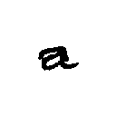 

 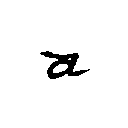 

 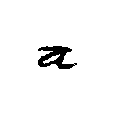 

 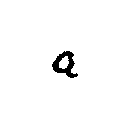 

 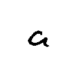 

 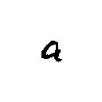 

 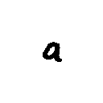 

 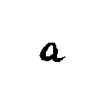 

 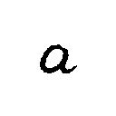 

 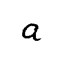 

### e

 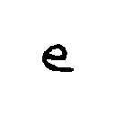 

 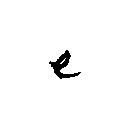 

 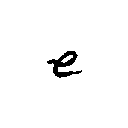 

 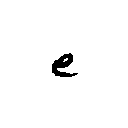 

 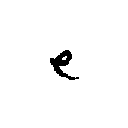 

 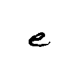 

 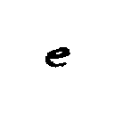 

 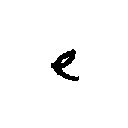 

  

 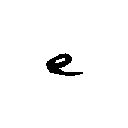 

### i

 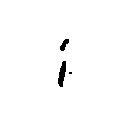 

 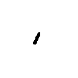 

 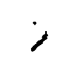 

 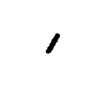 

 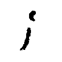 

 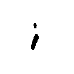 

 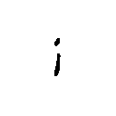 

 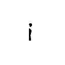 

 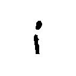 

 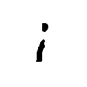 

### o

  

  

  

  

  

  

  

  

  

  

### u

  

  

  

  

  

  

  

  

  

  

### A

 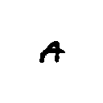 

 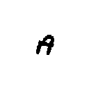 

 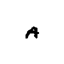 

 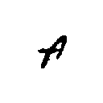 

 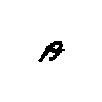 

 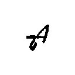 

 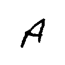 

 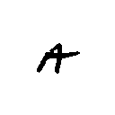 

 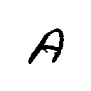 

 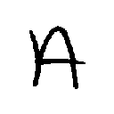 

### E

 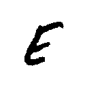 

 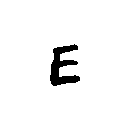 

 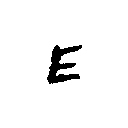 

 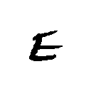 

 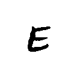 

 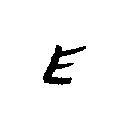 

 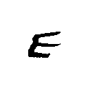 

 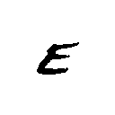 

 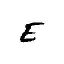 

 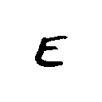 

### I

 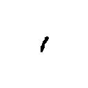 

  

  

  

  

  

  

  

  

  

### O

  

  

  

  

  

  

  

  

  

  

### U

  

  

  

  

  

  

  

  

  

  

## Objetivo

Fazer um estudo de um ou mais métodos de reconhecimento de imagens, para reconhecer a letra `i`, em um conjunto de imagens.

O seu método deve responder se a imagem entrada é ou não é a letra `i`.

As possibilidades de imagens se limitam a letras vogais, assim as únicas letras possíveis de entrada serão `a`, `e`, `i`, `o` ou `u`.

Você pode avaliar mais de um método para resolver o problema.

Você deve fazer uma avaliação de cada método estudado usando uma validação cruzada e exibir as pontuações de **acurácia média**_, _**precision**_, _**recall**_ e _**f1**_.

Como **Bônus**, valendo acima da nota máxima, o objetivo é fazer um programa que receba qualquer imagem de letra escrita a mão e responda se esta letra é um `i` ou não.

## Pontuação

A primeira parte avaliada será o _protótipo_: um relatório mostrando o resultado do(s) método(s) funcionando(s). Depois será avaliado o estudo do(s) método(s). E, por fim, caso o grupo decida fazer, o programa que recebe uma imagem de uma vogal e responda se é um `i` ou não.

- 4pts: Um protótipo com um método funcionando.
- 2pts: Mais de um método funcionando.
- 3pts: Um estudo com as pontuações de **acurácia média**_, _**precision**_, _**recall**_ e _**f1**_ de cada método.
- 1pts: Uma justificativa de qual método é melhor.
- 4pts (**Bônus**): Um programa que receba uma imagem qualquer com uma vogal escrita à mão e responda se é um `i` ou não.

.
