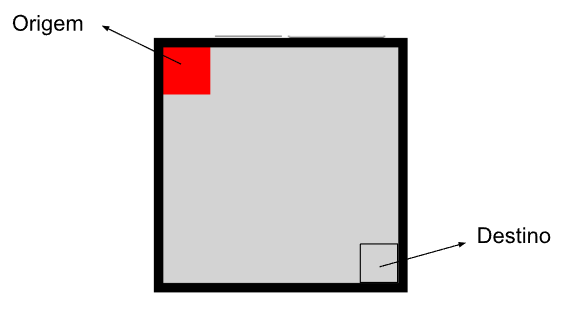
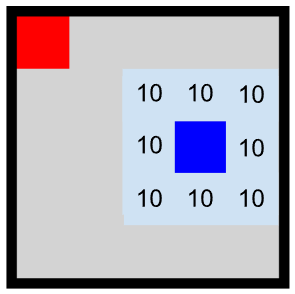
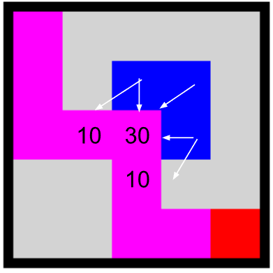
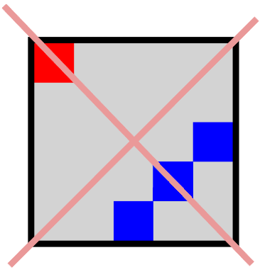

# Hokama`s Tower Defense (Sem fonte de vida) (Grupo de 5 pessoas, para o dia 07/05)

No Hokama’s Tower Defense o jogo se dá em um tabuleiro de `nxn`, o jogador começa no quadrado superior esquerdo na coordenada `(0, 0)` e precisa chegar no quadrado `(n-1, n-1)`.



O tabuleiro possui torres de ataque que causam 10 pontos de dano no jogador para cada jogada em que ele esteja em um quadrado adjacente à torre.

No desenho abaixo, o quadrado azul representa uma torre e a área azul claro representa a área de alcance da torre. Note que a torre ataca na diagonal.



O dano das torres acumula, ou seja, em um quadrado que tiver 3 torres em quadrados adjacentes, caso o jogador passe por ele, sofrerá 30 de dano. O jogador também pode sofrer danos múltiplos de uma mesma torre, caso passe por mais de um quadrado defendido por ela. Na figura a seguir o caminho realizado pelo atacante está marcado em magenta, note que o atacante sofre 50 de dano.



O jogador não pode ocupar o mesmo lugar de uma torre (não pode atravessar uma torre). E você pode supor que em nenhuma das entradas o caminho até o destino está bloqueado, como na figura abaixo.




O jogador **não pode passar em um lugar repetido!**

Para este trabalho você deve fazer um algoritmo exato para encontrar uma solução onde o jogador chega ao seu destino tomando a menor quantidade de dano possível.

### Entrada

Como entrada você deve ler um arquivo chamado `instXX.in` em que a primeira linha indica o tamanho do tabuleiro, e, à partir da segunda linha, um caracter para cada célula do tabuleiro, onde `0` representa um espaço vazio e `t` uma torre. Como, por exemplo


``` plain
5
00T00
00TT0
00000
00000
0T000
```

Um tabuleiro de `5x5` com torres nas posições `(2,0)`, `(2,1)`, `(3,1)` e `(4,1)`.


### Saída

Para saída o seu programa deve escrever um arquivo com as direções que o jogador deve andar para chegar no destino tendo o mínimo de dano possível. Onde `S` é a jogada de andar para baixo, `N` andar para cima, `L` andar para a direita e `O` andar para a esquerda. O arquivo de soluição deve ter apenas uma linha e todos os caracteres devem estar na mesma linha, e o nome do arquivo da solução da instância `instXX.in` deve ser `solXX.out`

Então uma solução ótima da instância acima, tendo `-30` de dano pode ser


``` plain
SSSLLLLS
```

### Avaliação

Seu algoritmo deve rodar qualquer tipo de instância especificada no enunciado, um exemplo de instâncias pode ser encontrado [aqui](https://github.com/viniciusdenovaes/viniciusdenovaes.github.io/tree/master/aulas/unip/20241/ia_files/trabalho/hokya/insts). Outras instâncias maiores serão adicionadas a este conjunto.

No dia da avaliação outras instâncias, de tamanhos variados, não vistas antes, serão apresentadas e seu trabalho terá que solucionar. Sua nota será proporcional à quantidade de instâncias resolvidas de forma ótima.


.
