# Estereoscopia (Como Simular Sentidos em 3D)[^1]
[^1]: Informações retiradas de [Capítulo 8 Visão Estereoscópica, Realidade Virtual, Realidade Aumentada e Colaboração](https://www.academia.edu/56235009/Cap%C3%ADtulo_8_Vis%C3%A3o_Estereosc%C3%B3pica_Realidade_Virtual_Realidade_Aumentada_e_Colabora%C3%A7%C3%A3o)
O capítulo pode ser acessado na íntegra neste [link](https://www.academia.edu/56235009/Cap%C3%ADtulo_8_Vis%C3%A3o_Estereosc%C3%B3pica_Realidade_Virtual_Realidade_Aumentada_e_Colabora%C3%A7%C3%A3o)

Para dar a sensação de um ambiente 3D em som temos a tecnologia estéreo.

Diferentes caixas de som ligadas à mesma fonte emitem os sons em diferentes tempos e volumes. 

Com um headset podemos ver claramente o efeito, dando a sensação exata da direção fonte do som, criando uma ambientação sonora em 3D.

A mesma tecnologia sonora em estéreo pode ser usada para a visão, criando a sensação de profundidade.

Nas figuras abaixo podemos ver como nossos olhos funcionam naturalmente dando a sensação de profundidade. Neste experimento colocamos o nosso polegar perto do nosso nariz, com um ponto de referência mais longe.

Na primeira figura olhamos para o nosso polegar e percebemos que o ponto ficou duplicado.

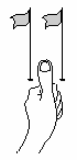

Na segunda figura olhamos para o ponto e percebemos que o nosso polegar ficou duplicado.

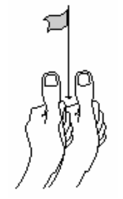

Assim como o som, saindo com uma diferença de diferentes fontes, a diferença das imagens que nossos olhos recebem nos dão a sensação de profundidade.

Em uma tela, normalmente somente imagens mono são geradas, fazendo que nossos dois olhos percebam a mesma imagem. Então como fazer para que nosso cérebro tenha a sensação de 3D (profundidade)?

Teremos duas principais estratégias para dar a ilusão de profundidade:
- Efeitos passivos: quando a ilução de profundidade se dá em uma única imagem, usando técnicas de pintura.
- Efeito ativo: quando o efeito não está presente em somente uma imagem, mas sim em diferentes imagens em que cada olho terá acesso separadamente.

### Efeitos Passivos

Uma imagem, tirada de uma câmera normal, por exemplo, dá a ideia de profundidade.

Nesta imagem de edifício conseguimos ver qual parte está mais distante. O que será que informa, de maneira intuitiva para o nosso cérebro, qual parte está mais distante e qual está mais próxima?

Vamos ver cada técnica passiva que causa este efeito:

##### Perspectiva

Quando a natureza da imagem cria linhas de perspectiva usando estruturas familiares, como janelas, ruas, portas. Sabemos que estas estruturas são retas, e isso informa ao nosso cérebro que tem uma reta da parte mais funda para a perte mais próxima.

Na imagem abaixo, mesmo que o paralelepípedo mais ao fundo seja maior, sabemos que ele está mais longe.

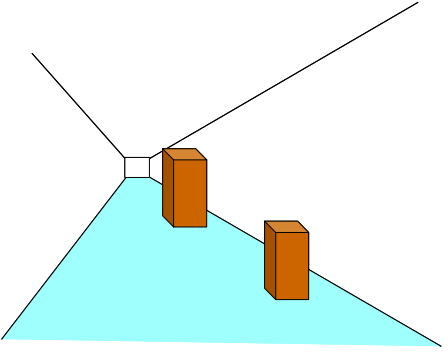

##### Iluminação

O clareamento e escurecimento de partes do mesmo objeto dão a ideia de profundidade e aumentam o realismo.

##### Oclusão

O obstrução de parte de um objeto em relação à parte de outro, dá a ideia de um estar na frente (mais próximo da câmera) que outro.

##### Sombra

Para dar a sensação de distância de um ponto de apoio, podemos ver as sombras na figura abaixo.

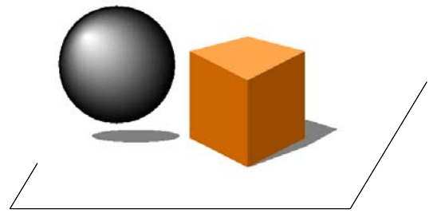

##### Gradiente de textura

Com o uso de uma textura (repetição de padrões em uma imagem) podemos dar a ideia de profundidade mudando o tamanho da textura

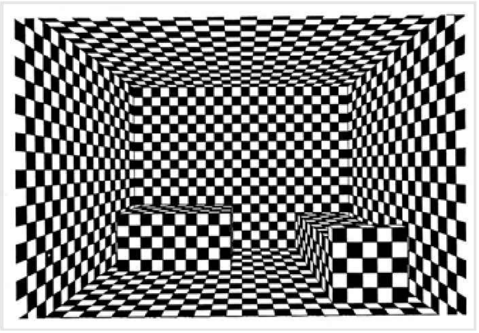

### Efeitos Ativos

Voltando ao conceito de estereoscopia, esta é um efeito ativo pois precisamos da geração de mais de uma imagem, e tecnicas para que imagens diferentes cheguem em olhos diferentes.

Na imagem abaixo podemos ver como que a profundidade de pinos alinhados são vistos por cada olho. Cada olho ve uma imagem diferente dos pinos!

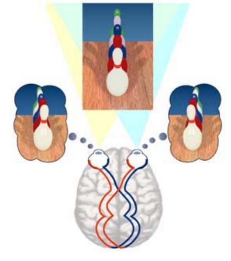

"Uma consequência imediata da diferença das imagens capturadas pelos dois olhos é o espaçamento entre o mesmo ponto projetado nas duas retinas, chamado de disparidade na retina.[^1]"

Na figura abaixo podemos ver como os dois olhos podem ver duas imagens, com objetos colocados em locais bem diferente em relação ao outro.

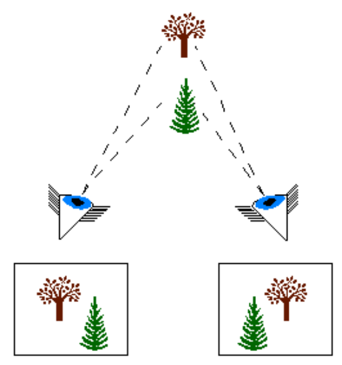

O cérebro processa esta imagem criando uma sobreposição

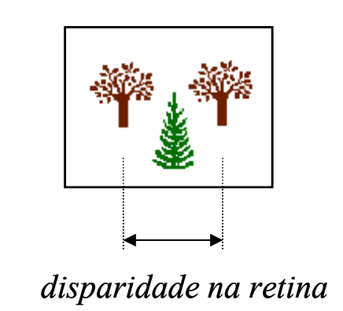

#### Estereoscopia No Computador

Com ajuda de estratégias, podemos fazer com que cada imagem chegue a um olho diferente. Teremos também uma estratégia passiva e uma ativa. Ambas usam o auxílio de óculos para fazer com que imagens diferentes cheguem em olhos diferentes.

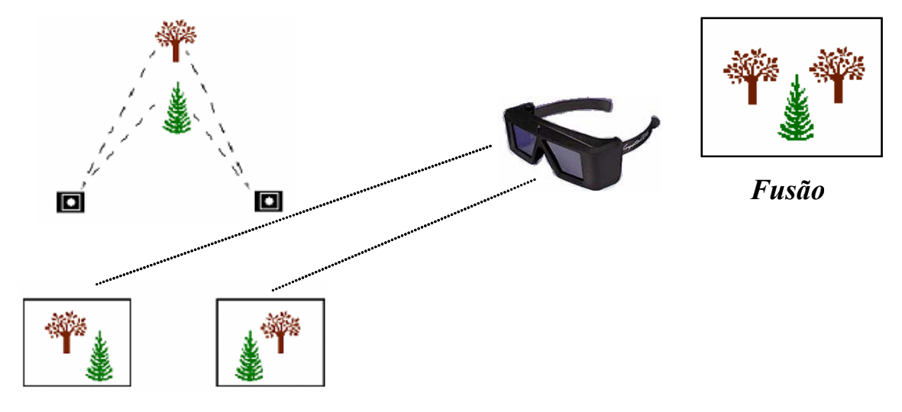

##### Estéreo Passivo

As duas imagens são exibidas simultaneamente, e o óculos atua como filtro.

###### Estéreo Anáglifo

Nesta estratégia, duas imagens de cor diferente são sobre postas, uma em vermelho e outra em azul. O usuário usa um óculo com duas lentes de filtro de cores diferentes, assim podemos ver uma imagem em cada olho.

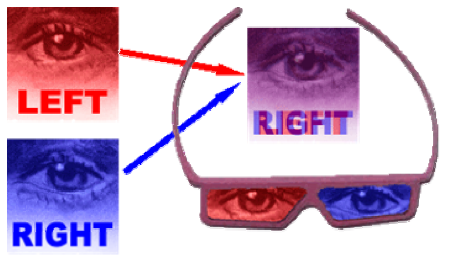

Na figura abaixo temos um outro exemplo com mais cores adicionadas.

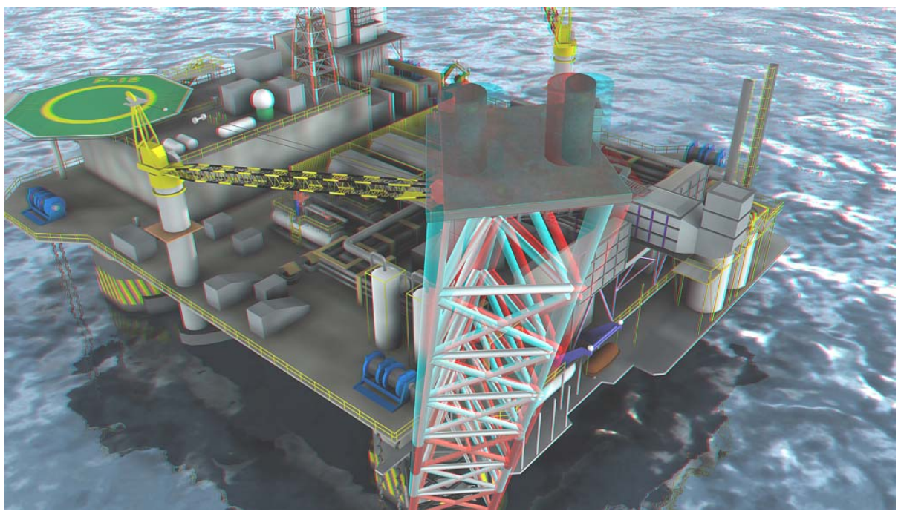

Vantagens desta estratégia:

1. Necessita apenas um projetor
1. Pode ser impressa
1. Baixo custo para confecção do óculos

Desvantagens:

1. Perda de qualidade na coloração

###### Filtragem por espectro de cores

Um óculos filtra cores por seu espectro da onda. 

Cores mais quentes, próximas ao vermelhos, vão parecer mais próximas do observador.

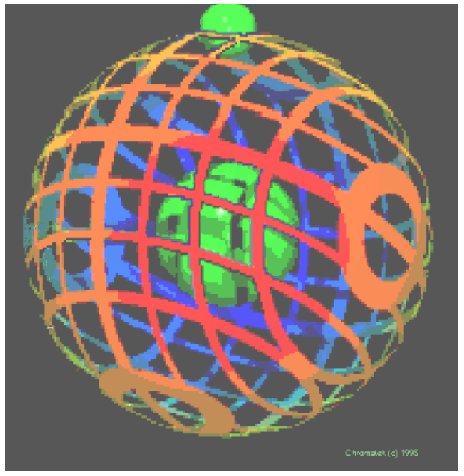

Vantagens desta estratégia:

1. Necessita apenas um projetor
1. Pode ser impressa

Desvantagens:

1. Precisa de óculos especial
    1. ChromaDepth 3D High Definition para monitores
    1. ChromaDepth 3D Standard Glasses para impressos
1. Funciona apenas para imagens estáticas
1. Limitação de cores

###### Polarizadores Lineares

Dois projetores projetam imagens diferentes, cada um com um filtro polarizador. Um óculos especial filtra a visão e cada olho recebe uma imagem diferente.

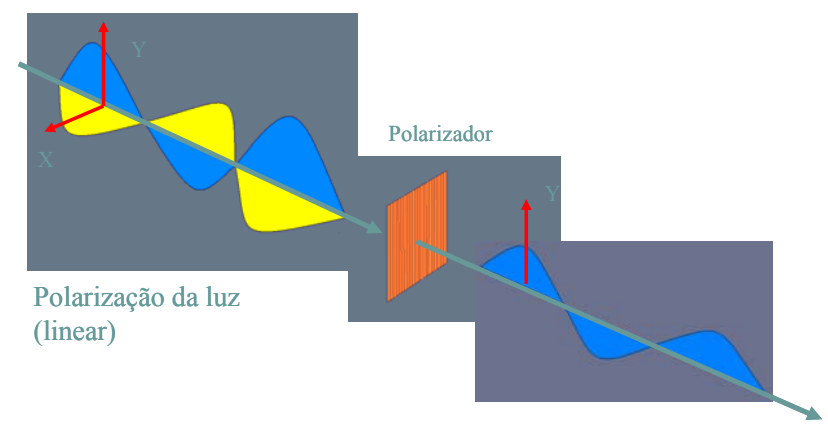

Na figura abaixo temos o esquema de como estas imagens chegam ao observador.

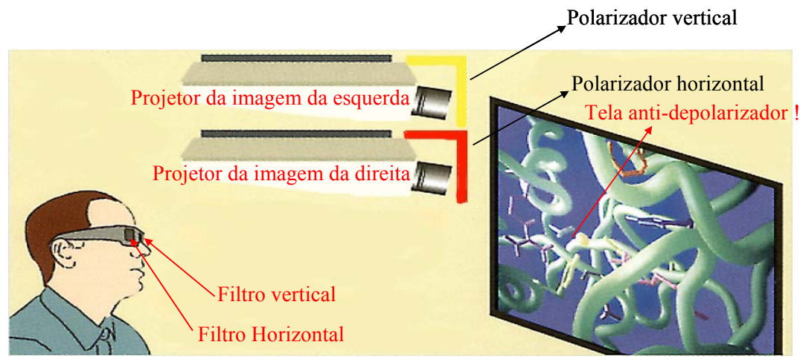

Vantagens desta estratégia:

1. Não existe limitação de cor
1. Podemos ver um filme

Desvantagens:

1. Precisa de dois monitores
1. Óculos especiais
1. Dois projetores

##### Estéreo Ativo

No estéreo ativo temos uma imagem diferente exclusiva para cada olho.

Um óculos bloqueia a visão de cada olho em cada frame, enquanto o monitor alterna a imagem de cada olho em cada frame

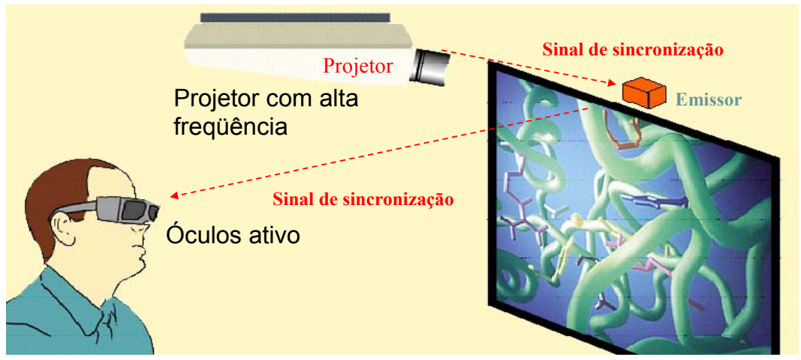

A desvantagem é que o *fps* recebido será a metade do projetado.

