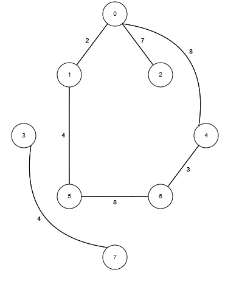
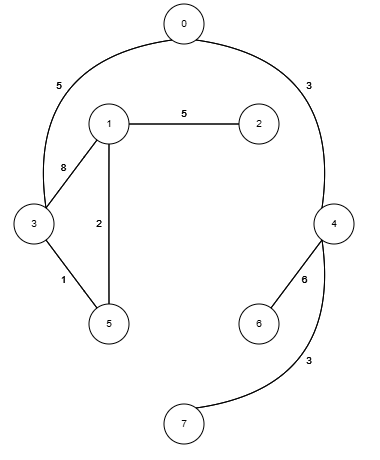
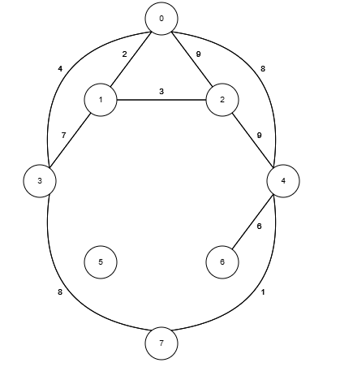

# Trabalho 01 de ATC: Algoritmo de Dijkstra

Para este trabalho você deve usar o **Algoritmo de Dijkstra** para fazer um programa que receba um grafo de entrada e escreva o caminho do vértice `0` para **todos** os outros vértices, assim como o valor do caminho, se houver.

### Entrada

O seu programa deve poder ler uma entrada de um arquivo. 
O formato será de diagonal inferior, representando um grafo simples não direcionado com pesos nas arestas.

Na primeira linha teremos a quantidade de vértices, e nas próximas linhas cada linha da diagonal inferior da matriz.

Todo grafo é: 
- simples (não existe mais de uma aresta ligando dois vértices), 
- não direcionado (a mesma aresta que vai de `a` para `b` também vai de `b` para `a`), 
- não necessariamente completo (não precisa haver uma aresta de cada vértice para todo vértice), 
- as arestas inexistentes serão denotadas pelo valor `-1` na definição da matriz
- toda aresta tem um valor maior que 0 representando a distância de um vértice ao outro.

##### inst01

Então por exemplo o seguinte arquivo:

```
8
 0
 2  0
 7 -1  0
-1 -1 -1  0
 8 -1 -1 -1  0
-1  4 -1 -1 -1  0
-1 -1 -1 -1  3  8  0
-1 -1 -1  4 -1 -1 -1  0
```

Define um grafo com 8 vértices que pode ser representado pelo seguinte desenho: 



##### inst02

O seguinte arquivo:

```
8
 0
-1  0
-1  5  0
 5  8 -1  0
 3 -1 -1 -1  0
-1  2  1 -1 -1  0
-1 -1 -1 -1  6 -1  0
-1 -1 -1 -1  3 -1 -1  0
```

Define um grafo com 8 vértices que pode ser representado pelo seguinte desenho: 





##### inst03

O seguinte arquivo:

```
8
 0
 2  0
 9  3  0
 4  7 -1  0
 8 -1  9 -1  0
-1 -1 -1 -1 -1  0
-1 -1 -1 -1  6 -1  0
-1 -1 -1  8  1 -1 -1  0
```

Define um grafo com 8 vértices que pode ser representado pelo seguinte desenho: 




### Saída

Como resposta, seu programa deve exibir a informação do menor caminho do vértice `0` para cada vértice do grafo, assim como o custo deste caminho. 
Caso não exista um caminho, deve ser exibido uma informação de que não existe caminho.

### Linguagem

Você pode usar qualquer linguagem de programação para resolver o problema, mas deve saber explicar seu código, ou a biblioteca usada.

### Links
- [instancias](https://github.com/viniciusdenovaes/viniciusdenovaes.github.io/tree/master/aulas/unip/20252/atc_files/trabalho/01/insts)
- [Wiki com o Algoritmo de Dijkstra](https://en.wikipedia.org/wiki/Dijkstra%27s_algorithm)
- [Animação com o algoritmo](https://www.cs.usfca.edu/~galles/visualization/Dijkstra.html)
- [data.csv](https://raw.githubusercontent.com/viniciusdenovaes/Unip222CN/master/aulaORTools/trabalho/data.csv)


.


