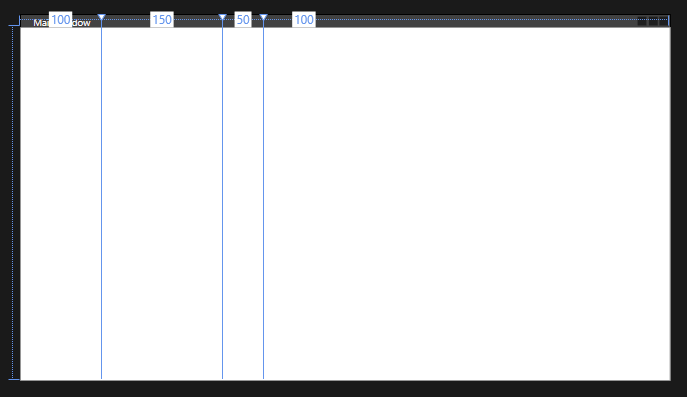
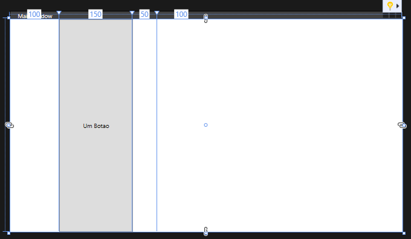
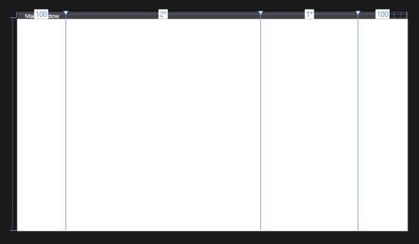
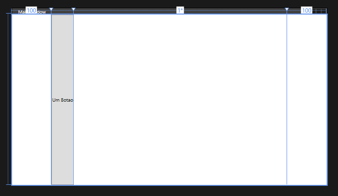
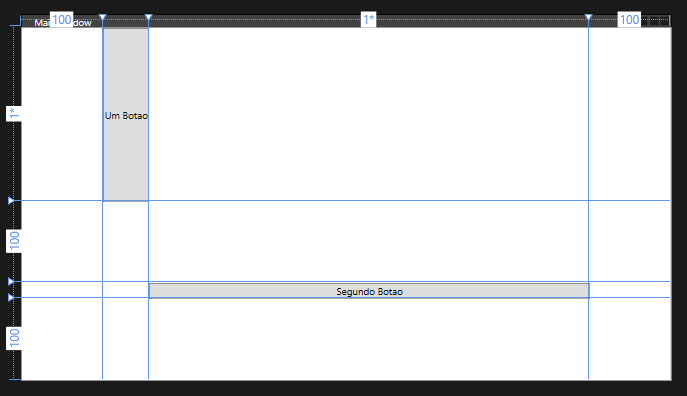
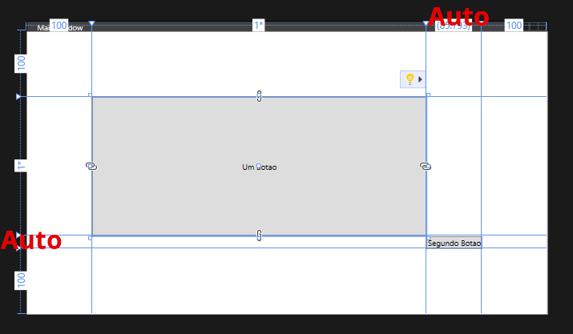

# O Layout `Grid`

Para criar uma janela responsiva devemos administrar todos os **componentes dentro de um layout**.

Um layout é uma regra de organização dos elementos dentro de uma janela.

Nesta aula vamos aprender o layout chamado `Grid`.

### Definindo as regras do `Grid`

O layout `Grid` organiza seus elementos dentro de uma grade.

O primeiro passo para configurar as colunas da grade é criar uma tag de configuração e uma tag para cada coluna indicando o tamanho desejado:

```xml
    <Grid>
        <Grid.ColumnDefinitions>
            <ColumnDefinition Width="100" />
            <ColumnDefinition Width="150" />
            <ColumnDefinition Width="50" />
            <ColumnDefinition Width="100" />
        </Grid.ColumnDefinitions>
    </Grid>
```
Ficaremos com o resultado



Perceba que a última coluna ocupou o espaço restante.

#### Como colocar um elemento dentro da coluna

Para colocar um elemento dentro de uma coluna basta indicar, nos parâmetros do elemento, em qual coluna ele ficará. Lembre que as colunas começam a contar à partir do 0.

No exemplo a seguir teremos um botão na segunda coluna.

```xml
    <Grid>
        <Grid.ColumnDefinitions>
            <ColumnDefinition Width="100" />
            <ColumnDefinition Width="150" />
            <ColumnDefinition Width="50" />
            <ColumnDefinition Width="100" />
        </Grid.ColumnDefinitions>

        <Button Content="Um Botao" Grid.Column="1"/>


    </Grid>
```




#### Outras configurações de tamanho

Podemos também usar o símbolo `*` se referir ao **espaço restante**

No exemplo a seguir a coluna 2 ocupará **duas partes** do espaço restante, enquanto a coluna 3 ocupará uma parte.

```xml
    <Grid>
        <Grid.ColumnDefinitions>
            <ColumnDefinition Width="100" />
            <ColumnDefinition Width="2*" />
            <ColumnDefinition Width="1*" />
            <ColumnDefinition Width="100" />
        </Grid.ColumnDefinitions>
    </Grid>
```




Também podemos usar a configuração `auto` para que uma coluna fique do menor tamanho possível para conter seus elementos.


``` xml
    <Grid>
        <Grid.ColumnDefinitions>
            <ColumnDefinition Width="100" />
            <ColumnDefinition Width="Auto" />
            <ColumnDefinition Width="*" />
            <ColumnDefinition Width="100" />
        </Grid.ColumnDefinitions>

        <Button Content="Um Botao" Grid.Column="1"/>
    </Grid>
```




#### Configurando Linhas e Colunas

A mesma técnica pode ser usada para configurar as linhas.

No exemplo abaixo teremos 4 linhas com um botão na linha 0 e coluna 1, e outro botão na linha 2 e coluna 2

``` xml
    <Grid>
        <Grid.ColumnDefinitions>
            <ColumnDefinition Width="100" />
            <ColumnDefinition Width="Auto" />
            <ColumnDefinition Width="*" />
            <ColumnDefinition Width="100" />
        </Grid.ColumnDefinitions>
        <Grid.RowDefinitions>
            <RowDefinition Height="*" />
            <RowDefinition Height="100" />
            <RowDefinition Height="auto" />
            <RowDefinition Height="100" />
        </Grid.RowDefinitions>

        <Button Content="Um Botao" Grid.Column="1" Grid.Row="0"/>
        <Button Content="Segundo Botao" Grid.Column="2" Grid.Row="2"/>
    </Grid>
```




## Exercícios

1. Crie um programa que tem a mesma interface da figura abaixo.




