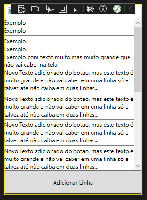

# Novo Layout: StackPanel

Nesta aula vamos aprender um novo layout que empilha elementos em uma direção: O StackPanel.

Este layout uma **quantidade qualquer** de elementos na **orientação** vertical ou horizontal.

Devido a este layout ter uma quantidade qualquer de elementos, podendo passar do espaço da tela, é recomendável que o tenhamos **dentro de um ScrollViewer**.

Abaixo vamos mostrar um exemplo de uso do StackPanel abrigando uma quantidade de blocos de texto.

```xml
        <ScrollViewer VerticalScrollBarVisibility="Auto">
            <StackPanel Orientation="Vertical">
                <TextBlock Text="Exemplo"/>
                <TextBlock Text="Exemplo"/>
                <Separator Height="2" Background="Gray"/>
                <TextBlock Text="Exemplo"/>
                <TextBlock Text="Exemplo"/>
                <TextBlock Text="Exemplo com texto muito mas muito grande que não vai caber na tela" TextWrapping="WrapWithOverflow"/>
            </StackPanel>
        </ScrollViewer>
``` 

Explicação: 
- Primeiro temos um elemento `ScrollViewer`, este elemento colocará o seu conteúdo em um espaço que pode ser navegado com uma barra de rolagem. 
   - O parâmetro         `VerticalScrollBarVisibility="Auto"`faz com que a barra de rolagem só apareça quando for preciso.
- Dentro, temos um layout `StackPanel`, este layout empilhará todo o conteúdo em um orientação
   - o parâmetro `orientation="Vertical"` escolhe a orientação em que os elementos serão empilhados.
- Dentro teremos alguns `TextBlock`
   - O parâmetro `TextWrapping="WrapWithOverflow"` fará que o texto use mais de uma linha se for maior que seu espaço máximo.
- Também teremos um exemplo de `Separator` que traçará uma linha entre dois elementos

## Adicionando elementos através do código

Um layout de tamanho flexível pode ser usado para criar uma lista de entradas do usuário. 

Nesta parte vamos ver como, através do código, podemos incluir elementos dentro do `StackPanel`.

Primeiro precisamos colocar o parâmetro `Name` no `StackPanel` para que possamos referenciar este elemento no código.

Ao acessar o `StackPanel` no código, precisamos usar o atributo `Children` e adicionar qualquer elemento que quisermos.

No exemplo abaixo fizemos um programa com um botão que adicionar uma frase no `StackPanel` cada vez que ele for pressionado.

###### MainWindow.xaml
```xml
    <Grid>

        <Grid.RowDefinitions>
            <RowDefinition Height="*"/>
            <RowDefinition Height="50"/>
        </Grid.RowDefinitions>

        <ScrollViewer Grid.Row="0" VerticalScrollBarVisibility="Auto">
            <StackPanel Name="Lista" Orientation="Vertical">
                <TextBlock Text="Exemplo"/>
                <TextBlock Text="Exemplo"/>
                <Separator Height="2" Background="Gray"/>
                <TextBlock Text="Exemplo"/>
                <TextBlock Text="Exemplo"/>
                <TextBlock Text="Exemplo com texto muito mas muito grande que não vai caber na tela" TextWrapping="WrapWithOverflow"/>
            </StackPanel>
        </ScrollViewer>

        <Button Grid.Row="1" Content="Adicionar Linha" Click="Button_Click"/>

    </Grid>
``` 


###### MainWindow.xaml.cs
```cs
using System.Windows;
using System.Windows.Controls;
using System.Windows.Media;

namespace WpfAppScroll01 {
    public partial class MainWindow : Window {

        StackPanel lista;

        public MainWindow() {
            InitializeComponent();
            lista = (StackPanel)FindName("Lista");
        }

        private void Button_Click(object sender, RoutedEventArgs e) {
            TextBlock texto = new TextBlock();
            texto.Text = "Novo Texto adicionado do botao, mas este texto é muito grande e não vai caber em uma linha só e talvez até não caiba em duas linhas...";
            texto.TextWrapping = TextWrapping.WrapWithOverflow;
            lista.Children.Add(texto);

            Separator se = new Separator();
            se.Height = 2;
            se.Background = Brushes.Gray;
            lista.Children.Add(se);
        }
    }
}
``` 

Com este código teremos o programa abaixo:


