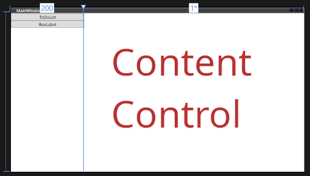
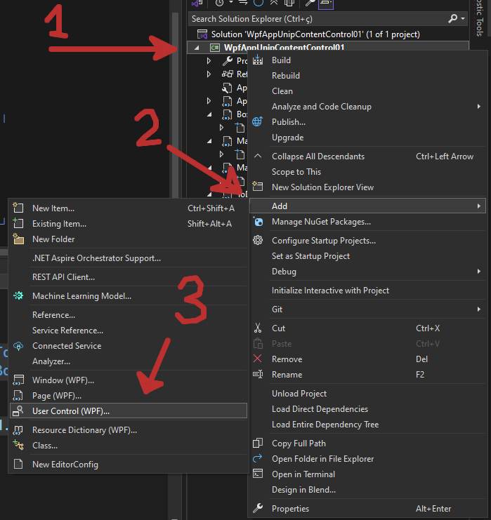
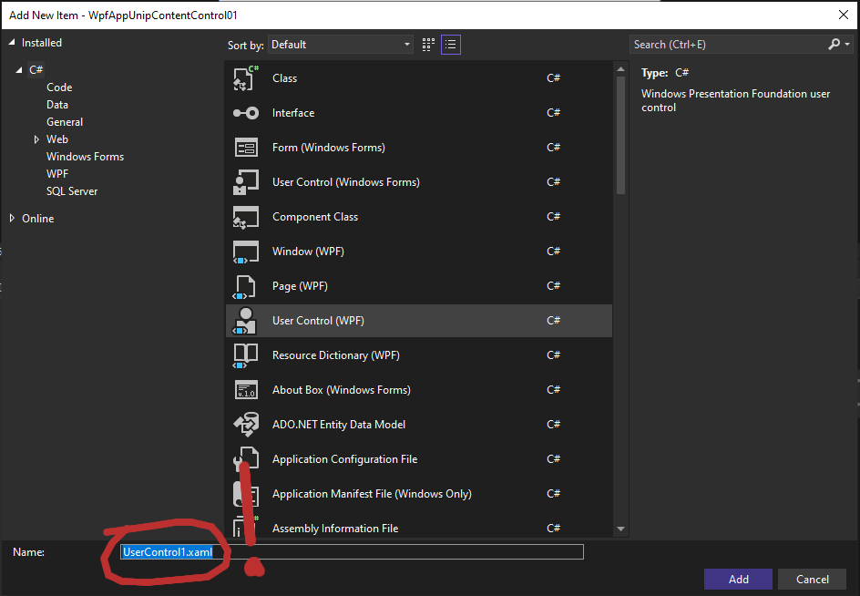

# Controlando o Conteúdo da Página

Nesta aula vamos aprender a fazer múltiplos conteúdos, e aprender a controlar qual destes conteúdos a janela vai mostrar.

## Uma Janela Metade Botão, Metade Content

Observe a seguinte janela:



Nesta janela dividimos ao meio e colocamos dois botões na esquerda e um `Content Control` na direita.

```xml
    <Grid>
        <Grid.ColumnDefinitions>
            <ColumnDefinition Width="200"/>
            <ColumnDefinition Width="*"/>
        </Grid.ColumnDefinitions>

        <StackPanel Grid.Column="0" >
            <Button Content="ToDoList" Click="OnToDoListClicked"/>
            <Button Content="BoxLabel" Click="OnBoxLabelClicked"/>
        </StackPanel>
        
        <ContentControl x:Name="MainContent" Grid.Column="1"/>
        
    </Grid>

```

Observe a *tag* **nova** `ContentControl` no final do `Grid`. 
Este é o espaço onde estará o conteúdo que iremos controlar.
O nome dele será `MainContent`.

Vamos controlar qual vai ser o conteúdo que vai aparecer no `ContentControl`, chamado `MainContent` através dos botões.

**Mas primeiro** precisamos criar o conteúdo que deverá aparecer no lugar.

## Criando um Conteúdo

Desenvolver um conteúdo é igual a desenvolver uma janela, podemos usar os mesmos layouts e os mesmos componentes.

Para criar um conteúdo devemos criar um `UserControl`:



1. Clique com o botão direito no projeto
1. Escolha `Add`
1. Escolha `User Control (WPF)`

**Atenção: Não esqueça de escolher o nome do conteúdo na próxima página!!!**



Para este exemplo vamos criar dois conteúdos vistos nas últimas aulas:

##### BoxLabelView

###### BoxLabelView.xaml
```xml
    <Grid>
        <Grid.ColumnDefinitions>
            <ColumnDefinition Width="10" />
            <ColumnDefinition Width="Auto" />
            <ColumnDefinition Width="Auto" />
            <ColumnDefinition Width="*" />
            <ColumnDefinition Width="10" />
        </Grid.ColumnDefinitions>
        <Grid.RowDefinitions>
            <RowDefinition Height="10" />
            <RowDefinition Height="Auto" />
            <RowDefinition Height="Auto" />
            <RowDefinition Height="Auto" />
            <RowDefinition Height="*" />
            <RowDefinition Height="10" />
        </Grid.RowDefinitions>

        <Label Content="Entrada:" HorizontalAlignment="Right" Grid.Row="1" Grid.Column="1"/>
        <Button Content="Aperte" Grid.Row="2" Grid.Column="1" Grid.ColumnSpan="2" Click="OnEntrada"/>
        <Label Content="Saída:" HorizontalAlignment="Right" Grid.Row="3" Grid.Column="1"/>

        <TextBox x:Name="TextEntrada" HorizontalAlignment="Left" Grid.Row="1" Grid.Column="2" MinWidth="100"/>
        <Label x:Name="TextSaida" HorizontalAlignment="Left" Grid.Row="3" Grid.Column="2"/>
    </Grid>
```

###### BoxLabelView.xaml.cs
```cs
using System;
using System.Windows.Controls;

namespace WpfAppUnipContentControl01 {
    public partial class BoxLabelView : UserControl {
        public BoxLabelView() {
            InitializeComponent();
        }
        private void OnEntrada(object sender, EventArgs e) {
            String textoEntrada = TextEntrada.Text;
            TextSaida.Content = textoEntrada;
        }
    }
}
```


##### ToDoListView

###### ToDoListView.xaml
```xml
    <Grid>

        <Grid.RowDefinitions>
            <RowDefinition Height="*"/>
            <RowDefinition Height="50"/>
            <RowDefinition Height="10"/>
            <RowDefinition Height="50"/>
            <RowDefinition Height="10"/>
            <RowDefinition Height="50"/>
        </Grid.RowDefinitions>

        <ScrollViewer Grid.Row="0" VerticalScrollBarVisibility="Auto">
            <StackPanel Name="Lista" Orientation="Vertical">
            </StackPanel>
        </ScrollViewer>

        <TextBox x:Name="Entrada" Grid.Row="1"/>
        <Button Grid.Row="3" Content="Adicionar Linha" Click="Button_Click"/>
        <Button Grid.Row="5" Content="Home" Click="OnHomeClicked"/>

    </Grid>
```

###### ToDoListView.xaml.cs
```cs
using System.Windows;
using System.Windows.Controls;
using System.Windows.Media;

namespace WpfAppUnipContentControl01 {
    /// <summary>
    /// Interaction logic for ToDoListView.xaml
    /// </summary>
    public partial class ToDoListView : UserControl {
        StackPanel lista;

        public ToDoListView() {
            InitializeComponent();
            lista = (StackPanel)FindName("Lista");
        }

        private void Button_Click(object sender, RoutedEventArgs e) {
            TextBlock texto = new TextBlock();
            texto.Text = "Novo Texto adicionado do botao, mas este texto é muito grande e não vai caber em uma linha só e talvez até não caiba em duas linhas...";
            texto.TextWrapping = TextWrapping.WrapWithOverflow;
            lista.Children.Add(texto);

            Separator se = new Separator();
            se.Height = 2;
            se.Background = Brushes.Gray;
            lista.Children.Add(se);
        }
        private void OnHomeClicked(object sender, RoutedEventArgs e) {
            MainWindow window = (MainWindow)Window.GetWindow(this);
            window.mainContent.Content = MainWindow.mainView;
        }
    }
}
```

Além de um conteúdo de página inicial

###### MainView.xaml

```xml
    <Grid>
        <Grid.ColumnDefinitions>
            <ColumnDefinition Width="10"/>
            <ColumnDefinition Width="1*"/>
            <ColumnDefinition Width="10"/>
            <ColumnDefinition Width="1*"/>
            <ColumnDefinition Width="10"/>
        </Grid.ColumnDefinitions>
        <Grid.RowDefinitions>
            <RowDefinition Height="10"/>
            <RowDefinition Height="Auto"/>
            <RowDefinition Height="10"/>
            <RowDefinition Height="50"/>
            <RowDefinition Height="1*"/>
            <RowDefinition Height="10"/>
        </Grid.RowDefinitions>

        <Label Content="Bem Vindo" FontSize="50"
               Grid.Column="1" Grid.Row="1"
               Grid.ColumnSpan="3" HorizontalAlignment="Center"
               />
        <Button Content="Lab TextBox" FontSize="30"
               Grid.Column="1" Grid.Row="3"
                Click="OnGoLabTextBoxClicked"
                />

        <Button Content="Lab ToDo List" FontSize="30"
               Grid.Column="3" Grid.Row="3"
                Click="OnGoLabToDoListClicked"
                />

    </Grid>
```
###### MainView.xaml.cs

```cs
using System.Windows;
using System.Windows.Controls;

namespace WpfAppUnipContentControl01 {
    public partial class MainView : UserControl {
        public MainView() {
            InitializeComponent();
        }
        private void OnGoLabTextBoxClicked(object sender, RoutedEventArgs e) {
            MainWindow window = (MainWindow)Window.GetWindow(this);
            window.mainContent.Content = MainWindow.boxLabelView;
        }
        private void OnGoLabToDoListClicked(object sender, RoutedEventArgs e) {
            MainWindow window = (MainWindow)Window.GetWindow(this);
            window.mainContent.Content = MainWindow.todoListView;
        }
    }
}
```

### O Desenvolvimento Da Página Inicial

Agora vamos desenvolver a página inicial, com os botões que vão controlar **qual conteúdo**.

O primeiro `xaml` que aparece nesta página é o `xaml` da janela.

Agora vamos ver o `cs`

```cs
using System.Windows;
using System.Windows.Controls;

namespace WpfAppUnipContentControl01 {
    
    public partial class MainWindow : Window {
        static public MainView mainView = new MainView();
        static public ToDoListView todoListView = new ToDoListView();
        static public BoxLabelView boxLabelView = new BoxLabelView();
        public ContentControl mainContent;
        public MainWindow() {
            InitializeComponent();
            mainContent = MainContent;
            mainContent.Content = mainView;
        }

        private void OnToDoListClicked(object sender, RoutedEventArgs e) {
            mainContent.Content = todoListView;
        }
        private void OnBoxLabelClicked(object sender, RoutedEventArgs e) {
            mainContent.Content = boxLabelView;
        }
    }
}
```

Vamos ver algumas partes deste código

```cs
static public MainView mainView = new MainView();
static public ToDoListView todoListView = new ToDoListView();
static public BoxLabelView boxLabelView = new BoxLabelView();
```

Acima estamos criando os objetos dos 3 conteúdos desenvolvidos. 
Estes objetos estão sendo criados de forma global para que seus estados permaneçam durante o programa.

```cs
public ContentControl mainContent;

public MainWindow() {
    InitializeComponent();
    mainContent = MainContent;
    mainContent.Content = mainView;
}
```

Acima, no constructor estamos referenciando o `ContentControl` criado no `xaml`, também estamos configurando o conteúdo dentro do `mainContent.Content` para ser a `mainView`


```cs
private void OnToDoListClicked(object sender, RoutedEventArgs e) {
    mainContent.Content = todoListView;
}
private void OnBoxLabelClicked(object sender, RoutedEventArgs e) {
    mainContent.Content = boxLabelView;
}
```

Acima, na definição dos botões, quando cada um for pressionado o conteúdo `mainContent.Content` é atualizado para seu conteúdo específico.

## Como Definir o Conteúdo da Janela De Dentro de um Conteúdo.

Como pode ser observado na página da TodoList, é possível, de dentro de um conteúdo, conseguir uma referência para a janela que contem este conteúdo.
Desta forma é possível mudar o conteúdo da janela.

A seguinte linha consegue uma referência para a janela
```cs
MainWindow window = (MainWindow)Window.GetWindow(this);
```

A seguinte linha consegue mudar o conteúdo da janela.
```cs
window.mainContent.Content = MainWindow.mainView;
```

Tudo isso pode ser feito de dentro de um conteúdo.
