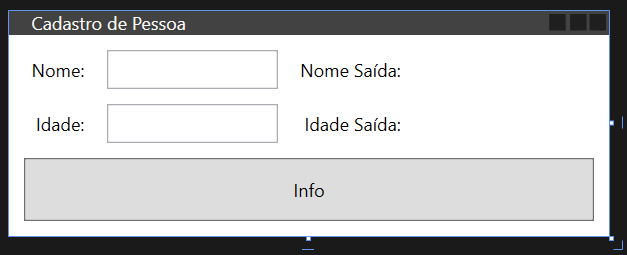

# Object Binding - Como Ligar Atributos de um Objeto com Componentes do `xaml`

Já aprendemos a passar informação dos campos do `xaml` para o código e do código para os componentes do `xaml`.

Nesta aula vamos aprender como criar uma ligação entre componentes do código e componentes do `xaml`.

Esta ligação vai fazer com que os componentes atualizem automaticamente sem precisar de código.

## Exemplo Prático

Vamos ver um exemplo prático com os dados de uma pessoa. 
Suponha que os tributos da classe pessoa são apenas `nome` e `idade`.

Vamos criar a seguinte interface com Nome de entrada e saída, também Idade de entrada e saída.



### Classe `Pessoa`

Vamos criar a classe `Pessoa` com os atributos `String Nome` e `int idade`.

```cs
using System;

namespace WpfAppDataBinding.Data {
    internal class Person {
        public String Nome { get; set;}
        
        private int idade;
        public int Idade {
            get { return idade; }
            set {
                if (value < 0) value = 0;
                idade = value;
            } 
        }
        public Person(String aNome, int aIdade) {
            this.Nome = aNome;
            this.Idade = aIdade;
            
        }
    }
}
```

Neste exemplo usamos o [modelo de criação de classes *properties* do C#](https://www.w3schools.com/cs/cs_properties.php
).

Na definição do `Nome` o `get` e `set` é feito de forma automática.

Usando o mesmo modelo configuramos o `get` e `set` da Idade para retornar 0 caso o valor entrado da idade for menor que 0.


### O código C# do data binding

No código abaixo criamos um objeto do tipo `Person` e adicionamos este objeto no `DataContext` da janela.

```cs
using System.Windows;
using WpfAppDataBinding.Data;

namespace WpfAppDataBinding {
    public partial class MainWindow : Window {

        Person person = new Person("Nome", 101);

        public MainWindow() {
            InitializeComponent();
            this.DataContext = person;
        }

        private void OnInfoClicked(object sender, RoutedEventArgs e) {
            MessageBox.Show($"{person.Nome} tem {person.Idade} anos");
        }
    }
}
```


### Definindo o Data Binding no `xaml`

No `xaml` abaixo criamos uma ligação da entrada com os campos do `DataContext` na direção do código fonte.

Assim como criamos uma ligação dos labels  com os campos do `DataContext` na direção do código `C#` para o `xaml`.

```xml
    <Grid>
        <Grid.ColumnDefinitions>
            <ColumnDefinition Width="10"/>
            <ColumnDefinition Width="Auto"/>
            <ColumnDefinition Width="10"/>
            <ColumnDefinition Width="*"/>
            <ColumnDefinition Width="10"/>
            <ColumnDefinition Width="Auto"/>
            <ColumnDefinition Width="10"/>
            <ColumnDefinition Width="*"/>
            <ColumnDefinition Width="10"/>
        </Grid.ColumnDefinitions>
        <Grid.RowDefinitions>
            <RowDefinition Height="10"/>
            <RowDefinition Height="Auto"/>
            <RowDefinition Height="10"/>
            <RowDefinition Height="Auto"/>
            <RowDefinition Height="10"/>
            <RowDefinition Height="*"/>
            <RowDefinition Height="10"/>
        </Grid.RowDefinitions>

        <Label Content="Nome:" HorizontalAlignment="Right"
               Grid.Column="1" Grid.Row="1"/>
        <TextBox  Name="NomeEntrada"
                  Text="{Binding Path=Nome, Mode=OneWayToSource}"
                  Grid.Column="3" Grid.Row="1"/>

        <Label Content="Idade:" HorizontalAlignment="Right"
               Grid.Column="1" Grid.Row="3"/>
        <TextBox Name="IdadeEntrada"
                Text="{Binding Path=Idade, Mode=OneWayToSource}"
                Grid.Column="3" Grid.Row="3"/>

        <Button Content="Info"
                Grid.Column="1" Grid.Row="5" Grid.ColumnSpan="7"
                Click="OnInfoClicked"
                />

        <Label Content="Nome Saída:" HorizontalAlignment="Right"
               Grid.Column="5" Grid.Row="1"/>
        <Label 
                  Content="{Binding Path=Nome, Mode=OneWay}"
                  Grid.Column="7" Grid.Row="1"/>

        <Label Content="Idade Saída:" HorizontalAlignment="Right"
               Grid.Column="5" Grid.Row="3"/>
        <Label 
                Content="{Binding Path=Idade, Mode=OneWay}"
                Grid.Column="7" Grid.Row="3"/>


    </Grid>
```


## Efeitos e Vantagens

Não é preciso fazer o *Data Binding* para passar informação do `xaml` para o `C#`, nem para o caminho contrário.

Mas temos certas vantagens em fazer isso:
- A informação é atualizada automaticamente e em tempo real
- Ocorre um parse automático da String de entrada para o valor inteiro da idade
- Ocorre um controle de erros no parse entre a String e a transformação em int.

