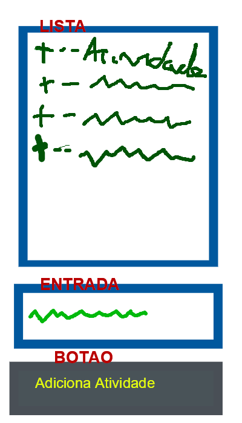

# Laboratório 01

### Desafio 01

Faça um programa que seja uma TODO List, uma lista de atividades.

Nesta lista o usuário pode escrever uma atividade na entrada e apertar um botão para que esta atividade seja adicionada a uma lista.

O cliente entregou um rascunho de como que ele gostaria que o projeto dele fosse:

O cliente pediu para que a atividade fosse adicionada na lista com o prefixo "+ -- ", por exemplo, se o usuário colocar "Praticar programação" na entrada, na lista deve ser adicionada a entrada "+ -- Praticar programação".

### Desafio 02

O mesmo cliente do desafio anterior gostou do programa, mas agora ele quer que as atividades sejam enumeradas pela ordem de entrada.

Por exemplo, se o usuário colocar na entrada "Praticar Programação" e depois colocar "Treinar corrida", na lista deve constar:
1 -- Praticar Programação
2 -- Treinar corrida

