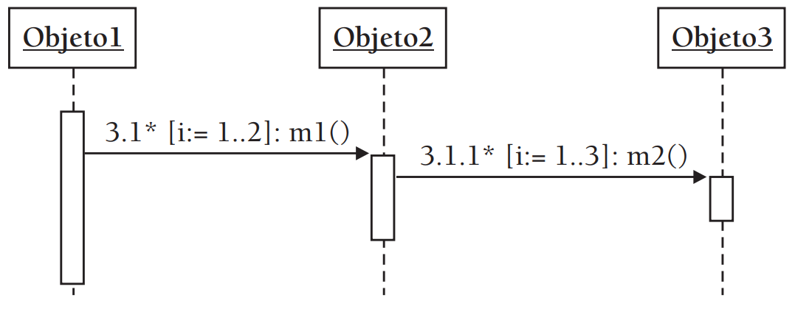
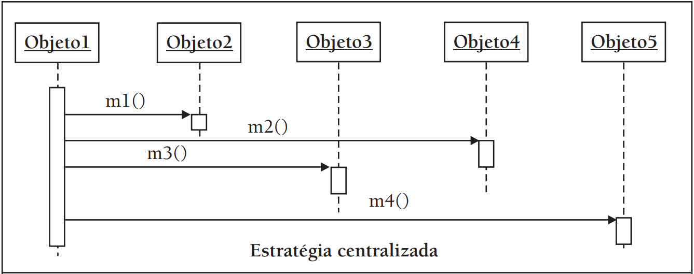
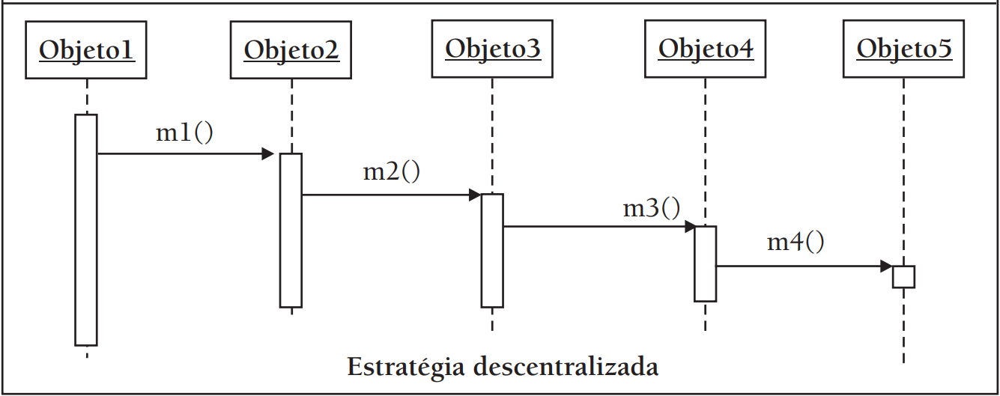

# Revisão para NP2

Capítulos 5, 7 e 9 do livro do Eduardo Bezerra

Exercícios selecionados:

### Capítulo 5

###### Exercício 5.4 
Desenhe um diagrama de classes com relacionamentos, nomes de papéis e multiplicidades para cada uma das seguintes situações:

1. Uma Pessoa pode ser casada com outra Pessoa.
1. Uma Disciplina é pré-requisito para outra Disciplina.
1. Uma Peça pode ser composta de diversas outras Peças.

###### Exercício 5.6 
Construa um diagrama de classes inicial para a seguinte situação: Pacotes são enviados de uma localidade a outra. 
Pacotes têm um peso específico. 
Localidades são caracterizadas pelas facilidades de transporte (por exemplo, rodoviárias, aeroportos e autoestradas). 
Algumas localidades são vizinhas, isto é, existe uma rota direta de transporte entre tais localidades. 
A rota de transporte entre as localidades tem um certo comprimento (a distância entre as localidades). 
Trens, aviões e caminhões são usados para o transporte de pacotes. 
Cada um destes meios de transporte pode suportar uma carga máxima de peso. 
A cada momento, durante o seu transporte, é necessário saber a posição (localidade) de cada pacote. 
Também é necessário manter o controle de que meio de transporte está sendo utilizado em cada parte da rota para um certo pacote.

###### Exercício 5.7 
Considere o seguinte discurso relativo a um sistema de partidas de tênis: 
"Num torneio de tênis, cada partida é jogada entre dois jogadores. 
Pretende-se manter informação sobre o nome e a idade dos jogadores; data da partida e atribuição dos jogadores às partidas. 
O máximo de partidas que um jogador poderá realizar são seis e o mínimo uma". 
Desenhe o diagrama de classes correspondente.

###### Exercício 5.9 
Identifique classes e/ou relacionamentos a partir das seguintes regras do negócio:
a) Pedidos são compostos de vários itens de pedido.
b) Um item de pedido diz respeito a um e exatamente um produto.
c) Um pedido pode conter até 20 itens.

###### Exercício 5.10 
Considere um sistema de software para controlar um hotel. Normalmente, umhóspede ocupa um quarto por estada. Mas, suponha que uma nova regra foi criada no negócio: agora, um hóspede pode utilizar até três quartos. Desenhe o diagrama de classe para essas duas situações.

### Capítulo 7

###### Exercício 7.3 
Considere o fragmento de diagrama de sequência a seguir. 

a) Determine a sequência em que as mensagens m1 e m2 serão passadas. (Perceba que teremos mensagens repetidas)
b) Desenhe um diagrama de comunicação equivalente

###### Exercício 7.6 

De acordo com a divisão de responsabilidades pelos objetos de um sistema, a colaboração entre eles para a realização de um cenário pode ser classificada em um espectro que vai desde a forma centralizada até a forma descentralizada.
Essas estratégias são também chamadas de garfo (*fork*) e escada (*stair*), respectivamente.
Na primeira forma de colaboração (centralizada),
a inteligência do sistema está concentrada em um único objeto. 
Por outro lado, na forma descentralizada, a inteligência do sistema está mais uniformemente espalhada pelas classes. 
As figuras a seguir apresenta de maneira esquemática as duas estratégias de colaboração, utilizando a notação vista para diagramas de sequência. 

Note que, na estratégia centralizada, há um objeto que
controla os demais (Obj1). 
Já na estratégia descentralizada, há uma cadeia de delegações entre os objetos; não há um objeto central que “conhece” todos os demais. 
Cada objeto realiza uma parte da tarefa. 
Considerando as questões de 
- *coesão*: como o foco de responsabilidade de uma classe, alta coesão significa menos responsabilidades em um classe
- *acoplamento* como a quantidade de relações entre classes de um sistema, uma classe tem baixo acoplamento se ela depende de menos classes

Discuta as características de cada uma dessas estratégias em termos de coesão e acoplamento.

### Capítulo 9

###### Exercício 9.2 
Modele através de um diagrama de estados a seguinte situação: 
em uma máquina de encher garrafas de refrigerante passam diversas garrafas. 
Uma garrafa entra inicialmente vazia no equipamento. 
A partir de um determinado momento, ela começa a ser preenchida com refrigerante. 
Ela permanece nesse estado (sendo preenchida) até que, eventualmente, esteja cheia de refrigerante. 
Nesse momento, o equipamento sela a garrafa com uma tampinha, e assim a garrafa passa para o estado de “lacrada”. 
Uma garrafa vazia não deve ser lacrada pelo equipamento. 
Além disso, uma garrafa cheia de refrigerante não deve receber mais esse líquido.

###### Exercício 9.3 

Construa um diagrama de estados considerando o seguinte “ciclo de vida” de um paciente de hospital. 
O paciente entra no hospital, vítima de um acidente. 
Ele é encaminhado para a emergência. 
Após uma bateria de exames, esse paciente é operado. 
Alguns dias depois, o paciente é movido da grande emergência do hospital para a enfermaria, pois não corre mais perigo de vida. 
Depois de passar por um período de observação na enfermaria, o paciente recebe alta médica.

###### Exercício 9.4 
Construa um DTE para a classe Pedido:
Esse objeto é criado quando o cliente realiza um pedido. 
O crédito deve ser aprovado para que o pedido seja aceito. 
Se o crédito é negado, o pedido é retornado ao cliente para ser modificado. 
Se o crédito é aceito, o pedido é confirmado. 
Após ser atendido (ou seja, todos os itens desse pedido foram providenciados), esse pedido é enviado ao sistema de distribuição para ser entregue. 
Depois disso, por alguma razão, o pedido pode ser devolvido pelo cliente. 

###### Exercício 9.5 

Construa um diagrama de estados para uma classe Mensagem, que representa uma mensagem de correio eletrônico. 
Como dica, considere os estados apresentados a seguir.

1. Recebida: este é o estado inicial. A mensagem acabou de entrar na caixa de correio e permanece nesse estado até ser lida.
1. Lida: a mensagem é lida pelo usuário.
1. Respondida: o usuário responde à mensagem.
1. Na lixeira: usuário remove a mensagem da caixa de correio.

###### Exercício 9.6
Construa um diagrama de estados para um aparelho de secretária eletrônica. 
Como dica, considere os estados apresentados a seguir. 
Utilize estados compostos se for necessário.
1. Registrando recados: alguém faz uma chamada para o aparelho de telefone ao qual a secretária está conectada, e a chamada não é atendida. 
A secretária, então, apresenta a mensagem gravada pelo usuário do aparelho e registra o recado deixado pela pessoa que fez a chamada telefônica.
1. Esperando: a secretária está ociosa esperando ser ativada.
1. Revendo recados: algum usuário da secretária requisitou que o aparelho apresentasse os recados gravados. 
