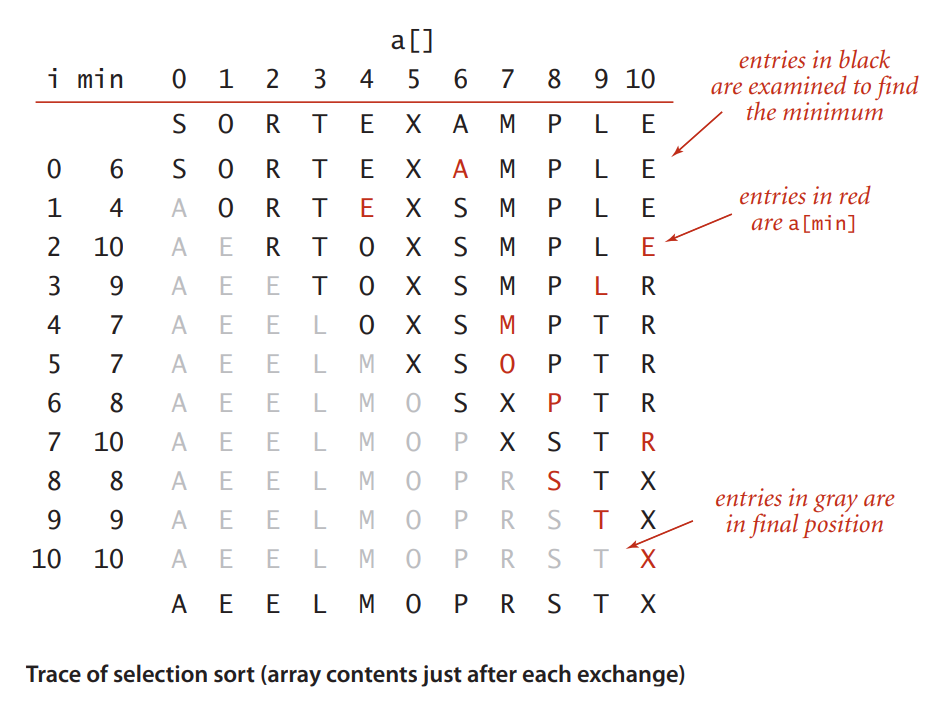
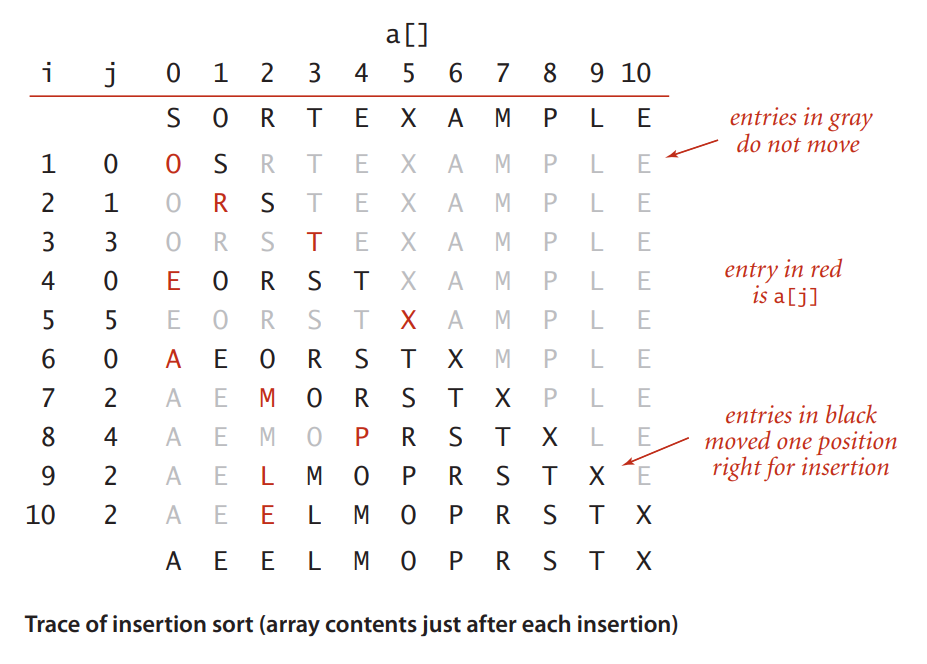
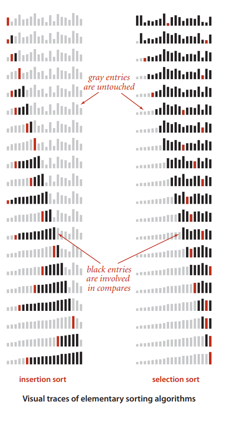

# Ordenações Elementares[^1]
[^1]: Esta aula (e imagens) foi retirada do capítulo 2.1 do livro Algorithms 4Ed por Robert Sedgewick e Kevin Wayne

Neste laboratório vamos tratar do problema de ordenar um array.

(**OBS** perceba que não estamos ordenando listas e sim arrays)

## Selection Sort

A estratégia do *selection sort* consiste em sempre selecionar o menor elemento do array e colocar na primeira posição.

Após cada iteração *i* se supões que o array está ordenada até o a posição *i* e o algoritmo é aplicado para a parte do array maior que *i*.

### O Algoritmo

Dado um array de tamanho `n`, repita os seguintes passos para `i` variando de `0` a `n-1`
- Invariante: Se supõe que o array está ordenada até o elemento `i`, e que todos elementos de `i` até o final são maiores ou iguais a todos os elementos de `0` até `i`.
- Procure o menor elemento da parte de `i` até o final do array
- Troque o menor elemento encontrado com o elemento da posição `i`
- Observe que agora a invariante se mantém para `i+1`

Observe a seguinte imagem representando a ordenação de um array de characteres.

Observe que para cada `i` a invariante se mantém, e em cada passo ele procura o menor, e este menor troca de lugar com a posição do `i`.

#### Características

##### Complexidade
A complexidade é O(n²), mais especificamente, o algoritmo sempre faz ~n²/2 comparações.

##### O tempo independe da entrada
Seja qual for a característica do array de entrada, se ela está quase ordenada ou não, o algoritmo sempre terá que procurar o menor elemento para cada `i`. Sempre fará a mesma quantidade de operações.

##### Trocas e movimentação é mínima
Em cada iteração fazemos a troca entre dois elementos do array. 
Em comparação com o próximo algoritmo, as trocas são mínimas.

## Insertion Sort

A estratégia do *insertion sort* consiste em supor que parte do array está ordenada, pegar o próximo elemento e inserir este elemento na posição correta da parte ordenada do array.
Imagine que você tem um deck ordenado de cartas e sempre que você recebe a próxima carta você coloca esta carta na posição correta, para que o deck permaneça ordenado.

### O Algoritmo

Dado um array `A` de tamanho `n`, repita os seguintes passos para `i` variando de `0` a `n-1`
- Invariante: Se supõe que o array está ordenada até o elemento `i`, e que todos elementos de `i`.
- Pegue o próximo elemento da posição `i`
- Seja `j` = `i`
- Enquanto `A[j]<A[j-1]` troque os elementos das posições `j` e `j-1`

Observe a seguinte imagem representando a ordenação de um array de characteres.

Observe que para cada `i` a invariante se mantém, e em cada passo ele faz a operação do `ArrayList` de inserir o elemento na posição correta. Ou seja, ele translada todos elementos maiores que ele para a direita.

#### Características

##### Complexidade
A complexidade é O(n²), no pior caso imagine que o array está ordenada ao contrário e cada elemento `i` deve viajar (trocar com seu vizinho) até o início do array.

##### O tempo depende da entrada
Um array que já está ordenada não precisará fazer **nenhuma troca**. Um array que está quase ordenada só precisará fazer quantidade de trocas da distância de sua posição até a posição correta. Tornando esté algoritmo muito rápido para os arrays quase ordenadas.

