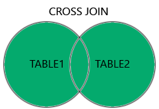

# Join

O comando `JOIN` é usado para combinar dados de duas tabelas **com uma coluna em comum**.

Este comando é essencial em um banco de dados relacional pois é o comando que relaciona duas (ou mais) tabelas para obtenção dos dados relacionados.

## Banco de Dados

Considere as seguintes tabelas referentes a jogadores e países.

##### Players
|id|nome|country_id|
|---|---|---|
|1|Ana|1|
|2|Beto|1|
|3|Carla|5|
|4|Dani|2|

##### Country
|id|nome|
|---|---|
|1|Brasil|
|2|Uruguai|
|3|Paraguai|
|4|Chile|

Este banco de dados está definido [aqui](bdPaisesDDL.txt)

## Tipos de JOIN

O comando `JOIN` sempre retorna uma tabela como combinação de duas tabelas combinadas: todos os dados da primeira tabela cruzados com todos os dados da segunda tabela **filtrados por uma coluna em comum**. Por conta do filtro, o resultado tipicamente não será um produto cartesiano entre as duas tabelas, ou seja, não será cada linha da primeira combinado com cada linha da segunda, será uma porção bem menor.


Aqui vamos tratar 6 tipos de `JOIN`:

### INNER JOIN

O mais comum de todos, irá retornar todos os dados que tem um relacionamento.

##### Sintaxe

Na sintaxe use o `SELECT` para escolher quais colunas você quer que apareça na tabela resultado. Como será o resultado da combinação de duas tabelas, você deve escolher o nome das colunas seguidas do nome da tabela a qual ela pertence.

No comando `FROM` você deve fornecer o nome das duas tabelas que você quer combinar: `table1 INNER JOIN table2`.

Por fim você deve especificar por qual coluna as duas tabelas estão relacionadas usando o comando `ON` especificando a coluna da primeira e da segunda tabela.

```sql
SELECT table1.column1, table1.column2, ..., table2.column1, ...
FROM table1
INNER JOIN table2
ON table1.condition_column = table2.condition_column;
```

Observe o seguinte exemplo onde listamos cada jogador relacionado com seu país:

###### Exemplo `INNER JOIN`
```sql
SELECT Players.nome AS nome_player, country.nome AS nome_country, country.id, players.country_id 
FROM Players INNER JOIN Country
ON Players.country_id=Country.id;
```

###### Resultado `INNER JOIN`
|nome_player|nome_country|id|country_id|
|---|---|---|---|
|Ana|Brasil|1|1|
|Beto|Brasil|1|1|
|Dani|Uruguai|2|2|

Perceba que o jogador `Carla` não tem um país cadastrado com seu `id_country`, então não aparece esta entrada. Assim como os países `Paraguai` e `Chile`, pois estes não têm nenhum jogador relacionado.


### LEFT JOIN


Similar ao `INNER JOIN`, porém irá manter os dados da tabela da esquerda, mesmo que estes não tenham nenhum relacionamento com dados da direita.


###### Exemplo `LEFT JOIN`
```sql
SELECT Players.nome AS nome_player, country.nome AS nome_country, country.id, players.country_id 
FROM Players LEFT JOIN Country
ON Players.country_id=Country.id;
```

###### Resultado `LEFT JOIN`
|nome_player|nome_country|id|country_id|
|---|---|---|---|
|Ana|Brasil|1|1|
|Beto|Brasil|1|1|
|Carla|NULL|NULL|5|
|Dani|Uruguai|2|2|

Perceba que mantemos todos os dados da **primeira** tabela, mesmo os que não estão relacionados. O seus dados, que não se encontram na segunda tabela, serão tratados como `nulo`.


### RIGHT JOIN

Igual ao `LEFT JOIN`, porém irá manter os dados da tabela da direita ao invés da esquerda.


###### Exemplo `RIGHT JOIN`
```sql
SELECT Players.nome AS nome_player, country.nome AS nome_country, country.id, players.country_id 
FROM Players RIGHT JOIN Country
ON Players.country_id=Country.id;
```

###### Resultado `RIGHT JOIN`
|nome_player|nome_country|id|country_id|
|---|---|---|---|
|Ana|Brasil|1|1|
|Beto|Brasil|1|1|
|Dani|Uruguai|2|2|
|NULL|Paraguai|3|NULL|
|NULL|Chile|4|NULL|

Perceba que mantemos todos os dados da **segunda** tabela, mesmo os que não estão relacionados. O seus dados, que não se encontram na primeira tabela, serão tratados como `nulo`.


### SELF JOIN

Podemos cruzar os dados de uma tabela com ela mesmo.

##### sintaxe
```sql
SELECT column_name(s)
FROM table1 T1, table1 T2
WHERE condition;
```

Suponha que queremos fazer uma partida com cada jogador contra cada jogador:

```sql
SELECT Players1.nome AS player1, Players2.nome AS player2
FROM Players AS Players1, Players as Players2
WHERE Players1.nome<>Players2.nome;
```

|player1|player2|
|---|---|
|Beto|Ana|
|Carla|Ana|
|Dani|Ana|
|Ana|Beto|
|Carla|Beto|
|Dani|Beto|
|Ana|Carla|
|Beto|Carla|
|Dani|Carla|
|Ana|Dani|
|Beto|Dani|
|Carla|Dani|

Perceba que temos repetições onde temos `Ana`x`Beto` e `Beto`x`Ana`

#### Retirando repetições

Podemos retirar as repetições trocando `Players1.nome<>Players2.nome` por `Players1.nome < Players2.nome`

```sql
SELECT Players1.nome AS player1, Players2.nome AS player2
FROM Players AS Players1, Players as Players2
WHERE Players1.nome < Players2.nome;
```

|player1|player2|
|---|---|
|Ana|Beto|
|Ana|Carla|
|Beto|Carla|
|Ana|Dani|
|Beto|Dani|
|Carla|Dani|


### FULL OUTER JOIN



Podemos combinar o `LEFT` e o `RIGHT` `JOIN` se quisermos manter tanto dados da primeira, quanto da segunda tabela:

```sql
SELECT Players.nome AS nome_player, country.nome AS nome_country, country.id, players.country_id 
FROM Players RIGHT JOIN Country
ON Players.country_id=Country.id
UNION
SELECT Players.nome AS nome_player, country.nome AS nome_country, country.id, players.country_id 
FROM Players LEFT JOIN Country
ON Players.country_id=Country.id;
```

|nome_player|nome_country|id|country_id|
|---|---|---|---|
|Ana|Brasil|1|1|
|Beto|Brasil|1|1|
|Dani|Uruguai|2|2|
|NULL|Paraguai|3|NULL|
|NULL|Chile|4|NULL|
|Carla|NULL|NULL|5|

### CROSS JOIN

O `CROSS JOIN` cruza os dados das duas tabelas sem precisar de uma coluna em comum.

**OBS:** Muito cuidado ao usar este comando pois o resultado pode ser potencialmente impraticável. Uma tabela de 400 entradas com uma de 500 resultaria em uma de 400x500 entradas, que daria 2*10^5.

##### Sintaxe
```sql
SELECT column_name(s)
FROM table1
CROSS JOIN table2;
```

###### Exemplo `CROSS JOIN`
```sql
SELECT * FROM Players CROSS JOIN country;
```

###### Resultado `CROSS JOIN`
|id|nome|country_id|id|nome|
|---|---|---|---|---|
|1|Ana|1|1|Brasil|
|2|Beto|1|1|Brasil|
|3|Carla|5|1|Brasil|
|4|Dani|2|1|Brasil|
|1|Ana|1|2|Uruguai|
|2|Beto|1|2|Uruguai|
|3|Carla|5|2|Uruguai|
|4|Dani|2|2|Uruguai|
|1|Ana|1|3|Praguai|
|2|Beto|1|3|Praguai|
|3|Carla|5|3|Praguai|
|4|Dani|2|3|Praguai|
|1|Ana|1|4|Chile|
|2|Beto|1|4|Chile|
|3|Carla|5|4|Chile|
|4|Dani|2|4|Chile|
