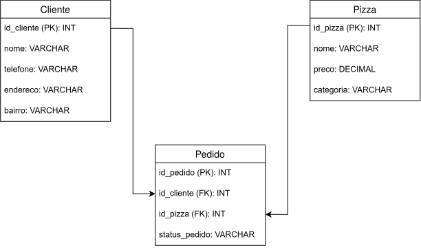

# Pizzaria

#### Data Definition Language

Neste laboratório vamos treinar os conceitos de DDL (Data Definition Language).

Considere que você fará um banco de dados de uma pizzaria. O banco de dados terá apenas as entidades `Cliente` e `Pizza` e uma relação entre elas que é o `Pedido`, cada `Pedido` relaciona uma pizza com um cliente. O Pedido pode estar `EmPreparacao`, `Entregue`, ou `Cancelado`.

Use o MySQL para criar este banco de dados.

OBS: Considere automatizar os ids com o comando `AUTO_INCREMENT`.

#### Data Manipulation Language

Teste as tabelas criadas adicionando pelo menos 3 entradas em cada tabela, tanto nas tabelas entidade quanto na de relação.

#### Data Query Language

Teste as entradas criadas usando o comando `SELECT` para visualizar todos os dados de cada tabela. (serão 3 comandos `SELECT`)

###### [Resposta](01-resposta.bd)
